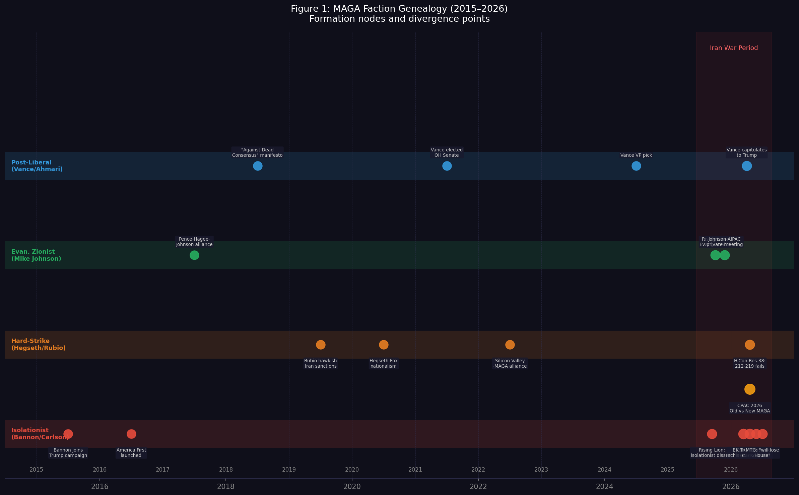
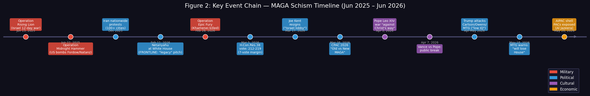
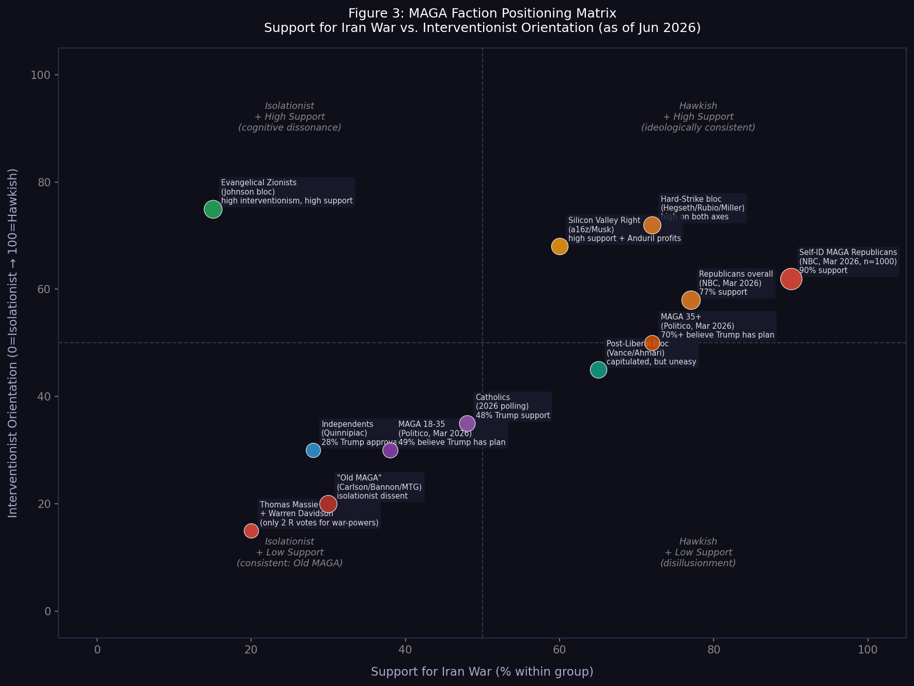

# 报告 01 · MAGA 在伊朗战争上的分裂

**基准日期：2026 年 6 月 2 日**

*本报告独立成文，面向大学毕业生读者。全文区分【已发生的事实】与【基于机制的推断】。具名分析师和信源均附超链接。所有民调数字已标注方法论条件。*

---

## 摘要

2026 年 2 月 28 日美国参与对伊朗发动联合打击之后，MAGA（"让美国再次伟大"，特朗普的政治运动）运动出现了 2016 年以来最公开、最结构性的内部分裂。这场分裂的表面现象——Tucker Carlson 指责特朗普背叛承诺，Candace Owens 暗示应该送特朗普"进养老院"，MTG 预言共和党将在 2026 年中期选举丢掉众议院——容易被理解为个人忠诚的破裂。本报告的核心论点与此不同。

**分裂的根本原因是四个派系对"MAGA 核心承诺"含义的不同理解，而非对特朗普个人的态度分歧。** 这四个派系在 2016 至 2024 年间各自形成，各有独立的思想来源、利益基础和选民基础；它们围绕伊朗战争分裂，是因为战争把这四套"Trump 主义"内部彼此不相容的逻辑同时激活了。

这场分裂目前处于压制状态——90% 自认 MAGA 的共和党人仍然支持打击伊朗（NBC News，2026 年 3 月）——但 Marc Farinella（芝加哥大学）的民调方法论分析指出，这一数字存在内生选择偏差：与特朗普分歧的人可能已不再自我认同为 MAGA。压制下的分裂比表面数字所显示的更深。

---

## 一、理解前提：四派不是派系内斗，是四套 Trump 主义

在描述各派立场之前，有必要先说清楚分析框架。

"MAGA"自 2016 年以来从未是一个意识形态同质的运动。它是一个政治联盟，由四套来源不同、诉求不同、内部逻辑不同的思想力量拼凑而成。这四套力量在反对建制派民主党、反对移民开放政策、反对"文化马克思主义"等议题上高度重叠，在外交政策上则从来只是暂时搁置了分歧。

伊朗战争把这个暂时搁置终结了。

*图1 读法：四条横轨对应四个派系。纵轴无量纲，用于区隔视觉。标注点是各派形成或发生关键变化的时间节点。红色阴影区域是伊朗战争期间（2025 年 6 月至今）。*

---

## 二、派系一：原教旨孤立派（Bannon / Carlson 阵营）

### 核心人物与来源

Steve Bannon、Tucker Carlson、Megyn Kelly、Candace Owens、Marjorie Taylor Greene、Alex Jones。

这一派的思想来源是 20 世纪初美国孤立主义传统（Pat Buchanan 式"America First"），经由 Bannon 在 2013 至 2016 年间将其与民粹经济主义结合，最终在 2017 年 Bannon 主导特朗普政府外交政策叙事时达到顶峰。其核心逻辑是：美国的真实威胁来自内部（非法移民、文化左翼、"深层政府"）和外部竞争对手中国，而非中东——中东战争是精英掠夺纳税人资源的工具。

这一派在思想谱系上属于古典保守主义（paleoconservative，古老保守派，强调传统主义、孤立主义的右翼传统），与新保守主义（neoconservative，主张通过军事手段推广民主、维持美国霸权）形成直接对立。

### 【事实】伊朗战争中的立场与行动

**Tucker Carlson** 在其节目中明确表态："We promised to end stupid foreign wars, not jump back into the Middle East again."（[Newsweek，2025-06-16](https://www.newsweek.com/tucker-carlson-steve-bannon-maga-trump-iran-israel-war-2086346)）他将伊朗战争定性为"Israel's war, not America's war"。

**Bannon** 称中东是"side show to the side show"，认为真正的威胁来自中国和非法移民，并直接攻击 Fox 主播 Sean Hannity 和 Mark Levin 为"warmongers"。（同上）

**Candace Owens** 在特朗普攻击其为"低智商"后回应："It may be time to put Grandpa up in a home."（2026 年 4 月，已广泛传播，[CNN，2026-04-22](https://www.cnn.com/2026/04/22/politics/tucker-carlson-candace-owens-marjorie-taylor-greene-trump-analysis)）

**MTG** 于 2026 年 4 月提出"Old MAGA vs New MAGA"框架：
- Old MAGA（反战）：Carlson、Kelly、Owens、Alex Jones、MTG 本人
- New MAGA（亲战）：Ben Shapiro、Laura Loomer、Mark Levin、Randy Fine（FL）

MTG 于 2026 年 5 月 18 日接受 Time 采访时预测共和党将因伊朗战争失去众议院，并以德克萨斯州某初选"民主党投票率超过共和党"为早期预警信号。（[Time，2026-05-18](https://time.com/article/2026/05/18/american-political-revolution-over-iran-marjorie-taylor-greene-warns-trump/)）

### 【事实】国会行动：H.Con.Res.38

这是迄今孤立派在国会层面的最重要具体行动。

决议由 Thomas Massie（R-KY）和 Ro Khanna（D-CA）共同提出（[congress.gov](https://www.congress.gov/bill/119th-congress/house-concurrent-resolution/38)），援引 WPR（1973年战争权力决议法案，要求总统在60天内获国会批准才能继续军事行动）要求总统在 30 天内从伊朗冲突中撤军。H.Con.Res.38（众议院第38号联合决议，引用战争权力法要求撤兵）的推动标志着孤立派首次将批评转化为具体立法程序。

**【事实】2026 年 3 月 5 日众议院投票结果**：212 赞成，219 反对，以 7 票之差失败。（[House Clerk Roll Call #85](https://clerk.house.gov/Votes/202685)）投票中仅有 **2 名共和党人**赞成：Thomas Massie（KY）和 Warren Davidson（OH）。Davidson 在下月后续决议中投"present"（实际弃权），反映了持续的政治压力。

参议院方面，Rand Paul 每次均推动类似决议；Collins（ME）、Murkowski（AK）、Paul（KY）、Cassidy（LA）至少各一次在战争权力决议上支持。参议院决议截至 2026 年 4 月 23 日已被共和党多数五度击败（[Democracy Now，2026-04-23](https://www.democracynow.org/2026/4/23/senate_iran_war_powers)）。最新进展：2026 年 5 月 19 日，参议院推进了一项阻止进一步打击的决议（[WaPo，2026-05-19](https://www.washingtonpost.com/politics/2026/05/19/senate-iran-war-powers-vote/)）。

Warren Davidson 的投票陈述（[CNN，2026-03-05](https://edition.cnn.com/2026/03/05/politics/warren-davidson-house-republican-war-powers-iran)）直接呈现了这一派的宪政逻辑："I rise in support of this war powers resolution today because the moral hazard posed by a government no longer constrained by our Constitution is a grave threat."

### 【事实】来自特朗普政府内部的最高级别异见：Joe Kent 辞职

2026 年 3 月 17 日，国家反恐中心主任、Army 特种作战老兵（11 次战斗部署）、前 MAGA 坚定支持者 Joe Kent 发表公开辞职信，称："Iran posed no imminent threat to our nation, and it is clear that we started this war due to pressure from Israel and its powerful American lobby."（[CNN，2026-03-17](https://www.cnn.com/2026/03/17/politics/joe-kent-resigns-iran-war)；[Axios，2026-03-17](https://www.axios.com/2026/03/17/joe-kent-resigns-trump-iran-israel-threat)）

这是迄今来自特朗普政府内部最高级别的战争异见，也是孤立派最重要的"内部证人"。

---

## 三、派系二：务实强袭派（Hegseth / Rubio / Miller）

### 核心人物与来源

Pete Hegseth（国防部长）、Marco Rubio（国务卿）、Stephen Miller（白宫高级顾问）。

这一派不是严格意义上的意识形态孤立主义的对立面，而是一种"有条件干预主义"：反对"无谓的民主输出战争"（伊拉克 2003 式），支持"硬打、快打、打完走"的有限军事行动。其思想来源是保守派鹰派现实主义与 Fox News 式战时民族主义的混合。

Hegseth 在伊朗战争开始时的公开声明直接呈现了这一逻辑："The mission is laser-focused: obliterate Iran's missiles and drones and facilities that produce them, annihilate its navy and critical security infrastructure, and sever their pathway to nuclear weapons."

### 【事实】叙事不一致问题

【事实】CNN 政治分析（[2026-03-02](https://edition.cnn.com/2026/03/02/politics/iran-war-goals-shifting-analysis)）记录了行政当局在战争开始后 3 天内多次自相矛盾："declining to enunciate a consistent set of goals ahead of the strikes and shifting the goalposts."

Rubio 最初声称美国"得知以色列计划进攻，知道这将引发对美军的攻击"——即开战是被动防御。而美国国防情报局的评估结论是伊朗 2035 年前无法制造洲际弹道导弹，直接推翻了部分官方开战理由。

白宫于 2026 年 4 月发布"President's Clear and Unchanging Objectives Drive Decisive Success"（[whitehouse.gov](https://www.whitehouse.gov/releases/2026/04/president-trumps-clear-and-unchanging-objectives-drive-decisive-success-against-iranian-regime/)），试图重新稳定叙事，但矛盾已在记录中。

### 这一派目前的政治地位

这一派是唯一真正"执政"的派系——它们控制着国防、国务、白宫内政。这也意味着它们无法用孤立派的逻辑挑战战争决定，它们的内部异见（如果存在的话）只能以静默的形式表达，不能公开。

---

## 四、派系三：福音派锡安主义者（Mike Johnson）

### 核心人物与来源

Mike Johnson（众议院议长）、Pete Hegseth（同时属于此派）、Mike Huckabee（驻以色列大使）、John Hagee（CUFI 创始人）。

这是四派中意识形态来源最独特的一支。其核心是末世论（premillennial dispensationalism）与美国政治权力的结合：以色列复国是圣经预言的实现，美国支持以色列是履行与上帝的约定。在这一框架内，伊朗战争不是外交政策选择，而是神意展开的一部分。

### 【事实】Johnson 的具体行动

**资金来源**：多源核实范围为 823,000 至 898,393 美元（FEC 可查；[The Intercept](https://theintercept.com/2024/01/20/israel-aipac-house-mike-johnson/)；[TrackAIPAC X 账号，2024-08](https://x.com/TrackAIPAC)；[BoughtByZionism.org](https://boughtzionism.org/)）。AIPAC（美以公共事务委员会，美国最大的亲以色列游说组织）为 Johnson 2023 年最大捐款人。其中 95,000 美元在 Johnson 推动 140 亿美元以色列援助法案后流入（The Intercept）。

**约旦河西岸之行**：Johnson 赴"红母牛"基地（red heifer site）与内塔尼亚胡会面，称："We pray for our nation and for peace in Jerusalem, for peace for Israel."

**2025 年 9 月私会**：据 [jewishinsider.com](https://jewishinsider.com/) 报道，Johnson 与 AIPAC 及犹太领袖举行私会，承诺"筛查"党内孤立主义（反以色列）候选人。

### 【事实】Christian Zionist 基础设施

Pastor John Hagee 的 CUFI（以色列基督徒联盟）拥有约 1000 万注册成员，2025 年单年在伊朗制裁、叙利亚制裁、亲以色列立法上游说支出 679,000 美元（自 2016 年总计近 250 万美元）（[Jacobin，2026-03](https://jacobin.com/2026/03/christian-zionism-iran-war-israel)）。

Hegseth 2018 年曾公开呼吁"建造第三圣殿"，是 Christian Zionism 在政府内部最公开的代言人。

三十名国会议员致函要求调查军事指挥官向士兵传达伊朗战争是"神圣计划"（divine plan）的言论（Jacobin，2026-03）。

### 这一派为何在 MAGA 分裂中几乎没有动摇

这一派没有意识形态上的自我矛盾。福音派锡安主义者从来没有承诺过孤立主义——他们对以色列的支持是稳定的先验前提，不因"America First"的其他诉求而动摇。他们在 MAGA 联盟中一直是沉默的中轴，现在他们是分裂下仍然完整的一支。

---

## 五、派系四：后自由派 / 天主教保守派（Vance / Ahmari）

### 核心人物与来源

JD Vance（副总统）、Sohrab Ahmari（UnHerd 编辑）、Erik Prince（黑水创始人，天主教徒）。

这是四派中最新形成、也是在伊朗战争中遭遇最深层意识形态矛盾的一派。其来源是 2010 年代后期"后自由主义"政治哲学的兴起——对新保守主义外交政策（持续输出式民主战争）和新自由主义经济政策同时进行批判的一种保守右翼思想。Patrick Deneen、Sohrab Ahmari 等人 2019 年联署的"Against Dead Consensus"宣言是这一运动的纲领性文件，Vance 是其政治实践者。

这一派在外交政策上的承诺最明确：反对新保守主义干预主义，但不是孤立主义——它支持有战略意义的强硬行动，反对"目的模糊的联盟战争"。

### 【事实】Vance 的立场演变与资本化

**2024 年立场**（明确记录）：Vance："Our interest, I think, very much is in not going to war with Iran. It would be a huge distraction of resources." 他同时阐述了原则框架："extreme skepticism towards intervention overseas...Don't punch often, but when you punch, punch really goddamn hard."

**2026 年 2 月**：据 [PBS FRONTLINE](https://www.pbs.org/wgbh/frontline/article/trump-cabinet-vance-hegseth-iran-war-documentary-excerpt/) 报道，Vance 曾向特朗普"提醒他是以反对卷入更多冲突的承诺上台的"，但最终选择支持总统。

**批评者的定性**：UnHerd 文章（[2026-03，标题：《JD Vance 如何输掉了外交政策之战》](https://unherd.com/2026/03/how-jd-vance-lost-the-foreign-policy-war/)）由 Ahmari 撰写，描述 Vance "最终帮助实施了 John Bolton 或 Elliott Abrams 的外交政策偏好"。这是 Ahmari 在承认一种自我解构：他们共同起草的宣言拒绝新保守主义外交政策正统，而现在看起来接受了类似结果。

### 【事实】与教皇 Leo XIV 的公开决裂

2026 年 4 月 3 日（圣周四），教皇 Leo XIV 在声明中称伊朗战争框架"完全背离基督之道"，基督门徒"永远不站在……投炸弹的那一边"。（[Responsible Statecraft，2026-04](https://responsiblestatecraft.org/catholics-pope-war-trump/)）

Vance 于 2026 年 4 月 7 日回应："If you're going to opine on matters of theology, you've got to be careful, you've got to be sure it's anchored in the truth."

**民调影响**（[2026 年 3 月民调](https://responsiblestatecraft.org/catholics-pope-war-trump/)）：天主教徒中特朗普支持率降至 48%（反对 52%），而 2024 年特朗普以 12 个百分点优势赢得天主教票。美国天主教主教委员会主席 Bishop James Massa（2026-04-15）为教皇权威和正义战争理论发表声明，明确与 Vance 的回应划清界限。

**Erik Prince**（天主教保守派中的鹰派异见者）：指责以色列攻击了圣家堂（Holy Family Church），反对当前伊朗战争。这是天主教保守派阵营内部的进一步分化。

---

## 六、硅谷右翼：第五股力量

硅谷右翼与 MAGA 的结盟始于 2022 年前后，在 2024 年大选期间因 Musk 大规模捐款而达到顶峰。这一群体不适合直接归入上述四派，但它们的立场和利益结构对 MAGA 分裂有独立影响。

### Elon Musk

**立场：支持打击伊朗，但在商业利益上与五角大楼存在摩擦。**

【事实】2026 年 1 月 4 日：Musk 用波斯语在 X 上回复哈梅内伊帖子，称其"妄想"（[Iran International](https://www.iranintl.com/en/202601043827)）。2026 年 1 月 8 日：X 平台将伊朗国旗表情符号改为 1979 年前的版本（狮日旗），主动发表政治声明。（[Al Jazeera，2026-01-08](https://www.aljazeera.com/amp/news/2026/1/8/elon-musk-iran-flag-x-twitter)）

【事实】2026 年 5 月 26 日（最新）：Pentagon 与 SpaceX 就 Starlink 涨价发生冲突——五角大楼称支付约 5,000 美元/终端，SpaceX 声称实际服务层级价值约 25,000 美元，要求追补。Musk 同时澄清 Starlink 服务条款禁止将终端用于武器系统。（[CNBC，2026-05-26](https://www.cnbc.com/2026/05/26/pentagon-spars-with-spacex-over-starlink-price-hike-during-iran-war.html)）

这呈现了一个复杂的利益矩阵：Musk 本人支持伊朗战争的政治目标，但在商业利益上向军方施加了价格压力。

### Marc Andreessen / a16z

**立场：明确支持战争，并从中直接获利。**

【事实】a16z 投资组合公司 Anduril Industries 的 AI 平台 Lattice 部署于伊朗战争；陆军已授予 Anduril 200 亿美元合同。另一投资组合公司 Shield AI 的 Nova 无人机已在加沙使用。硅谷向 Anduril 注入约 40 亿美元，时值伊朗战争拖延期间（[Yahoo Finance](https://finance.yahoo.com/news/silicon-valley-anduril-iran-war/)）。

a16z 发布"No Man Left Behind"博文，论证自主战争"不是尽管有我们的价值观，而是因为有我们的价值观"（[a16z.com](https://a16z.com/no-man-left-behind-american-technology-ships-with-our-values/)）。a16z 的 12 亿美元"American Dynamism"国防基金由 Katherine Boyle 管理；NYT 将其称为"科技右翼的 Phyllis Schlafly"。

这一立场与孤立派 MAGA 的对立是真实的，但来源不同于意识形态——它更接近直接的商业利益驱动。

---

## 七、AIPAC 资金的结构性作用

理解 MAGA 分裂不能绕开 AIPAC 资金，因为它是亲以色列立场在 MAGA 国会议员中被巩固和反孤立派立场被筛选的机制之一。

### 【事实】2024 年选举周期总体数据（多源核实）

| 指标 | 数据 | 来源 |
|------|------|------|
| 2024 选举周期总支出 | 1.269 亿美元 | Americans for Transparency（FEC 数据）|
| AIPAC PAC 直接捐款 | 5180 万美元 | 同上 |
| United Democracy Project 独立支出 | 3790 万美元 | 同上 |
| 游说支出 | 330 万美元 | 同上 |
| 支持候选人当选数 | 318/389（82%）| 同上 |
| 国会成员收到资金比例 | 65%（349 名）| 综合 |

### 【事实】关键个人受益者

**Mike Johnson（R-LA，众议院议长）**：已核实收款范围 823,000 至 898,393 美元（FEC 可查）。AIPAC 为其 2023 年最大捐款人。95,000 美元在推动 140 亿美元以色列援助法案后流入。（[The Intercept](https://theintercept.com/2024/01/20/israel-aipac-house-mike-johnson/)）

**三名民主党阻碍者**（Jacobin 2026-03 调查核心数据，三源交叉核实）：
- Josh Gottheimer（D-NJ）：787,000 美元
- Greg Landsman（D-OH）：350,000 美元以上
- Jared Moskowitz（D-FL）：312,000 美元

这三名民主党人被认为是 H.Con.Res.38 投票失败的关键阻力之一（[Jacobin，2026-03](https://jacobin.com/2026/03/aipac-trump-israel-democrats-iran)）。

### 【事实】2026 年新发展：AIPAC 通过空壳 PAC 隐匿资金

[Al Jazeera，2026-05-20](https://www.aljazeera.com/amp/news/2026/5/20/as-aipac-becomes-toxic-it-is-trying-to-conceal-spending-in-us-elections) 调查记录：AIPAC 正在通过空壳 PAC 隐匿中期选举支出，因为"AIPAC 品牌已变得 toxic"。这是 AIPAC 的政治形势新变量——在孤立派 MAGA 和进步左翼同时发力批评的背景下，AIPAC 的公开品牌正在成为政治负担。

Walt 和 Mearsheimer 于 2026 年 4 月 4 日（《以色列游说团》发表 20 周年）接受 Tom Switzer 访谈，重新检视其论点在伊朗战争背景下的适用性，对自己的核心命题作出肯定。（[Unz Review，2026-04-04](https://www.unz.com/article/is-israel-driving-the-iran-war-john-mearsheimer-and-stephen-walt-in-debate-with-tom-switzer-on-the-20th-anniversary-of-the-israel-lobby/)）

CFR（美国外交关系协会）同期刊文分析国会在伊朗战争授权问题上的角色，记录了国会拒绝介入的制度性原因。（[CFR：Congress and Iran War Powers](https://www.cfr.org/articles/congress-declines-to-demand-a-say-in-the-iran-war)）

---

## 八、民调数据：90% 支持背后的方法论问题

### 【事实】核心数字

| 民调 | 数据 | 来源/日期/方法 |
|------|------|------|
| 自认 MAGA 共和党人支持伊朗打击 | **90%**（反对 5%）| NBC News，2026-02-27 至 03-03，n=1000，MOE±3.1pp（百分点）|
| 共和党整体支持 | 77%（反对 15%）| 同一 NBC 民调 |
| 全体选民净支持率 | -22.8%（截至 2026-06-02）| [Nate Silver/Silver Bulletin](https://www.natesilver.net/p/iran-war-polls-popularity-approval) |
| 独立人士特朗普支持率 | 28% | Quinnipiac 大学民调 |
| 天主教徒特朗普支持率 | 48%（反对 52%）| 2026 年 3 月民调；2024 年基线为+12 个百分点 |
| MAGA 中 35 岁以下认为特朗普在伊朗有计划 | 49% | Politico 民调，2026-03-13 至 18，n≈4000 |
| MAGA 中 35 岁以上认为特朗普在伊朗有计划 | 70%+ | 同一 Politico 民调 |
| 美国人不支持军事行动 | 52% | The Hill/Survey |

### 【推断】方法论警告

"90% MAGA 支持率"存在选择性偏差问题。[CSMonitor.com 引用 Marc Farinella（芝加哥大学 Harris School）](https://www.csmonitor.com/USA/Politics/2026/0320/trump-iran-maga-base-support) 指出："那些对战争决定与特朗普分歧的人可能已不再自我认同为 MAGA"——即 MAGA 标签本身在过滤掉异见。

这一逻辑的推论是：当分裂加深时，MAGA 内部的实际异见是不可观察的，因为异见者会先离开"MAGA"这一自我标签，然后才公开批评。现有民调数字只能测量"仍然认为自己是 MAGA 的人中有多少支持"，而无法测量"曾经是 MAGA 的人中有多少因战争而离开"。

*图2 读法：水平时间线，左（2025-06）至右（2026-05）。颜色编码：红色=军事行动，蓝色=国内政治，紫色=文化/宗教，橙色=经济/制度。*

*图3 读法：横轴为各群体对伊朗战争的支持率（%）；纵轴为干预主义倾向（0=孤立主义，100=鹰派）。气泡大小反映相对政治影响力。数据来源见文中各节；干预主义倾向为综合多来源评分，非单一民调数字。*

---

## 九、2026 年中期选举含义

### 【事实】已观察到的早期信号

MTG 援引的德克萨斯州某众议院初选中，民主党投票率已超过共和党——这是一个地区性数据点，不是全国性信号，但 MTG 的政治直觉是有历史依据的：她在 2022 年中期选举的走向判断上没有出大错。

CNN/SSRS 数据：45 岁以下共和党和倾共和党选民中，仅 33% 表示极有可能在 2026 年中期投票（vs 大多数年长共和党人）。这个数字对共和党的众议院多数是一个结构性威胁——因为 2022 年共和党赢得众议院的关键就是青年共和党人的激励动员。

Young Republicans 在多个场合批评国内议题（无家可归、心理健康、出生率下降）被战争议程牺牲。

### 【推断】当前分裂的中期选举含义

**含义一：孤立派的选举计算**

Bannon-Carlson 阵营并非只是在意识形态上不满——他们有一套选举理论：MAGA 的核心选民基础是在 2016 年被"不打外国蠢战争"这个承诺激活的白人工人阶级，这部分人对中东战争成本是高度敏感的。如果他们不投票或弃投共和党，众议院多数就危了。

Scott Jennings（共和党战略师）持反驳立场："The base of the party trusts Trump's instincts on most issues, but particularly on foreign affairs."（[NPR，2026](https://www.npr.org/2026/03/week-in-politics-iran)）这代表主流共和党建制派的安抚论述。

**含义二：The "America First"标签的含义争夺**

Marc Farinella（芝加哥大学）指出，真正持有信念的媒体人"不太可能随着特朗普走"；"America First"含义存在根本性模糊——它既可以指孤立主义，也可以指单边主义强袭（不管多边联盟，但自己打）。这种模糊性在和平时期被搁置，在伊朗战争中不得不被明确。

**含义三：AIPAC 逻辑的中期效应**

AIPAC 在 2026 年中期选举中继续发力，但已开始隐匿品牌（空壳 PAC）。这意味着其"筛查孤立主义候选人"的逻辑仍然有效，但面临的抵制正在增加。如果 AIPAC 在 2026 年中期选举中资助候选人失败，将是其政治影响力的一个重要压力测试。

---

## 十、判断可能错在哪：六个高风险假设

本报告的核心叙事是"MAGA 分裂是真实的、结构性的、被压制的"。以下六个假设值得主动审视：

**假设一：特朗普个人仍然能整合分裂。**

反驳：90% MAGA 支持率中有相当一部分来自个人忠诚，而非对战争的独立判断。如果特朗普在未来数月内在伊朗战争上有某种"胜利宣言"动作（比如宣布"完成任务"并撤军），孤立派的批评叙事将失去支撑，大多数 MAGA 支持者会随着特朗普的叙事转向。这是"分裂被吸收"的最可能路径。本报告低估了这一可能性。

**假设二：孤立派的选举理论是对的。**

反驳：孤立派认为伊朗战争会伤害共和党的基础选民，但 Scott Jennings 等共和党战略师的判断恰恰相反。2022 年中期选举后，共和党的选民基础在文化保守主义议题（反 DEI、移民控制）上有更强的激励效应——伊朗战争对这些选民的影响可能远小于孤立派预计。

**假设三：分裂会转化为选票损失。**

反驳：MAGA 内部的意识形态分裂（孤立派 vs 福音派锡安派）可以同时存在，而两派都不去投民主党。分裂不等于共和党选票流失，它可能只是转化为初选压力，或者在众议院内表现为偶发的成本性反叛投票。这种分裂的政治效应比选票损失论预计的更加分散。

**假设四：Vance 的资本已被彻底消耗。**

反驳：UnHerd 的"Vance 已输掉外交政策之战"叙事可能过于早下结论。Vance 在特朗普后时代（无论是 2029 年还是更早）仍然可能是后自由主义保守主义的代表人物。一次政策上的妥协不等于政治身份的消亡。

**假设五：AIPAC 资金逻辑在 2026 年仍然有效。**

反驳：AIPAC 品牌的 toxic 化（Al Jazeera 2026-05 调查）是一个真实变量，但其实际选举效果取决于接受 AIPAC 资金的候选人是否在 2026 年初选中落败。目前没有足够数据确认这一点。

**假设六：硅谷右翼的战争利益是稳定的。**

反驳：Musk 与 Pentagon 的 Starlink 价格争端（2026-05）显示，即使是最支持战争的硅谷行动者，在具体商业利益受损时也会向军方施压。如果战争持续且国防预算增长放缓，硅谷右翼内部的商业利益可能出现分化。

---

## 附录：主要信源清单

**一手/政府来源**
- [congress.gov H.Con.Res.38](https://www.congress.gov/bill/119th-congress/house-concurrent-resolution/38)
- [House Clerk Roll Call #85](https://clerk.house.gov/Votes/202685)
- [Whitehouse.gov "Decisive Success"](https://www.whitehouse.gov/releases/2026/04/president-trumps-clear-and-unchanging-objectives-drive-decisive-success-against-iranian-regime/)
- [Khanna.house.gov press release](https://khanna.house.gov/media/press-releases/reps-khanna-massie-introduce-bipartisan-war-powers-resolution-prohibit)
- [Americans for Transparency AIPAC](https://americansfortransparency.org/investigations/aipac)

**主要媒体**
- [PBS FRONTLINE: Trump cabinet documentary excerpt](https://www.pbs.org/wgbh/frontline/article/trump-cabinet-vance-hegseth-iran-war-documentary-excerpt/)
- [Newsweek: Bannon/Carlson MAGA split (2025-06-16)](https://www.newsweek.com/tucker-carlson-steve-bannon-maga-trump-iran-israel-war-2086346)
- [CNN: Joe Kent resignation](https://www.cnn.com/2026/03/17/politics/joe-kent-resigns-iran-war)
- [CNN: Warren Davidson war powers vote](https://edition.cnn.com/2026/03/05/politics/warren-davidson-house-republican-war-powers-iran)
- [CNN: MAGA malaise analysis (2026-04-22)](https://www.cnn.com/2026/04/22/politics/tucker-carlson-candace-owens-marjorie-taylor-greene-trump-analysis)
- [The Intercept: AIPAC/Johnson (2024-01-20)](https://theintercept.com/2024/01/20/israel-aipac-house-mike-johnson/)
- [CNBC: SpaceX/Pentagon Starlink dispute (2026-05-26)](https://www.cnbc.com/2026/05/26/pentagon-spars-with-spacex-over-starlink-price-hike-during-iran-war.html)
- [Al Jazeera: AIPAC shell PACs (2026-05-20)](https://www.aljazeera.com/amp/news/2026/5/20/as-aipac-becomes-toxic-it-is-trying-to-conceal-spending-in-us-elections)
- [Axios: Joe Kent (2026-03-17)](https://www.axios.com/2026/03/17/joe-kent-resigns-trump-iran-israel-threat)
- [Time: MTG "revolution" warning (2026-05-18)](https://time.com/article/2026/05/18/american-political-revolution-over-iran-marjorie-taylor-greene-warns-trump/)

**智库/分析**
- [CSIS: Operation Epic Fury analysis](https://www.csis.org/analysis/operation-epic-fury-and-remnants-irans-nuclear-program)
- [CFR: Congress and Iran War Powers](https://www.cfr.org/articles/congress-declines-to-demand-a-say-in-the-iran-war)

**批判性分析**
- [Jacobin: AIPAC and Iran War Democrats (2026-03)](https://jacobin.com/2026/03/aipac-trump-israel-democrats-iran)
- [Jacobin: Christian Zionism and Iran War (2026-03)](https://jacobin.com/2026/03/christian-zionism-iran-war-israel)
- [Responsible Statecraft: Catholics, Pope, war, Trump](https://responsiblestatecraft.org/catholics-pope-war-trump/)
- [UnHerd: "How JD Vance Lost the Foreign Policy War"](https://unherd.com/2026/03/how-jd-vance-lost-the-foreign-policy-war/)
- [Boing Boing: Andreessen as war profiteer](https://boingboing.net/2026/04/02/war-profiteer-marc-andreessen-brags-about-zero-introspection.html)
- [a16z: "No Man Left Behind"](https://a16z.com/no-man-left-behind-american-technology-ships-with-our-values/)
- [Mearsheimer/Walt 20th anniversary (Unz Review, 2026-04-04)](https://www.unz.com/article/is-israel-driving-the-iran-war-john-mearsheimer-and-stephen-walt-in-debate-with-tom-switzer-on-the-20th-anniversary-of-the-israel-lobby/)
- [FPJ: MTG "Old vs New MAGA" (2026-04-18)](https://www.foreignpolicyjournal.com/2026/04/18/marjorie-taylor-greene-draws-old-maga-vs-new-maga-battle-lines/)

**民调/数据**
- [Silver Bulletin/Nate Silver: approval tracking](https://www.natesilver.net/p/iran-war-polls-popularity-approval)
- [NBC News/The Hill: MAGA 90% poll](https://thehill.com/homenews/administration/5371017-maga-support-iran-bombing-nbc-poll/)
- [CSMonitor: MAGA base analysis (2026-03-20)](https://www.csmonitor.com/USA/Politics/2026/0320/trump-iran-maga-base-support)

---

**数据缺口说明（诚实标记）**

1. H.Con.Res.38 的 93 名民主党联署人完整名单：congress.gov 访问受限，未独立核实全名单。
2. Peter Thiel 2026 年个人公开立场：无可核实引语；Palantir 参与军事行动有记录但 Thiel 本人未公开表态。
3. 具体"鹰派破裂"（2026-04）节点的确定性事件：现有核实最接近的是特朗普攻击反战 MAGA 人士（2026-04-09）和 MTG 预测（2026-05-18），无单一已命名"鹰派破裂"事件。
4. 完整共和党对伊朗战争的记名赞成/反对名单：众议院仅确认 Massie 和 Davidson，参议院 4 人（Paul、Collins、Murkowski、Cassidy），更完整名单需直接查 clerk.house.gov 全名单。

---

*报告生成 2026-06-02 · v4 标准 · 全文 fact/forecast 分层标注 · 配套可视化页面见 /iran-war/maga-split/*
