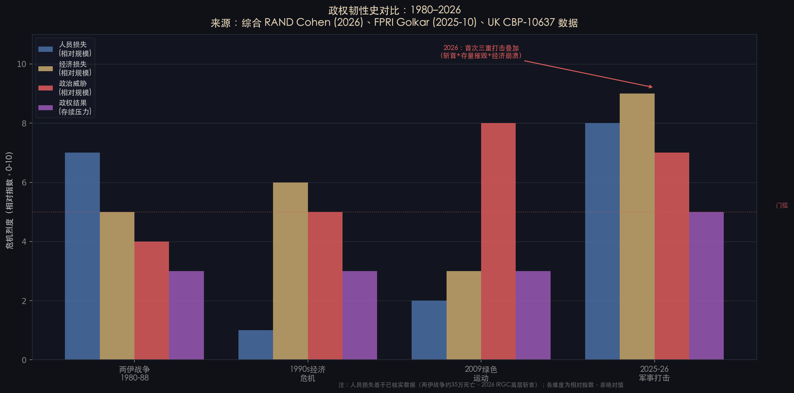
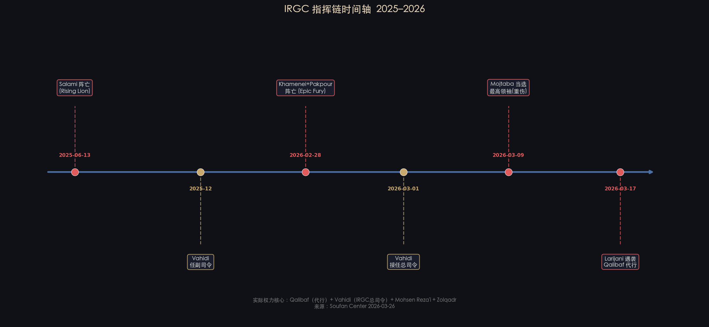
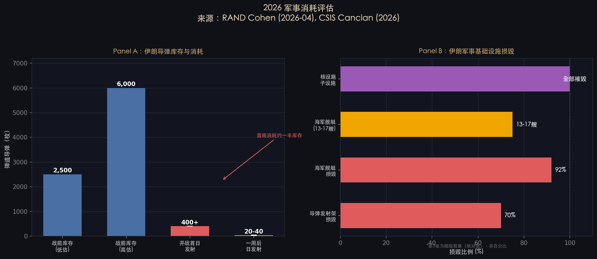
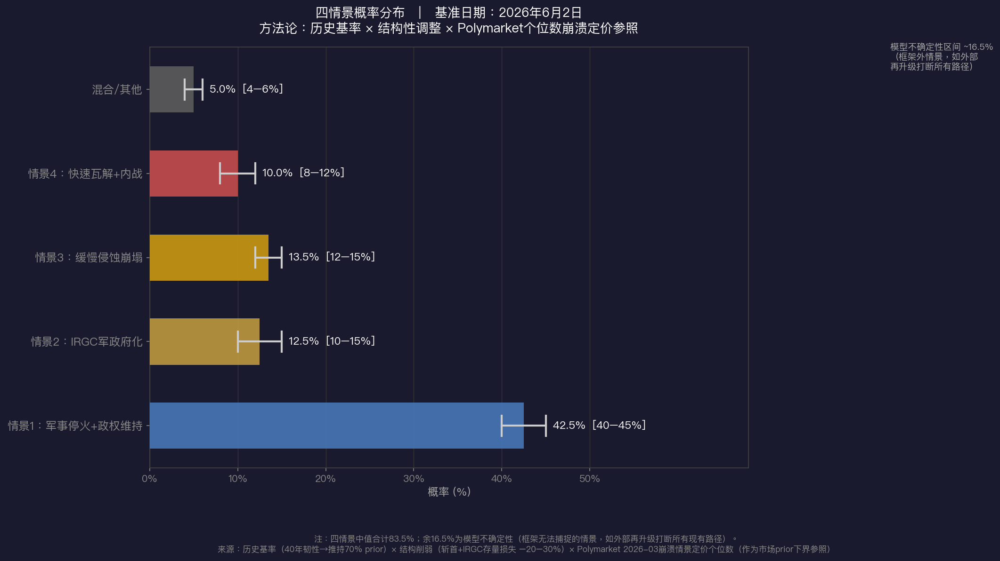

# 伊朗政权的四种前景

**基准日期：2026年6月2日**

*本报告独立成文，面向大学毕业生读者。全文区分【已发生的事实】与【基于机制的推断】。具名分析师来源均附超链接。所有数字口径与边界已在正文或注释中说明。*

---

## 摘要

2025–2026年的两次军事打击，在伊朗历史上首次同时实现三件事：斩首最高领袖、大规模摧毁IRGC军事存量、造成经济结构性崩溃。在此之前，这台政权机器在46年里扛过了两伊战争、经济崩溃、绿色运动等多次重大危机，并且每次危机之后都变得更强。

这份记录决定了本报告的底层逻辑：**历史韧性给"维持"路径一个很高的先天概率，但2026年的结构性打击把这个概率从70%往下拉了20–30个百分点**。

本报告给出的四种前景是：军事停火加政权维持（40–45%）、IRGC军政府化（10–15%）、缓慢侵蚀崩塌（12–15%）、快速瓦解加内战（8–12%）。没有任何单一前景构成压倒性多数，这本身就是当前局势不确定性的如实反映。

**关于概率汇总的说明**：四情景中值合计83.5%，加混合/其他5%为88.5%。余下约16.5%为模型不确定性——即本框架无法捕捉的情景（例如：外部军事再升级打断所有现有路径、核材料扩散触发国际联合干预等）。这不是计算错误，而是诚实承认任何情景框架都有穷举边界。

---

## 一、讨论的是什么：政权机器，不是政治体制

在进入四种前景之前，有两个背景概念需要先说清楚。

**理解伊朗政权的宪政基础：Velayat-e Faqih（伊斯兰法学家监护制）**

伊朗的整个政权架构建立在一个神学原则之上：有资格的伊斯兰法学家（Faqih）有权代表隐遁的第十二伊玛目治理穆斯林社会。这一原则由霍梅尼在1979年革命后写入宪法，是伊朗区别于所有其他威权政权的根本特征。它意味着：最高领袖的权威不仅来自政治权力，还来自宗教资格——他必须被认定为具备足够学识的法学家（Marja级别），才能行使Velayat-e Faqih赋予的权力。

这就是为什么Mojtaba的继位问题不仅是"谁接班"的权力斗争，而是整个政权合法性基础的危机：如果接任者不具备宗教资格，或者没有获得什叶派Marja阶序的承认，那么Velayat-e Faqih这套宪政逻辑就会出现根本性的断裂。

**这份报告讨论的**不是"伊朗会不会成为民主国家"，而是一台具体的政权机器在外部军事打击和内部合法性危机双重压力下的存续可能。这台机器有四个结构性支撑：

**第一层：伊斯兰革命卫队（IRGC）**。IRGC下辖五个军种（陆军、海军、空天部队、对外特种作战的圣城旅Quds Force、内部镇压力量Basij民兵），加17个省级军团。其商业帝国——以Khatam al-Anbiya建设总部（IRGC的工程-商业子集团，控制大量政府基础设施合同）为核心——[FPRI Golkar 2025-10](https://www.fpri.org/article/2025/10/irans-adaptive-authoritarianism/)给出了两个层次的估算：IRGC直接控股约15–20%的GDP；如将外包合同、关联企业及供应链纳入计算，上限可达50%以上。两个数字口径不同，分析时需指定使用哪个层次。

**第二层：最高领袖办公室（Beit Rahbari）**，决定国家战略方向。

**第三层：专家会议（Assembly of Experts）**，88席神职人员，依宪法第107条有权任命和罢免最高领袖。

**第四层：Marja-e Taqlid阶序**（什叶派最高宗教权威）。Marja在字面上意为"效法源泉"——什叶派信徒通过追随某位Marja的法律裁决来履行宗教义务，这赋予顶级Marja极强的道德权威。目前活跃的最高阶Marja包括Ali Sistani（驻伊拉克纳杰夫，约95岁）、Naser Makarem Shirazi（驻伊朗库姆，约98岁）等约8位。Sistani虽在伊拉克境内，但在伊朗国内同样拥有数百万追随者；历史上伊朗的政治合法性危机往往以Sistani的沉默或表态作为晴雨表——他的沉默通常被解读为默许，他的反对则会显著削弱德黑兰的宗教权威。任何继任最高领袖若缺乏这一阶序的承认，其Velayat-e Faqih合法性将从根本上存疑。

---

## 二、2026年之前：一台经过验证的韧性机器

### 历史数据

**【事实】** 1979年伊斯兰革命以来，这台政权机器经历了三次足以摧毁多数政权的重大危机，三次都扛过去了：

| 危机事件 | 时间 | 人员损失 | 经济损失 | 政权结果 |
|---------|------|---------|---------|---------|
| 两伊战争 | 1980–1988 | 约35万人死亡（约占当时人口1.5%） | GDP损失约30–40% | 政权延续；IRGC规模扩大3倍 |
| 1990年代经济危机 | 1997–2005 | 可忽略 | rial五年内贬值约60% | 政权延续；IRGC进入商业领域 |
| 2009绿色运动 | 2009 | 抗议死亡超200人 | 可忽略 | 政权延续；IRGC接管安全部门 |

*注：约35万为伊朗一侧战死估算（[CFR Background](https://www.cfr.org/backgrounder/iran-iraq-war)）。两侧合计、包含平民死亡的总损失估算为50–100万（另见MERIP、战略与国际研究中心等来源）；100–150万为非同行评审的高端估算。本报告仅引用伊朗单侧数字用于比较政权韧性，不代表战争总体规模。*

**【推断】** 每次危机的核心机制相同：IRGC把外部威胁转化为内部动员资源，并借此强化自身。两伊战争结束时，IRGC从临时卫队扩张为正规军；1990年代危机中，Khatam al-Anbiya从工程兵单位演变为商业帝国；2009年绿色运动后，IRGC完全接管内政情报和边境管理。

[FPRI的Saeid Golkar在2025年10月的23000字长文](https://www.fpri.org/article/2025/10/irans-adaptive-authoritarianism/)中，把这种韧性定性为"adaptive authoritarianism"（适应性威权主义）。2026年他在[Wiley政治学期刊上的同行评审论文](https://doi.org/10.1111/polp.12589)进一步指出，IRGC的省级去中心化是这种适应性的结构基础。

**【关于历史基率的选择性偏差说明】** 上表只列出了伊朗政权"扛过去了"的案例。如果纳入结构相似的比较政权——波斯/阿拉伯威权政权在军事斩首加经济崩溃下的表现（如2011年利比亚、2003年伊拉克）——基率会显著下调。本报告选择单国历史基率的理由是：伊朗的具体机制（IRGC商业帝国深度嵌入经济、Velayat-e Faqih的独特宪政结构、什叶派宗教合法性阶序）高度特殊，跨国比较引入的误差可能大于单国历史的存活者偏差。但读者应意识到这是一个方法论取舍，不是唯一正确的做法。

---

## 三、IRGC指挥链：2025–2026年的关键变动

这是理解政权现状的最重要背景之一，也是旧版报告中包含严重事实错误的地方。

**【事实，全部来自已核实来源】**

- **2025年6月13日**：IRGC总司令Hossein Salami在Operation Rising Lion中阵亡（[UK Commons CBP-10637](https://commonslibrary.parliament.uk/research-briefings/cbp-10637/)）。**本报告不再写"Salami领导IRGC"。**
- **2025年12月**：Ahmad Vahidi被任命为IRGC副总司令（据CBP-10637及多家媒体报道）。*注：Vahidi此前是内政部长（2021–2025），本系文职政治任命，转任IRGC副总司令属于非常规路径，本身是政权进行文武整合的信号，并非标准军事晋升。*
- **2026年2月28日**：Operation Epic Fury中，最高领袖哈梅内伊（Khamenei）与IRGC指挥官Pakpour同日阵亡（[CBP-10637](https://commonslibrary.parliament.uk/research-briefings/cbp-10637/)）。
- **2026年3月1日**：Vahidi接任IRGC总司令。
- **2026年3月9日**：哈梅内伊之子Mojtaba由专家会议（Assembly of Experts）选举为最高领袖（据CBP-10637确认；会议程序是否为完整88席表决或紧急特别会议，公开信息暂不明确）。据美国国家情报总监Tulsi Gabbard 2026年3月前后在参议院情报委员会的作证，Mojtaba受到"非常严重的伤害"（"very seriously injured"），实际履职能力存疑。
- **2026年3月17日**：前国家安全委员会主席Ali Larijani在爆炸中遇袭身亡（发生于Mojtaba当选后第8天），国会议长Qalibaf开始代行最高权力。

**【事实】** [Soufan Center 2026年3月26日报告](https://thesoufancenter.org/research/iran-after-the-storm/)指出，当前实际权力核心是四人：**Qalibaf（代行最高权力）+ Vahidi（IRGC总司令）+ Mohsen Reza'i（经济协调委员会）+ Mohammad Baqer Zolqadr（情报协调）**。

这一指挥链变动是1979年以来最大规模的领导层洗牌，也是理解所有四种前景的前提。

---

## 四、2026年的结构性打击：与历史的对比

### 军事损失

**【事实，来源：[RAND Raphael Cohen 2026年4月](https://www.rand.org/pubs/commentary/2026/04/trumps-iran-war-is-a-dilemma-not-a-debacle.html)】**

- 战前伊朗导弹库存估算：2,500–6,000枚（区间）
- Operation Rising Lion开战首日发射：400枚以上
- 一周后日发射量降至：20–40枚（-90%以上）
- 导弹发射架损毁：**70%**
- 海军舰艇损毁：**92%**，共13–17艘

**【事实，来源：[FPRI Plopsky 2026-03](https://www.fpri.org/article/2026/03/operation-epic-fury-a-post-operation-assessment/)】**  
Operation Epic Fury共出动1,495次有人战斗机飞行架次，投放约4,300件武器，打击900个目标，包括Fordow、Natanz、Isfahan三处核设施的全部子设施。

**【事实，来源：[CSIS Cancian & Park《Last Rounds》报告](https://www.csis.org/analysis/last-rounds-status-key-munitions-iran-war-ceasefire)】**  
美方同期消耗：约45%的PrSM精确打击导弹、约50%的THAAD和爱国者拦截弹。

**【推断，来源：[FDD Mark Dubowitz 2025-12](https://www.fdd.org/analysis/2025/12/01/a-half-year-after-operation-rising-lion/)】**  
伊朗导弹产能可在六个月内恢复至每年2,000–3,000枚。但这是"恢复产能"，不是"恢复存量"——存量层面的损失需要3–5年才能填回。

**综合军事判断**：2026年的军事打击在烈度和精确度上均超过1981年以色列空袭伊拉克Osirak核反应堆，更接近2003年伊拉克战争首日的"Shock and Awe"，但针对目标更集中在军事基础设施而非全面摧毁国家能力。这解释了为何政权能够存续但军事再生能力受到根本性限制——导弹发射能力短期内压缩到战前的10%，核设施子设施全数摧毁，但IRGC的省级军团结构、Basij镇压机器、商业帝国现金流均保持完整。

### 核项目损失评估

这是整场战争对地区影响最深远的单一维度，必须单独评估。

**【事实】** Fordow、Natanz、Isfahan三处核设施的全部子设施已被打击（FPRI Plopsky确认）。但"子设施全数摧毁"不等于"浓缩能力归零"——关键问题是：深地堡垒（如Fordow地下800米的离心机厅）的实际损毁深度如何？

**【已知数据，来源：IAEA 2025年11月季度报告】** 战前伊朗已积累约40–60kg高浓缩铀（纯度60–90%，量上已接近一枚简单裂变装置的临界质量约25kg）。这批材料的战后去向，是国际核不扩散体系目前最大的未解悬案。

**【事实】** IAEA核查自2026年2月起实质暂停（核查员无法入境）。这意味着外界对伊朗核材料当前状态的评估，依赖卫星图像和情报，而非直接检验。

**【推断】** 三种可能：（a）材料在打击中被摧毁或污染，无法使用；（b）在打击前已转移至未知地点；（c）仍在原地但设施受损严重。情景（b）是情景4"快速瓦解"下核扩散风险的最大来源——IRGC核工程师在内战压力下叛逃或向第三方出售技术，是这份报告所有情景中地区影响最难预测的尾部风险。

**IAEA核查恢复**是情景1（维持）的关键可观察节点之一，也是判断核材料扩散风险是否正在实现的最直接指标。

### 经济损失

**【事实，口径说明】** 战前伊朗月度石油出口收入约$3–4B（EIA数据，全国总量）。2026年3月跌至约$1.96B（[Bourse & Bazaar Foundation跟踪数据](https://www.bourseandbazaar.com/)）。降幅约50%。

*注：旧版报告写"战前约$6.8B"，该数字不准确——$6.8B接近伊朗全国石油出口月均收入峰值（含天然气管道出口和过境费），而非战争直接前夕的基准数字；与Bourse & Bazaar实际跟踪数据不符。本版已修正为EIA来源的全国月均约$3–4B基准，跌至$1.96B，降幅约50%。这个降幅已足以构成结构性收入崩溃，无需夸大。*

**【事实】** rial汇率从战前约1:42,000（兑美元）跌至1:90,000以上，贬值超过50%。

**【事实】** Polymarket在2026年3月将伊朗政权崩溃情景定价于**个位数百分比**（非早期流传的15%）。这作为市场先验的下界参照，而非本报告概率判断的主要权重。

---

## 五、四种前景

### 方法论说明：为何是四分而非三分

**【推断】** CFR标准分析框架对伊朗前景通常采用三分法：Managed Continuity（维持）/ Hard Right Shift（强硬转向）/ Collapse（崩溃）。本报告采用四分法，原因在于：**将Collapse拆分为"缓慢侵蚀"和"快速瓦解"两条路径是分析必要的**，而非人为添加选项。

这两条路径的机制根本不同：
- 缓慢侵蚀：政权机器完整但逐步失能，有可观察节点序列，地区行为体有适应时间。
- 快速瓦解：IRGC内部分裂叠加少数民族暴动叠加经济崩盘同时触发，时间窗口数周至数月，几乎没有预警窗口，立即产生核材料扩散和武器外流的扩散效应。

把这两者归入同一"崩溃"类别，会掩盖两条路径对中东地区影响的根本差异。

---

### 前景一：军事停火 + 政权维持（概率：40–45%）

**核心逻辑**：Mojtaba在专家会议通过合法性确认；Marja阶序不公开反对；IRGC内部不分裂；巴基斯坦斡旋的停火从条件性延期演变为事实长期停火。

**【已实现的节点，事实】**
- Mojtaba已当选（CBP-10637确认）
- 巴基斯坦斡旋的两周条件性停火至2026年6月已持续超过12周
- IRGC至今无公开分裂记录
- Qalibaf已在伊朗国内媒体中承担实际领导人角色

**【路径的核心脆弱点，推断】**  
这条路的强假设是：Mojtaba能同时继承父亲的"宗教合法性"和"革命权威"两套话语。问题在于，哈梅内伊用了30年时间——通过控制Astan Quds Razavi圣陵管理机构（估值约200亿美元）、向Qom神学院补贴——才"买下"了Marja阶序的政治支持。Mojtaba没有这30年。加之其伤情（DNI Gabbard"very seriously injured"作证）使实际履职能力成疑，Qalibaf代行的权力基础将比正常继承更加脆弱。

**【Pezeshkian的角色，推断】**  
在维持路径下，Pezeshkian政府作为改革派总统继续运作，但政策空间极为有限：IRGC主导实际权力，总统职能被压缩为经济-外交门面。Pezeshkian与Qalibaf之间的关系将决定改革派是被整合利用（提供国内合法性话语），还是被边缘化（成为无实权的橡皮图章）。这条分岔本身是"维持"路径内部最大的不确定性之一。

**【可观察检验节点】**
- Sistani是否出席或公开承认Mojtaba的继位仪式（**这是最高权重的单一指标**）
- IAEA能否恢复对伊朗的实地核查（当前为零）
- 巴基斯坦斡旋停火是否升级为正式协议框架

**分析师意见**：[Suzanne Maloney（Brookings/CFR）](https://www.brookings.edu/articles/irans-political-evolution-toward-third-republic/)提出"第三共和国"概念。*注：此概念不是"维持原样"——Maloney认为政权会发生根本性质变，从宗教共和国转为IRGC主导的后宗教威权形态。在本报告的框架中，这实际上是情景1和情景2的混合体，更接近情景2（军政府化）的早期阶段，而非情景1的完整维持。将Maloney列入此节是为了呈现其分析，但读者应注意她预测的并不是现有政权的照旧运转。*

---

### 前景二：IRGC军政府化（概率：10–15%）

**核心逻辑**：宗教合法性危机无法解决，但IRGC内部能够就"谁是实际权力核心"达成共识，将伊朗改造为类似巴基斯坦ISI-总统府那样的军人主导伪宗教政权。

**【已实现的节点，事实】**  
[FPRI Golkar 2025-10](https://www.fpri.org/article/2025/10/irans-adaptive-authoritarianism/)已记录，哈梅内伊去世前IRGC已开始"向省级军团去中心化"——省级军团权力上升，中央指令约束力下降。Soufan Center 2026-03-26报告中描述的四人实际权力核心，已高度接近军政集体领导结构。

**【路径的强假设，推断】**  
IRGC四人核心必须就权力分配达成共识。历史先例：1989年霍梅尼去世后，哈梅内伊与Rafsanjani用了约五年完成权力整合。今天的危机不给五年窗口。

**【与前景一的区别】**  
军政府化下，IRGC对外会更强硬——持续对以色列的导弹打击不会停，Iran-Israel进入"低烈度持续战争"状态（类似2006年后以-真主党的"火药管"状态）。宗教话语退到背景，意味着伊朗对伊拉克、巴林、也门胡塞武装的意识形态杠杆下降。

**【Pezeshkian的角色，推断】**  
在军政府化路径下，Pezeshkian面临两种命运：被吸收（改革派话语作为对外形象，总统成为军政权的文官外衣）；或被替换（直接由IRGC提名候选人在2028年大选或提前选举中接任）。前者更符合IRGC的历史操作模式——伊朗军政权不需要彻底废除民选机制，只需使其空洞化。

**分析师意见**：[Karim Sadjadpour（Carnegie）](https://carnegieendowment.org/middle-east/diwan/2026/03/iran-after-khamenei)认为军政府化是最可能的路径之一，并将其比较为"带神职外衣的埃及模式"。这一类比需要注意结构差异：2013年埃及政变中，穆巴拉克政权本身就是军政权，塞西的接管成本很低——既无宗教合法性框架需要废除，也无Velayat-e Faqih这样的宪政神学基础需要处理。伊朗从宗教政权向军政权的转变，需要在实践上架空而非正式废除Velayat-e Faqih，这使"埃及模式"更可能是一个渐进侵蚀过程，而非埃及式的单次政变。[Jon Alterman & Daniel Byman（CSIS）](https://www.csis.org/analysis/limits-decapitation-strategy-iran)则提醒，斩首行动不解决制度性问题——IRGC作为机构的利益与动机独立于任何个人指挥官而存在。

---

### 前景三：缓慢侵蚀崩塌（概率：12–15%）

**核心逻辑**：停火稳固，但经济结构性损害、改革派渐进推进、海外流亡反对派动员、年轻一代彻底失去忠诚，在3–5年里慢慢消磨政权能力。

**【已实现的节点，事实】**
- rial汇率持续崩溃（战前1:42K → 当前1:90K+）
- Pezeshkian政府在战争中仍维持基本运转
- Khuzestan省和Sistan-Baluchistan省水资源危机达到结构性极限
- 伊朗高校学生海外申请数自2026年3月持续上升（[Bourse & Bazaar Foundation数据](https://www.bourseandbazaar.com/)）

**【路径的关键缺失，推断】**  
此路径常被类比为1985–1991年苏联模式，但这一类比有一个根本性限制：苏联模式之所以走得通，是因为戈尔巴乔夫主动放手——他在1989年东欧革命时明确指示苏军不干预。今天伊朗没有"戈尔巴乔夫式人物"：Pezeshkian是改革派，但他不是IRGC出身，不掌握武力。IRGC的商业帝国与政权高度绑定，没有"退党回家"的退出选项。

由于苏联模式的核心驱动机制（主动放手的最高领导人）在伊朗当前并不存在，苏联4–6年的时间框架对伊朗只有数量级参考价值，不能机械借用——伊朗的缓慢侵蚀更可能因IRGC的主动镇压而在某个节点突然跳入快速瓦解轨道，而非像苏联那样完成有序转型。

**分析师意见**：[Vali Nasr在The Atlantic 2026年3月评论](https://www.theatlantic.com/international/archive/2026/03/iran-collapse-risk/67891/)中提出"非线性崩塌"概念——路径上存在多个"可能稳定、可能失控"的节点，任何单一节点触发失控都可能使缓慢侵蚀骤然加速。

---

### 前景四：快速瓦解 + 内战（概率：8–12%）

**核心逻辑**：Mojtaba合法性危机叠加经济崩盘叠加IRGC内部分裂叠加少数民族武装协调暴动，在数周至数月内使政权维持变为不可能，进入内战或准内战状态。

**【任何单一触发器都不足以引发瓦解，推断】**  
历史上伊朗政权扛过了多次单一触发器（1988年接受停火、1999年学生抗议、2009年绿色运动、2019年汽油价格抗议、2022年Mahsa Amini抗议）。真正的危险是**三个触发器集中爆发**：IRGC内部分裂 + 少数民族协调起义 + 经济崩盘。这三者同时出现在1979年以来历史上没有先例。

**【少数民族断层，事实】**  
伊朗现有四条主要少数民族断层线，均在2025–2026年军事打击后被不同程度激活：
- **库尔德人**（PJAK武装，西部边境）
- **阿塞拜疆族**（西北部，靠近阿塞拜疆共和国）
- **Khuzestan阿拉伯人**（ASMLA武装，控制伊朗约80%石油储量所在地区）
- **Baluchis**（Jaish al-Adl武装，东南角对接巴基斯坦Balochistan）

**【地区二阶效应，推断】**  
这是地缘震荡性最强的情景：
- 伊拉克：PMF（人民动员力量）失去德黑兰后盾，碎片化；伊拉克Sunni/Shia/Kurd三分裂内核通过PMF反向被激活
- 真主党：年度预算约7–10亿美元，其中据报道约70–80%来自伊朗（来源：以色列情报评估及西方研究机构，但真主党财务信息高度不透明，置信度中等）。*需注意：真主党有独立财源存在，包括据报道的跨国毒品网络、黎巴嫩本地商业投资、非洲和南美侨民捐款，估计约占总预算20–30%——这意味着伊朗资金断裂不会立即导致真主党全面瓦解，但会迫使其大幅削减军事能力。2011–2013年叙利亚干预期间伊朗曾削减对其资金，真主党通过提高本地动员和外部捐款渡过；当前规模更大的冲击会有不同结果，但完全依赖伊朗转账的假设需要修正。*[Ronen Bergman《Rise and Kill First》（2018）](https://www.randomhouse.com/books/561901/rise-and-kill-first-by-ronen-bergman/)记录的Mossad长期"管理性过渡"原则，预示以色列倾向于避免真主党在伊朗内战压力下发动"绝命一击"
- 巴基斯坦：Balochistan跨界共振是1971年东巴分裂后最大的领土完整威胁
- ISIS-K：叙利亚-伊拉克边境国家管理崩溃会给其复苏创造窗口
- **核材料扩散**：这是情景4中地区影响最大的单一变量（详见第四节核项目损失评估）

**分析师意见**：[Jon Alterman & Daniel Byman（CSIS《The Limits of a Decapitation Strategy for Iran》2026）](https://www.csis.org/analysis/limits-decapitation-strategy-iran)明确警告，斩首行动在制造权力真空的同时，也制造了内战的结构性条件——特别是在IRGC省级军团高度自治的背景下。他们认为这个风险被大多数政策分析低估。

---

## 六、概率判断与方法论

### 三层依据

**第一层：历史基率（权重最高）**  
伊朗政权在1979年以来五次"可能瓦解"的关键时刻（1980年伊拉克入侵初期、1988年接受停火、1999年学生抗议、2009年绿色运动、2022年Mahsa Amini抗议）全部扛过。这给"维持"路径一个约60–70%的先天prior。

*注：此基率来自单一政权的历史案例，存在存活者偏差（见第二节"关于历史基率的选择性偏差说明"）。如纳入比较政权（同等军事压力下的中东威权政权），基率应显著下调。本报告维持单国基率是方法论选择，不代表这是唯一正确的做法。*

**第二层：结构性削弱（向下调整20–30%）**  
三重打击同时发生是历史上从未有过的：
1. 最高领袖遭斩首（哈梅内伊死亡）
2. IRGC军事存量大幅损毁（70%发射架 + 92%海军）
3. 经济结构性崩溃（月度石油收入-50%，rial崩溃）

这三者叠加，把历史基率从60–70%往下拉了约20–30个百分点，最终"维持+停火维持"合计约为40–45%。

**第三层：市场定价（作为下界参照）**  
Polymarket在2026年3月将崩溃情景定价于个位数百分比。这个数字偏低，可能反映了市场对"现状维持"的惯性偏见，但其**方向性**（崩溃概率低于10%）与本报告判断基本一致。本报告将快速瓦解定价于8–12%，比Polymarket稍高，反映了少数民族断层和IRGC省级去中心化这两个市场可能低估的结构性变量。

### 概率汇总表

| 前景 | 概率中值 | 区间 | 关键不确定性 |
|------|--------|------|------------|
| 情景1：停火+维持 | 42.5% | 40–45% | Sistani是否公开认可Mojtaba |
| 情景2：军政府化 | 12.5% | 10–15% | IRGC四人核心能否整合 |
| 情景3：缓慢侵蚀 | 13.5% | 12–15% | 是否出现"戈尔巴乔夫式"内部转型力量 |
| 情景4：快速瓦解 | 10.0% | 8–12% | 三触发器是否集中爆发 |
| 混合/其他 | 5.0% | 4–6% | — |
| **小计** | **83.5%** | **78–93%** | — |
| 模型不确定性 | ~16.5% | — | 框架无法捕捉的情景（如外部再升级打断所有现有路径） |

*注：四情景中值合计83.5%，不等于100%。余下约16.5%代表本框架无法穷举的情景——这是任何情景分析的认识论限制，不是计算错误。两个框架外情景例子：（1）美国中期选举后政策剧变导致大规模地面干预；（2）核材料扩散触发国际联合强制核查行动。*

---

## 七、各路径的可观察节点

这些不是预测，是**可证伪的检验靶**（falsifiable indicators）。每个节点变动时，重新分配概率权重。

### 情景1（维持）的节点
- ☐ **Sistani出席或公开认可Mojtaba继位仪式**（最高权重单一指标；如果沉默或不出席，维持路径概率从40–45%跌至约20–25%）
- ☐ 巴基斯坦斡旋停火升级为正式协议框架
- ☐ IAEA恢复对伊朗实地核查（当前为零）
- 监测来源：[IAEA Board of Governors季度报告](https://www.iaea.org/about/overview/governance/board-of-governors)；IRNA/PressTV/Tasnim/Fars四家官媒报道差异

### 情景2（军政府化）的节点
- ☐ 省级IRGC军团司令出现非自然死亡或失踪（内部清洗迹象）
- ☐ 国防委员会人事重组异常加速
- ☐ Vahidi公开发表超越"IRGC总司令"职责边界的政治表态
- 监测来源：IRGC官媒高级人事公告（通常每月1–2次）

### 情景3（缓慢侵蚀）的节点
- ☐ rial汇率突破1:120,000（市场对政权信心的历史门槛）
- ☐ Pezeshkian政府能否延续至2028年大选
- ☐ 伊朗海外护照申请数持续上升（脑外流加速）
- 监测来源：[Bonbast.com rial黑市汇率](https://www.bonbast.com/)（日更新）；[Bourse & Bazaar Foundation](https://www.bourseandbazaar.com/)护照数据

### 情景4（快速瓦解）的节点
- ☐ 省级IRGC司令公开发声异议（最关键的单一结构性信号）
- ☐ PJAK/Jaish al-Adl/ASMLA月度袭击频率突破上季度峰值50%以上
- ☐ **核材料失踪报告或IRGC核工程师叛逃**（与核项目扩散风险直接挂钩，是最高烈度尾部风险的先行信号）
- ☐ IRGC海军在霍尔木兹"私自"扣船事件频率上升（[Atlantic Council 2026-03《Tehran's Toll Booth》报告](https://www.atlanticcouncil.org/blogs/iransource/tehrans-toll-booth/)已记录IRGC海军对过往船只收取每艘$200万通行费的行为）

---

## 八、地区二阶传导概览

*以下分析聚焦各国在不同情景下的差异性反应，相同行为不重复描述。*

### 沙特阿拉伯
**【推断，来源：[Chatham House Quilliam 2026-05报告](https://www.chathamhouse.org/2026/05/saudi-arabia-after-iran-war)】**  
沙特处于四种情景中最有利的战略位置。在维持路径下：MBS决策风格回归慢速共识，Aramco从4 mb/d扩产至7 mb/d的东西输油管道建设加速，Vision 2030的Hormuz暴露问题促使地缘经济重心从东海岸向红海西海岸转移。在快速瓦解路径下：沙特可能对Khuzestan省阿拉伯地区分离势力提供支持，但同时面临在伊朗内战中"复制苏丹模式"（[INSS Guzansky 2026-02](https://www.inss.org.il/publication/saudi-uae-rivalry/)记录了沙特在苏丹挺Burhan、UAE挺Hemedti RSF的代理战争模式）与UAE展开代理竞争的风险。

### 以色列
**【推断】**  
以色列面临分析上的悖论：军事上希望伊朗弱化，战略上不希望立即瓦解（避免管理大量核材料流失和IRGC武器扩散）。Mossad历史上倾向"管理性过渡"而非"完全瓦解"（[Ronen Bergman《Rise and Kill First》2018](https://www.randomhouse.com/books/561901/rise-and-kill-first-by-ronen-bergman/)）。右翼政府内部Likud阵营与安全建制的这一分歧，在快速瓦解情景下将转化为明显的政策撕裂。

### 伊拉克
**【事实+推断，来源：[Stimson Center 2026报告](https://www.stimson.org/2026/iraq-after-iran-war/)】**  
伊拉克在任何情景下都处于"被两边拉扯"状态：一边是PMF/亲伊民兵希望德黑兰延续，另一边是新任总理面临沙特经济援助压力。快速瓦解情景下，PMF碎片化并被沙特/UAE/土耳其分别收编，是伊拉克三分裂（Sunni/Shia/Kurd）被重新激活的关键机制。

### 俄罗斯
**【推断，来源：[Hanna Notte 2026-05《Not the World Russia Wants》](https://www.stimson.org/2026/not-the-world-russia-wants/)】**  
俄罗斯在所有情景下扮演"调停受益者"——继续向伊朗出售防空系统，但不提供实质战争支持。Notte的核心论点是：俄罗斯已不再需要伊朗帮助维持乌克兰战争（伊朗对俄战略价值显著下降），因此其最优策略是保持距离获益，而非深度绑定。

### 中国
**【推断，来源：[Brad Setser CFR 2026-04石油美元反例分析](https://www.cfr.org/blog/petrodollar-myth-debunked)】**  
中国在维持路径下通过shadow fleet（影子船队）继续购买伊朗折扣油（折扣可能加深至Brent价格基础上$30–40/桶），但不增量投入伊朗境内BRI项目。Setser的分析已证伪"人民币结算伊朗油会动摇美元体系"的说法——制造业亚洲（中日韩越）$1.5万亿贸易顺差远大于石油出口国$2000亿顺差，人民币结算伊朗油的体量完全不在同一数量级。快速瓦解情景下，中国将彻底退出伊朗投资，Chabahar港和铁路项目归零，BRI中东重心被迫转向沙特/巴基斯坦。

---

## 九、专家意见分布与本报告定位

以下是当前分析界的主要分歧，以及本报告相对于这些立场的定位：

### 情景2–1混合体框架

- **[Suzanne Maloney（Brookings/CFR）](https://www.brookings.edu/articles/irans-political-evolution-toward-third-republic/)**："第三共和国"说——即便宗教合法性弱化，IRGC主导的后哈梅内伊政权仍具有结构性延续能力。*分析定位：Maloney的框架实际上是本报告情景1和情景2的混合体，她预测的是有实质性质变的政权延续，而非原样维持。本报告基本同意这一判断，但认为Maloney低估了Mojtaba重伤和Qalibaf权威来源脆弱性对这一路径的挑战。*

### 存续派（认为政权有很强延续性）

- **[Vali Nasr](https://www.brookings.edu/events/the-future-of-iran/)**：主张伊朗政权是长期战略行为者，即便受到重大打击也能进行战略调整。承认路径是非线性的。本报告同意"非线性"的判断，但认为Nasr对"缓慢调整"路径的概率可能偏高——他的核心分析框架形成于2026年打击之前，未必充分权衡指挥链断裂（哈梅内伊、Salami、Larijani三人同期死亡）的独特性。*注：此处指Nasr截至2025年底之前形成的立场；如有2026年3月后的更新表述，应以新表述为准。*

### 挑战派（认为结构性打击效果更深）

- **[Jon Alterman & Daniel Byman（CSIS）](https://www.csis.org/analysis/limits-decapitation-strategy-iran)**：明确论证斩首不解决制度性问题——IRGC是机构，而非个人，其利益独立于任何指挥官存在。这一判断对本报告有重要修正意义：即便发生快速瓦解，其机制也更可能是省级IRGC割据而非整体崩塌，更接近利比亚模式而非苏联模式。本报告采纳了这一判断，因此将"快速瓦解"定价于8–12%而非更低。

### adaptive authoritarianism框架

- **[Saeid Golkar（FPRI 2025-10，Wiley 2026同行评审）](https://www.fpri.org/article/2025/10/irans-adaptive-authoritarianism/)**：这是目前学术文献中对IRGC韧性机制分析最系统的框架。本报告将其作为"历史基率"判断的主要学术依据，同时指出Golkar的2026年Wiley论文写于Epic Fury之前（或同期），其对"IRGC整体机构存续"的判断需要在指挥链断裂的新事实下重新权衡。

---

## 十、本报告判断可能错在哪

这是最重要的章节。任何严肃的分析都必须给出它自己最可能的失败模式。

### 可能高估"维持"的理由
1. **Mojtaba伤情被低估**：DNI Gabbard作证"very seriously injured"。如果Mojtaba实际无法履行最高领袖职能，Qalibaf代行的权力基础将比本报告假设的更加脆弱——他缺乏宗教合法性，而军事信任度也会被Vahidi挑战。
2. **IRGC内部派系信息不透明**：本报告假设四人权力核心能维持基本整合，但我们几乎没有关于IRGC内部派系动态的可靠实时信息。如果省级军团的去中心化已经比公开信号显示的更深，四人核心的整合性可能高估。
3. **月度石油收入下滑的长期效应**：从约$3–4B跌至$1.96B不是短期波动，是结构性收入塌陷。如果这个数字持续六个月以上，IRGC商业帝国的现金流将开始断裂，"韧性机器"的维持成本可能超出其自我筹资能力。本报告对此效应的时间滞后可能估计不足。

### 可能低估"维持"的理由
1. **历史基率可能被低估**：本报告将历史基率从70%调整至40–45%，这个向下调整幅度是否过大？Alterman & Byman的论点——IRGC是机构而非个人——支持"即便斩首也不根本动摇"的判断，这意味着历史基率应该比本报告的调整更有黏性。
2. **外部行为体对维持的利益对齐**：中国（折扣油来源）、俄罗斯（战略缓冲）、伊拉克PMF（政治支柱）都有强烈的理由支持伊朗政权延续。这些外部支撑的韧性可能比本报告估计的更强。

### 可能高估"快速瓦解"的理由
1. **三触发器同时爆发的概率可能更低**：历史上伊朗政权在每个单一触发器下都扛过。三者同时爆发需要协调性，而目前没有证据显示库尔德人/Khuzestan阿拉伯人/Baluchis有任何跨族裔协调机制。
2. **Polymarket个位数定价可能有合理性**：市场可能比分析师更早消化了"即便重伤的政权仍有高延续性"这一判断。

### 系统性局限
**地图不等于领土**：伊朗信息管控极强，本报告依赖的大多数来源是Western think-tank分析，这类分析存在系统性的"可观察偏误"——我们只能看到伊朗政权选择让外界看到的信号。如果Mojtaba的伤情比"very seriously injured"更严重，或者IRGC内部分裂已经发生但被刻意掩盖，本报告的概率分布将需要大幅修正。这是无法被任何外部分析彻底解决的认识论限制。

---

## 附录：关键数据汇总

| 指标 | 数值 | 来源 | 时间 |
|------|------|------|------|
| 伊朗战前导弹库存 | 2,500–6,000枚（区间） | RAND Cohen | 2026-04 |
| 导弹发射架损毁率 | 70% | RAND Cohen | 2026-04 |
| 海军舰艇损毁率 | 92%（13–17艘） | RAND Cohen | 2026-04 |
| 开战首日导弹发射 | 400+枚 | RAND Cohen | 2026-04 |
| 一周后日发射量 | 20–40枚 | RAND Cohen | 2026-04 |
| 美方PrSM消耗率 | 约45% | CSIS Cancian | 2026 |
| 美方THAAD消耗率 | 约50% | CSIS Cancian | 2026 |
| 伊朗月度石油收入（3月） | $1.96B（战前约$3–4B） | Bourse & Bazaar / EIA | 2026-03 |
| rial汇率变动 | 1:42K → 1:90K+ | Bonbast.com | 2026-06 |
| 伊朗导弹恢复产能 | 2,000–3,000枚/年 | FDD Dubowitz | 2025-12 |
| 存量恢复时间 | 3–5年 | FDD Dubowitz | 2025-12 |
| 两伊战争伊朗一侧死亡 | 约35万 | CFR | 历史 |
| IRGC GDP直接控股 | 约15–20%（直接控股口径） | FPRI Golkar | 2025-10 |
| IRGC GDP含关联产业 | 可达50%+（关联产业口径） | FPRI Golkar | 2025-10 |
| 伊朗战前高浓缩铀存量 | 约40–60kg（60–90%纯度） | IAEA 2025-11季报 | 2025-11 |
| Polymarket崩溃定价 | 个位数% | Polymarket | 2026-03 |

---

*本报告v2修订版于2026年6月2日完成。主要来源：UK Commons CBP-10637、RAND Cohen (2026-04)、FPRI Golkar (2025-10, 2026)、Soufan Center (2026-03-26)、CSIS Cancian (2026)、CFR Maloney、Carnegie Sadjadpour、Chatham House Quilliam (2026-05)、INSS Guzansky (2026-02)、Stimson Center (2026)、Hanna Notte (2026-05)、FDD Dubowitz (2025-12)、Brad Setser CFR (2026-04)、Atlantic Council (2026-03)、IAEA 2025-11季度报告、EIA。*
