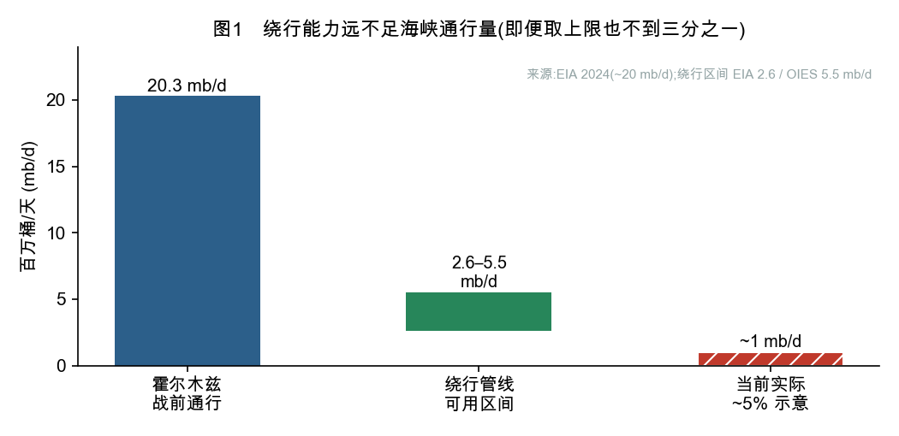
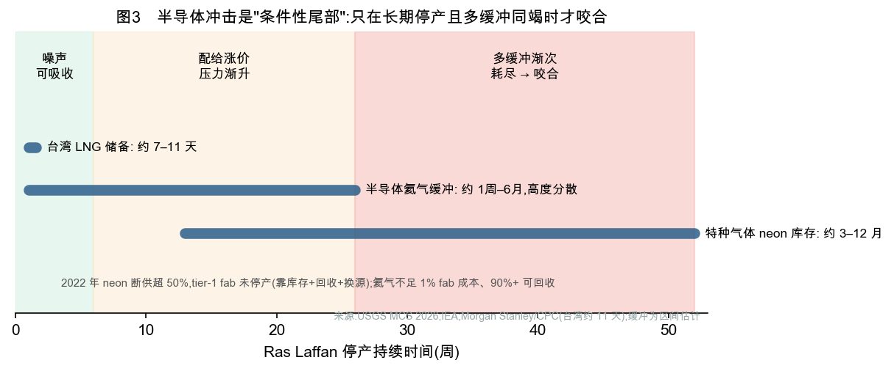
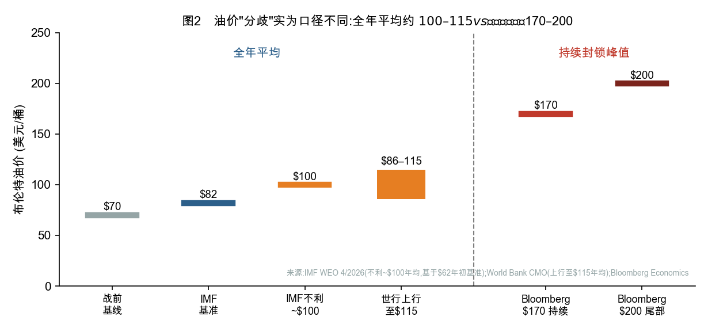
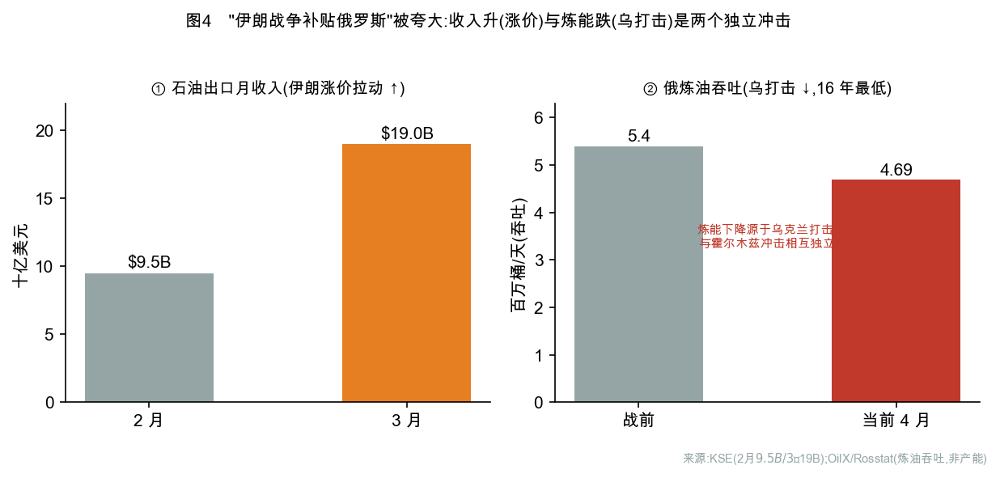

# 霍尔木兹海峡危机的全球供应链传导

**基线日期:2026 年 5 月 30 日**
*本报告评估 2026 年伊朗战争与霍尔木兹海峡通行中断对全球供应链的影响。数据以一手机构为准,媒体仅作旁证。全文区分【已发生的事实】与【基于机制的推断】。所有图表的底层数据经独立核查,口径与边界已在图注与正文标明。*

---

## 摘要

到 2026 年 5 月,霍尔木兹海峡的实际通行量已降至战前的约 5%。市场最初的直觉是:这场危机的严重程度,取决于伊朗如何使用这条海峡——是收费放行、武器化威胁,还是彻底封锁。

本报告的核心判断与此不同:**真正决定全球供应链损害大小的,不是伊朗的能力或意图,而是买方国家适应的速度。** 历史上每一次海上咽喉危机,最终都是"适应战胜封锁":船只绕道好望角、各国协调释放战略石油储备、电厂从天然气改烧煤、买家更换油种。守门人能抬高代价,但化解代价的是市场。

由这一判断出发,本报告给出两个不同于直觉的结论:

第一,**伊朗政权"维持"造成的长期损害,可能大于政权"崩溃"。** 一个理性的、靠收费维生的伊朗政权,有最强的动机维持海峡通行——因为不航行的船无法被收费。相反,政权崩溃最可能引来美国与海湾国家联合护航,反而更快重开海峡。

第二,**市场普遍高估了半导体环节的"灾难"。** 流行的"断气几周、芯片厂停产"叙事并不成立——氦气不到芯片厂成本的 1%、九成以上可回收,2022 年乌克兰氖气断供超过一半时,顶级芯片厂也没有停产。真正值得警惕的尾部风险是**条件性的**:只有当卡塔尔 Ras Laffan 设施长期(数个季度)停产、各类缓冲渐次耗尽时,氦气、液化天然气与航运成本才会**同时**压向台积电(TSMC)这一个节点。这个风险的结构性根源,是 Ras Laffan 同时是全球氦气与液化天然气的关键节点——一次打击同时击中多条链。

贯穿这两个结论的,是同一条主线:**在能源与供应链上,市场的适应能力往往强于直觉,灾难叙事则往往被高估。** 本报告反复出现的几处纠正——发电可以从天然气改回煤、红海航运早已改道好望角、"伊朗战争补贴俄罗斯"被夸大——都是这条主线的例证。

---

## 一、地理决定了什么

霍尔木兹海峡位于伊朗东岸,最窄处 33 公里,最深 90 米。战前,全球约 20 百万桶/天的海运原油经此通过,约占全球海运原油的 28–30%;同时通过的还有约占全球 20% 的液化天然气贸易([EIA,2024 年数据](https://www.eia.gov/todayinenergy/detail.php?id=65504))。其中 84% 的原油和 83% 的液化天然气运往亚洲。

地理是不变的。伊朗政权无论维持还是更迭,海峡都还在那里。政权状态改变的只是这条海峡的**使用方式**。理解这一点很重要,因为它纠正了一个常见的误解——以为伊朗政权一旦崩溃,海峡就会"恢复正常"。事实恰恰相反:海峡的物理位置不会消失,失去中央控制只意味着海上多了更多失控的变量。

更关键的是,海峡的绕行能力远不足以替代它。沙特的"东西输油管道"(Petroline)名义容量 7 百万桶/天,但 2025 年的实际运行量只有约 2.6 百万桶/天;阿联酋的 Habshan–Fujairah 管线可用约 1.5 百万桶/天。把两条管线的可用余量合起来,牛津能源研究所([OIES](https://www.oxfordenergy.org/publications/strait-of-hormuz-oil-shock-features-and-implications/))给出的乐观估计是 3.5–5.5 百万桶/天,而美国能源信息署([EIA](https://www.eia.gov/todayinenergy/detail.php?id=65504))给出的保守估计只有约 2.6 百万桶/天。即便取最乐观的上限,绕行能力也不到海峡通行量的三分之一(见图 1)。

OIES 的 Bassam Fattouh 和 Andreas Economou 指出了这场危机最根本的机制:这是一次**"缓冲受限"的供应冲击**。海湾产油国确有闲置产能,但**这些闲置的产能本身就困在海湾内部,出不了海峡**。换句话说,平时用来平抑油价的"安全阀"——欧佩克的闲置产能——这一次失灵了,因为它和被困的石油在同一侧。这就解释了为什么实际通行量会塌到 5%、为什么价格上限会被推得那么高。

---

## 二、决定损害的是买方,不是伊朗

把分析的焦点从"伊朗怎么用海峡"转到"买方多快能绕开",才能看清这场危机的真实结构。

原因在于,从伊朗的政治状态到全球供应链的实际表现,中间隔着太多买方可以主动干预的环节。一个有用的拆解是把传导分成三层,而不是设想一条从伊朗政治一路单向流下来的因果链:

- **第一层是物理基线**:海峡的地理、战前的流量、绕行管线的上限。这一层是给定的。
- **第二层是外生冲击**:这些事件可以独立于伊朗的政治状态发生。比如一艘油轮触雷或沉没(2019 年富查伊拉、2021 年 Mercer Street 号都是先例),几天之内就能引发保险费率和航运绕道的连锁反应,而伊朗革命卫队的指挥是否协调,在这里完全不相关。以色列的升级和美国的交战规则,也常常是触发事件,而非伊朗政治的下游结果。
- **第三层是市场的反身性**:一个**可信的威胁**就足以推高油价和保险费,无需任何实际封锁发生。预期本身就是一条传导通道。

这就是为什么"伊朗如何决策"虽然重要,却不是损害的主要决定因素。真正起作用的,是中国能多快动用战略储备、东亚能多快把发电从天然气改回煤、全球航运能多快把航线改到好望角。

---

## 三、为什么"维持"可能比"崩溃"更伤

一个反直觉但站得住的判断是:伊朗政权维持下去,对全球供应链的**长期**损害,可能大于政权崩溃。

理解这一点,可以借用经济学家曼瑟·奥尔森(Mancur Olson)的"坐寇"概念。一个四处劫掠的流寇,抢完就走;而一个定居下来、靠抽税维生的"坐寇",反而希望商队继续通过——因为他要靠持续的过路费养活自己。**一个靠收费维生的伊朗政权,正是这样的坐寇:它有最强的动机维持海峡通行,因为停航的船无法被收费。**

反过来,如果伊朗政权崩溃,最可能的结果不是海峡陷入无政府,而是**美国与海湾国家出面联合护航**。这有先例:1987–88 年美国为科威特油轮重新挂旗护航的"诚意行动"(Earnest Will),以及 2019 年的国际护航联盟。外部力量介入、巡逻、重开海峡,往往比一个敌对但理性的德黑兰更快让通行恢复。

所以两种情景的时间形状是相反的:**崩溃是一次尖锐但相对短暂的冲击,随后由外部力量强行恢复常态;而政权维持下的"收费 + 周期性扣船 + 制裁期保险摩擦",才是一种拖上数年的高摩擦状态。**

这里需要一个重要的限定,否则结论会走偏。上述"坐寇"逻辑只在**和平勒索**状态下成立。当伊朗进入**存亡战争**状态时(也就是 2026 年的当下现实),政权已经顾不上收费收入,通行量于是塌到战前的 5%,与伊朗"想不想"收费无关。

把这两种状态合起来看,结论就清楚了:**伊朗的意图只在和平时期决定通行量;一旦进入战争或崩溃,通行量的塌缩与伊朗的选择脱钩,此时决定损害大小的,只剩买方适应的速度。** 这正好回到本报告的核心判断。

---

## 四、五条供应链:现状与数据

**石油与天然气。** 通行量从战前的约 20 百万桶/天降到战时的约 5%;布伦特油价从战前约 70 美元升到战时峰值约 120 美元。中国是名义上暴露最大的买家——约一半的石油进口经过海峡——但它同时也是韧性最强的(详见第六节)。

**航运与保险。** 海峡日通行船只从战前的约 178 艘降到 9–15 艘。私人保险市场一度无法独立承保,美国国际开发金融公司(DFC)紧急投入 400 亿美元滚动再保险设施,劳合社首席执行官 John Neal 公开了 200 亿美元的 DFC–Chubb 后盾安排([《Insurance Journal》2026-03-19](https://www.insurancejournal.com/news/international/2026/03/19/862608.htm))。

**国防工业。** 美方在这场战争中消耗了约 45% 的精确打击导弹(PrSM)、约 50% 的"萨德"(THAAD)和约 50% 的"爱国者"拦截弹([CSIS《Last Rounds》报告,Cancian & Park](https://www.csis.org/analysis/last-rounds-status-key-munitions-iran-war-ceasefire))。伊朗一侧弹道导弹库存被打掉约一半、发射架损毁 70%、海军舰艇损毁 92%([RAND,Raphael Cohen,2026-04](https://www.rand.org/pubs/commentary/2026/04/trumps-iran-war-is-a-dilemma-not-a-debacle.html))。不过捍卫民主基金会(FDD)的 Mark Dubowitz 评估,伊朗的导弹产能在六个月内可恢复到每年 2000–3000 枚。

**半导体。** 这一环最容易被误判,既被高估也被错置,详见第五节。

**金融管道。** 美国财政部已制裁伊朗全部主要银行;英法德三国在 2025 年 10 月触发了对伊核协议下的"快速恢复制裁"(snapback)。伊朗与中国的双边结算大部分通过人民币跨境系统完成。但这是否动摇美元的根基,见第六节的讨论。

---

## 五、半导体:被高估的"灾难",和真正的条件性尾部

在所有传导链里,半导体是叙事与事实差距最大的一环。流行的说法是:卡塔尔氦气一断,芯片厂几周内停产,人工智能经济随之瘫痪。深入考察后,这个说法在两个层面都需要修正。

**第一,把"灾难"放在了错的尺度上。** 氦气在芯片制造中确实重要(用于冷却、检漏、光刻惰性气氛),且大多无法用别的气体替代。但关键事实是:氦气的成本不到一座芯片厂运营成本的 1%([USGS《矿产品概要 2026》](https://pubs.usgs.gov/periodicals/mcs2026/mcs2026-helium.pdf)),而且**九成以上可以回收再用**——这正是顶级芯片厂应对短缺的主要手段。一种占成本不到 1%、又能大量回收的投入,即便价格涨上几倍,也是被吸收,而不是让生产停摆。

历史提供了最有力的检验。2022 年俄乌战争切断了乌克兰对全球约 45–54% 的半导体级氖气供应([CNBC,2022-03](https://www.cnbc.com/2022/03/12/russias-attack-on-ukraine-halts-half-of-worlds-neon-output-for-chips.html)),但台积电、英特尔、三星**都没有停产**——因为业界在 2014 年克里米亚危机后已经降低了氖气用量,并在气体供应商和芯片厂两端各囤了 3 到 12 个月的库存。2026 年的氦气冲击(移除全球约三分之一供应、且可回收),从结构上比 2022 年的氖气冲击(超过一半、当时更难回收)还要温和。

还有一个必须点破的误解:2026 年内存芯片价格的飙升(DRAM、NAND 合约价单季涨五到九成),主要是**人工智能需求**驱动的,这股涨势在 3 月霍尔木兹冲击之前就已开始([TrendForce](https://www.trendforce.com/presscenter/news/20260331-12995.html))。把内存涨价归因于氦气,是一个时间次序上的错误。

**第二,真正的尾部风险是条件性的,而且根源在"双节点"。** 说半导体灾难被高估,不等于说没有风险。真正值得警惕的,是一种**多条链同时压向同一节点**的小概率情景。卡塔尔的 Ras Laffan 设施,同时是全球氦气和液化天然气的关键出口节点——一次打击,同时击中两条链。如果停产持续足够久,各类缓冲会**渐次**耗尽:台湾的液化天然气储备只有约 7–11 天([Morgan Stanley / 台湾中油](https://finance.yahoo.com/news/morgan-stanley-taiwan-11-day-005848190.html)),芯片厂的氦气缓冲从约一周到六个月不等(高度分散),氖气库存约 3 到 12 个月。只有当这些缓冲在一次长期停产中**先后见底**,氦气配给、台湾电力紧张、霍尔木兹航运成本才会同时压向台积电——这是能源成本、工艺气体、物流三重冲击叠加在一个全球算力经济都依赖的节点上(见图 3)。

诚实的结论是:**这是一个条件性的、渐进的尾部风险,只在 Ras Laffan 长期(超过两个季度)停产时才会咬合,而不是一个数周内就兑现的灾难。** 对一次六周的中断,回收、库存和优先供电足以化解。把它当作迫在眉睫的基准情景,是错的;把它当作"双节点 + 长期停产"条件下值得防范的相关性风险,是对的。

---

## 六、专家意见的分歧与本报告的判断

在几个关键问题上,严肃的分析者意见并不一致。厘清这些分歧,是判断的基础。

**油价会涨到多高?** 表面上各机构数字差异很大,但这些差异大多来自**口径不同**,而不是实质分歧(见图 2)。世界银行《大宗商品市场展望》给出的严重情景是 2026 年**全年均价**上行至 115 美元([World Bank CMO,2026-04](https://www.worldbank.org/en/news/press-release/2026/04/28/commodity-markets-outlook-april-2026-press-release));国际货币基金组织(IMF)的不利情景是在 2026 年初约 62 美元的基准上**上调 80%**,对应**全年均价约 100 美元**([IMF《世界经济展望》2026-04](https://www.imf.org/en/publications/weo/issues/2026/04/14/world-economic-outlook-april-2026));彭博经济研究的情景阶梯则给出 110 美元"可控"、170 美元"翻倍"、200 美元"尾部"——其中 200 美元明确以"海峡长期关闭"为前提。把口径对齐后,各家是一致的:**全年平均**油价落在约 100–115 美元,而**持续封锁下的峰值**可达 170–200 美元;一个全年均价 115 美元,完全可以包含年内某段时间冲到 170–200 美元的尖峰。其中 OIES 的分析最为根本,因为它解释了价格上限为何这么高——平抑油价的闲置产能被地理困住了。

**人民币结算会动摇美元吗?** 美国外交关系协会(CFR)的 Brad Setser 的判断是:不会。他指出,所谓"石油美元"在很大程度上是一个迷思。2025 年海湾国家加挪威的石油顺差已萎缩到约 2000 亿美元(沙特本身甚至出现了 330 亿美元的财政赤字),相比制造业亚洲 1.5 万亿美元的顺差微不足道([CFR,Setser](https://www.cfr.org/article/petrodollars-myth-and-reality))。美元的根基是亚洲制造业顺差经由中国国有银行和离岸美元市场的循环,而不是石油用什么货币计价。本报告采纳这一判断:伊朗与中国的人民币结算,是一次成功的制裁规避,也在全球南方边缘侵蚀着美元份额,但它把成本压在了中国央行的资产负债表上,触不到美元的核心。沙特出现财政赤字这一事实,本身就是最有力的佐证——"石油美元"的所谓锚定国,如今是美元的净消费者。

**中国是最脆弱还是最有韧性的买家?** 答案是:两者同时成立,因为这是两个不同维度的事实。从流量看,中国是暴露最大的——约 45–50% 的石油进口经过海峡。但从缓冲看,中国是韧性最强的,而这份韧性来自多年刻意的布局:
- 绕开所有海上咽喉的**陆上管线**——俄罗斯的 ESPO 管道(中国第一大供应来源,约占进口 20%、超过 2 百万桶/天)、哈萨克斯坦和缅甸的管线,合计约 1.5 百万桶/天,2025 年在岸管线占比已达 38%([Vortexa](https://www.vortexa.com/insights/chinas-crude-import-stress-resistance));
- 约 13.9 亿桶的**战略石油储备**,约相当于 120 天的净进口,且其中很大一部分是用打了折扣的受制裁原油(伊朗、俄罗斯、委内瑞拉)便宜囤起来的;
- 以**煤炭为主的电网**——这意味着油气中断打击的是交通,而非电力,这是中国韧性的结构性底座;
- 作为绝望的受制裁伊朗的边际买家,中国还握有压价的议价权。

OIES 的中国能源专家 Michal Meidan 给出的限定很重要:这份韧性是"昂贵的冗余加上行政管控"换来的,并非免费,而且并不均衡(例如靠缅甸管线供油的云南炼厂,库存只有约一个月)。综合判断:**中国是大进口国中对冲最充分的,而不是最脆弱的;真正结构上更糟的是日本(约 90–95% 的原油经海峡)和韩国(约 70%)。**

**海峡收费是一门可持续的生意吗?** 大西洋理事会的报告记录了伊朗对每艘船收取约 200 万美元"过路费"的做法([Atlantic Council《Tehran's Toll Booth》](https://www.atlanticcouncil.org/dispatches/inside-tehrans-toll-booth/))。但把这笔费用乘以战前的通行量,得出每年数百亿美元的收入,是一个站不住的推算——因为危机本身已经把通行量压到每天约 10 艘,而不是上百艘。这里有一个自我限制的逻辑:**收费高到足以当武器,就会压垮产生收入的流量。** 作为间歇性的胁迫手段,收费是可持续的;作为石油出口收入的财政替代,它不可持续。

**保险是一件武器吗?** 有观点认为,伊朗无需真正关闭海峡,只要注入足够的不确定性使保险无法定价,"无法投保"本身就成了事实上的封锁。但劳合社市场协会(LMA)在开战后一周的调查给出了相反的证据:88% 的战争险承保人维持了承保意愿,船东互保(P&I)责任险不可撤销且仍在伦敦再保。LMA 的结论是——**驱使船只减少通行的是船员安全顾虑,而非保险买不到**([LMA](https://lmalloyds.com/safety-concerns-not-insurance-availability-driving-reduced-vessel-traffic-in-the-strait-of-hormuz/))。据此,保险更应被理解为一条**传导介质**:真正的武器是对船只本身的威胁,保险费率飙升只是这一威胁的症状。

**哪些环节能替代,哪些不能?** 大致分三档:
- **无法替代**:氦气,以及非发电用途的液化天然气分子本身——它们没有替代来源,也没有绕开海峡的航路(但如第五节所述,无法替代不等于无法回收、配给和优先分配)。
- **可以替代但很慢**:用于**发电**的液化天然气可以改烧煤——韩国已取消燃煤电厂 80% 利用率上限、日本提高了燃煤发电率、台湾恢复采购燃煤电力。但这是"慢"的替代:需要解除管制、重启封存产能、承受排放代价。这里有一个必须守住的区分:**"发电可以改烧煤"绝不等于"液化天然气中断可控"**——它对发电可控,对石化原料、半导体工艺气和氦气则完全不可能。
- **名义上可替代,但被政策锁住**:化肥。全球名义产能(2.4 亿吨)高于需求(1.85 亿吨),但可调用的余量被中国的出口禁令锁住了。

---

## 七、几个容易被误判的二阶效应

**伊朗战争是否在补贴俄罗斯?** 这个说法流传很广,但需要谨慎对待。伊朗战争推高油价,确实给俄罗斯带来了一次性的月度收入跳升——2026 年 3 月俄罗斯石油出口收入达 190 亿美元,而 2 月仅为 95 亿美元([基辅经济学院,2026-04](https://kse.ua/about-the-school/news/russian-oil-tracker-april-2026-russias-oil-revenues-nearly-doubled-in-march-amid-the-war-in-iran/))。但与此同时,**乌克兰对俄罗斯炼油设施的持续打击,已把俄罗斯的炼油吞吐量压到 469 万桶/天——2009 年以来的 16 年最低点**([Euromaidan Press / OilX,2026-05](https://euromaidanpress.com/2026/05/27/russia-jet-fuel-export-ban-refineries-16-year-low/)),俄罗斯被迫禁止航空煤油出口。这里有一个关键的区分:**收入上升(因伊朗涨价)和炼能下降(因乌克兰打击)是两个相互独立的冲击,后者并非伊朗战争造成的**(见图 4)。卡内基国际和平基金会的 Sergey Vakulenko 直接比较了这两股力量,结论是二者大体相互抵消([Carnegie](https://carnegieendowment.org/russia-eurasia/politika/2026/04/russia-oil-gains-losses))。更重要的是,这次涨价并不改变俄罗斯的结构性困境:它需要全年布伦特均价达到约 115 美元才能不削减 2026 年预算,而这不会发生;同期俄军在战场上也表现不佳,夏季攻势开打数周即停滞、5 月净失土约 259 平方公里。因此,**"伊朗战争补贴俄罗斯"的干净说法是夸大的:价格红利是真实的,但短暂、有争议、且与乌克兰造成的炼能损失并行,既不改变俄罗斯的财政挤压,也不改变其战场颓势。**

**红海已经改道。** 需要强调的是,经由红海/苏伊士的航运中断,**不是一个未来的假设,而是已经发生并被消化的现实**。到 2026 年 5 月,约 60–70% 的亚欧航运已改走好望角,地中海航运公司(MSC)、达飞(CMA CGM)等主要航运公司已把好望角作为常态化的网络设计,而非应急方案。这一点很重要:两年来世界经济在红海大幅改道的情况下照常运转,这恰恰是反对"灾难论"极端情景的直接证据——市场对部分咽喉关闭的适应能力,比悲观预期要强。

---

## 八、时间维度

对决策者而言,唯一重要的区分是"可以挺过去的尖峰"还是"结构性的断裂",而这完全取决于时间尺度:

- **数天到数周**:油价和保险费率重新定价(由预期驱动,先于任何物理封锁);
- **数周到数月**:航运改道与战略储备释放开始缓冲(中国的 120 天储备、东亚的煤电切换、好望角绕行);
- **数月到数年**:替代供应、新产能和需求破坏开始发挥作用。需要特别指出,高价本身会摧毁需求、诱导替代——这正是 2008 年和 2022 年阻止油价冲上 200 美元的自我限制机制。忽略这一点,会系统性地高估所有价格预测。

---

## 九、本报告判断可能错在哪

诚实地列出本报告判断的边界条件:

- "维持比崩溃更伤"是一个基于机制的推断,而非可建模的预测;它依赖于"政权崩溃会引来外部护航"这一假设,而崩溃也可能走向真正的无政府(无人愿意介入)。
- "半导体灾难被高估"成立于一次**六周量级**的中断;若 Ras Laffan 停产拖到数个季度,各类缓冲渐次耗尽,条件性尾部就会从"可吸收"滑向"咬合"——本报告对这一转折点的时间估计本身有较宽的误差带。
- "伊朗决策连贯性"在现实中几乎无法实时观测,因此本报告刻意不把它当作一个可测量的驱动变量。
- 几乎所有的伤亡与产量数字都有争议;本报告以方向性而非精确值作为论证支点,图表中凡区间估计均已标明。

---

## 结论

第一,决定供应链损害大小的是买方适应的速度,而不是伊朗的能力或意图。守门人能抬高代价,化解代价的是市场。

第二,伊朗政权"维持"下的长期摩擦,可能比"崩溃"造成更大的累积损害——理性的收费者有动机维持通行,而崩溃会引来外部护航更快重开。但在当前的存亡战争状态下,通行量的塌缩已与伊朗的选择脱钩。

第三,半导体的"灾难"被市场高估;真正的尾部是条件性的——只有在 Ras Laffan 长期停产、氦气与液化天然气两条链同时受困时,才会压向台积电这一节点。

第四,中国是大进口国中对冲最充分的,而非最脆弱的;真正更脆弱的是日本和韩国。

第五,"伊朗战争补贴俄罗斯"被夸大了,"红海改道是未来风险"则已经是过去式——这两点和半导体一样,都提醒我们:市场的适应能力往往强于直觉,灾难叙事则往往被高估。

---

## 主要信源与分析师

牛津能源研究所(Bassam Fattouh、Andreas Economou、Michal Meidan)· 美国外交关系协会(Brad Setser)· 哥伦比亚全球能源政策中心(Erica Downs)· 战略与国际研究中心(Mark Cancian、Chris Park)· 兰德公司(Raphael Cohen)· 捍卫民主基金会(Mark Dubowitz)· 劳合社市场协会及其首席执行官 John Neal · 卡内基国际和平基金会(Sergey Vakulenko)· 美国地质调查局(USGS《矿产品概要 2026》)· 世界银行《大宗商品市场展望》· IMF《世界经济展望》· 国际能源署 · 美国能源信息署 · Vortexa · 基辅经济学院 · 大西洋理事会地缘经济中心 · Morgan Stanley / 台湾中油。

*本报告为概率与机制分析,非确定性预测。所有图表底层数据经独立核查,口径与区间已在图注标明。*
