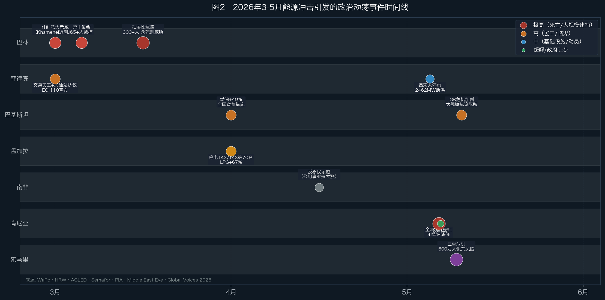
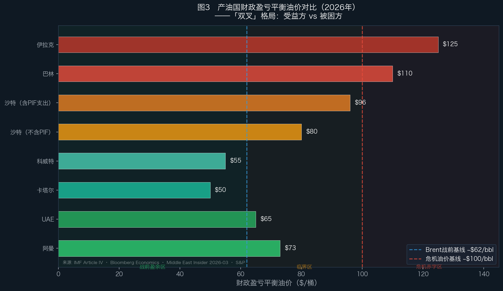
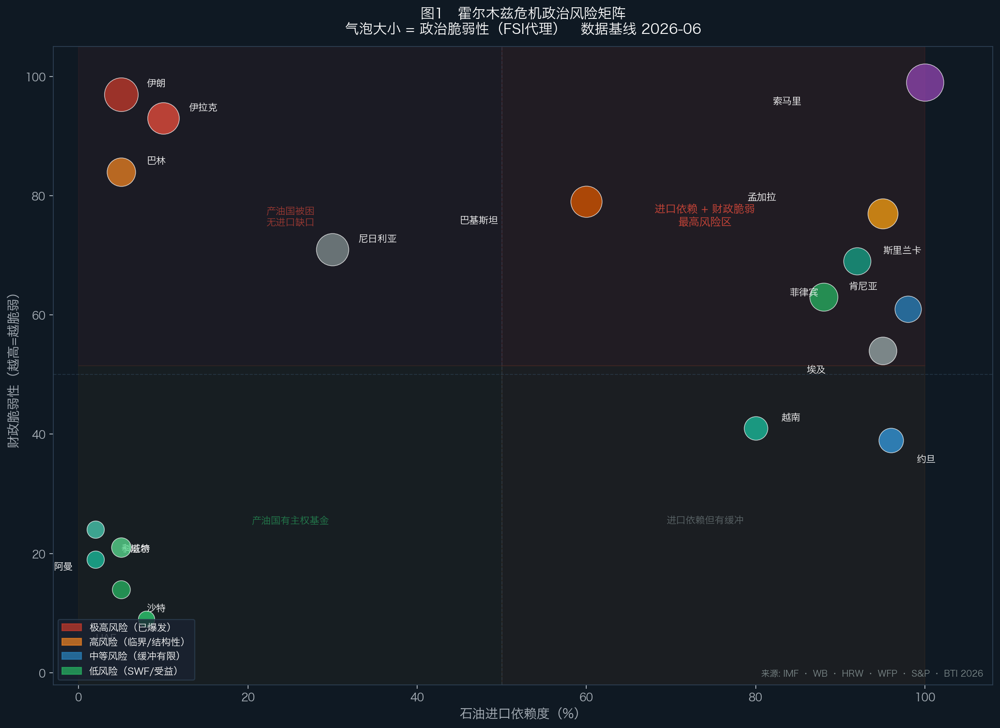

# 报告 04 · 霍尔木兹持续中断的政治动荡风险

**数据基线 2026-06-02 · 假设情景：海峡通行量持续约战前 5%（≤1 mb/d，日均 ~10 艘 vs 战前 125-140 艘）12-24 个月不缓解**

---

## 0. 方法论与信源纪律

本报告严格区分两类陈述，全文标注：

- **【事实】**——已发生、有具名信源的事件（抗议、紧急状态、价格变动、死亡数）。
- **【推演】**——基于机制 + 前提的风险评估，非确定性预测。

**核心方法论立场**：政治动荡的时点几乎不可预测（取决于触发事件、镇压决策、反对派组织度）。本报告能可靠陈述的是**哪些国家的"干柴"已经堆好**，以及**哪些已经在燃烧**；不能、也不假装能说哪个月点火。

每个具体数字都附信源。无法核实的，明确标注"未找到"或"单一来源，存疑"。

---

## 1. 执行摘要

**五条核心判断：**

**1. 政治动荡不是"会不会"，部分已经是"正在"。** 伊朗、巴基斯坦、菲律宾、孟加拉、巴林、斯里兰卡均已出现危机驱动的动荡或紧急状态。2026年3-5月之间，肯尼亚爆发4人死亡的全国性燃油抗议，巴林超过300人遭扫荡性逮捕，索马里600万人面临饥荒风险。至少60国采取了紧急能源措施。

**2. 动荡风险不与经济冲击成正比。** 它取决于四要素的交集：冲击大 × 镇压能力弱 × 既有脆弱 × 无外部缓冲。这把最高风险指向两端——无缓冲产油国和最穷进口国——而非受冲击最大的富裕大国。GDP 受损最深的科威特（−14%，Goldman Sachs）和卡塔尔，恰恰有最厚的主权基金缓冲；没有 SWF（主权财富基金，国家财政盈余的长期储备基金）的伊拉克，反而是政治风险最集中的。

**3. 关键分析修正：产油国是"双叉冲击"，不是统一的"财政崩塌"。** 能绕开海峡的（沙特经 Petroline（沙特东西输油管道，将波斯湾原油输往红海沿岸出口终端）、阿曼靠地理）在高油价下是财政 windfall；真正财政崩 + 政治风险的只有 Hormuz-trapped + 无主权基金缓冲 + 教派断层的三国：**伊朗、伊拉克、巴林**（见图3）。

**4. 伊朗"幸存但削弱"是共识，不是崩溃。** Polymarket 隐含 2026 年内政权倒台概率约 15%。真实的不稳定形态是**精英内部解体**（派系争夺 + 继位危机），而非教科书式的"财政崩→群众推翻"。政权在 2026 年 1 月镇压（死亡数中位估计约 30,000）后反而**强化**了控制。

**5. 最被低估的传导渠道是化肥→粮食。** 霍尔木兹承运约 25% 全球尿素海运量；世界银行 CMO（2026-04-28）显示综合化肥指数年内已涨 31%，尿素 4 月突破 $850/吨（+80%）。WFP 模型估计：若油价持续 >$100 到 2026 年中，将有 **4500 万人**新增陷入急性粮食不安全（IPC 3+，粮食不安全阶段分类，3+ 即"危机"或更高，意指无法维持最低食物需求）——这是把撒哈拉以南和南亚最穷国拉进危机的主渠道，而非仅仅燃油涨价。

---

## 2. 核心机制框架：四条传导链

政治动荡通过四条机制从霍尔木兹传导到国内政治。一个国家可能同时被多条击中。

### 机制 ① 燃料短缺 → 交通/经济瘫痪 → 街头暴力

最快，已大规模爆发。石油高度进口依赖 + 储备薄 + 财政弱的国家首当其冲。

- **【事实】** 肯尼亚 EPRA 于 2026 年 4 月上调燃油价格 24.2%、5 月再上调 23.5%（柴油 +Sh46.29/升，汽油 +Sh16.65/升）。2026 年 5 月 18 日，全国性抗议爆发，4 人死亡，30+ 人受伤，内罗毕、蒙巴萨、基苏木"全面瘫痪"（[WaPo 2026-05-18](https://www.washingtonpost.com/business/2026/05/18/kenya-fuel-prices-protests/)；[ACLED 记录首日 ≥8 死](https://www.semafor.com/article/05/20/2026/kenya-cuts-fuel-prices-after-deadly-protests)）。
- **【事实】** 巴基斯坦 2026 年 4 月起全国燃油涨价超 40%；全国市场强制晚 8 点关门；国家能源紧急状态实际执行（[Wikipedia, Pakistan in 2026 Iran war](https://en.wikipedia.org/wiki/Pakistan_in_the_2026_Iran_war)）。
- **【事实】** 菲律宾 2026 年 3 月底交通工人全国罢工，70,000 人参与，马尼拉 15-20 个中心瘫痪；马科斯于 2026 年 3 月 24 日宣布 EO 110 全国能源紧急状态（[PNA](https://www.pna.gov.ph/articles/1271702)）。

**学术先例：** [Atlantic Council（Webster/I'Anson 2026-04-21）](https://www.atlanticcouncil.org/dispatches/the-strait-of-hormuz-closure-forces-a-choice-ration-oil-now-or-pay-a-steep-price-later/)明确援引哈萨克斯坦 2022 年 LPG 补贴骤撤案例——"几乎立即触发全国抗议和政治不稳"；安哥拉 2025 年 IMF 支持的燃油补贴削减（柴油 +33%）触发全国抗议，约 30 人死亡，1500+ 人被捕（[HRW 2025-07-18](https://www.hrw.org/news/2025/07/18/angola-police-use-excessive-force-against-peaceful-protesters)）。

### 机制 ② 粮价飙升 → 面包暴动（经典机制）

学术基础最扎实。**[NECSI / Lagi et al. (2011)](https://arxiv.org/abs/1203.1313)** 给出 FAO 食品价格指数约 210 的阈值（*非同行评审；须与同行评审的局部价格冲击文献并用*）。2007-08 和 2010-11（阿拉伯之春前夜）的暴动峰值与价格峰值高度吻合。

**【事实】世界银行（CMO 2026-04-28）量化核心脊柱：食品占低收入国家消费 43%（vs 新兴市场 25%、发达国 12%）。** 这是为什么最穷进口国的动荡风险最集中的量化基础。

**【事实】化肥传导：**

| 肥料品种 | 2026 年涨幅 | 霍尔木兹传导机制 | 来源 |
|---------|------------|----------------|------|
| 综合化肥指数 | **+31%** | 伊朗/卡塔尔产能受损+天然气成本 | [世行 CMO 2026-04-28](https://www.worldbank.org/en/news/press-release/2026/04/28/commodity-markets-outlook-april-2026-press-release) |
| 尿素 | **+60-80%**（4月超$850/吨） | 海运量损失~25%；中国限出口 | [世行博客 2026-05-14](https://blogs.worldbank.org/en/opendata/fertilizer-prices-surge-as-strait-of-hormuz-disruptions-tighten-) |
| DAP | **+10%**（4月单月） | 同上 | 世行博客 2026-05-14 |
| MOP | **+17%**（同比） | 同上 | 世行博客 2026-05-14 |

**【推演，条件明确】WFP（2026-03-17）估计：若冲突不在 2026 年中期结束且油价维持 $100 以上，将有 4500 万人新增陷入急性粮食不安全（IPC 3+）。** 区域分布：东/南非 1770 万、西/中非 1040 万、亚洲 910 万、中东北非 520 万、拉美/加勒比 220 万。全球基线已有 3.18 亿人，若叠加将达 3.63 亿——历史最高（[WFP 2026-03-17](https://www.wfp.org/news/wfp-projects-food-insecurity-could-reach-record-levels-result-middle-east-escalation)）。

世界银行 CMO（2026-04-28）在同一情景下给出结构相似的判断：预计 2026 年发展中国家粮食价格上涨 4–8%，与 WFP 的人口规模推算**方向一致**，两者相互印证数量级可信（尽管具体数字分别基于不同模型和假设，不能直接叠加）。

### 机制 ③ 财政崩 → 发不出工资/补贴 → 政权不稳

**仅适用于无缓冲产油国。** 不适用于沙特、UAE、科威特（均有主权基金）。

**【事实】伊拉克财政数字：**
- 2026 年 2 月石油收入：$68 亿；3 月骤降至 **$19.6 亿**，单月跌幅 >70%
- 月度工资+养老金+社会福利支出：8 万亿伊拉克第纳尔（约 $54.5 亿/月）
- 公共部门依赖人口：442 万在职雇员 + 300 万退休人员 + 300 万社保受益人，共超 1050 万人（约占总人口 25%）
- 全年薪酬义务：约 $700 亿；中央银行外汇储备：约 $1000 亿（覆盖 11 个月进口）
- S&P 于 2026 年 3 月 19 日将伊拉克 B- 评级列入**负面信用观察**（CreditWatch Negative，标普将评级列入"负面观察"，意指近期可能下调）
- IMF 预测 2026 年经济萎缩 **−6.8%**，较 10 月预测下调超 10 个百分点

（[The National 2026-05-11](https://www.thenationalnews.com/business/energy/2026/05/11/iraqs-pm-designate-confronts-worst-fiscal-crisis-in-decade-after-iran-war-oil-shock/)；[S&P 2026-03-19](https://www.spglobal.com/ratings/en/regulatory/article/-/view/type/HTML/id/3532323)）

**重要【事实修正】：** 截至 2026-06-02，伊拉克工资危机**尚未实际爆发**。财政部已向国有银行提款约 $180 亿应急；国会提案设立"工资稳定基金"；3-4 月工资靠战前油款收入（2-3 个月滞后）维持。"真正的清算时刻"被预测在 2027 年初（The National）。报告中应表述为"财政压力已临界，危机正在逼近"，而非"工资危机已发生"。

### 机制 ④ 教派激活（跨国动员）

亲伊朗什叶动员，2026 年已激活。

- **【事实】** 巴基斯坦 Gilgit-Baltistan（Gilgit/Skardu/Shigar）亲伊朗什叶抗议致命（13-24 死，来源不一）；UN 军事观察员办公室被焚；军队按第 245 条款部署 + 3 天宵禁（[Al Jazeera 2026-03-02](https://www.aljazeera.com/)）。
- **【事实】** 巴林 Khamenei 遇刺后多城爆发罕见骚乱；2026 年 3 月 1 日大规模示威；内政部 3 月 5 日宣布禁止一切集会（[Middle East Eye 2026-03-05](https://www.middleeasteye.net/news/war-iran-ignited-civil-unrest-bahrain)）。

---

## 3. 已发生的政治动荡（事实层）

完整事件时间线见**图2**。主要事件逐一标注来源：

| 国家 | 已发生【事实】 | 信源 |
|---|---|---|
| **伊朗** | 2026 年 1 月抗议遭历史最大规模镇压，死亡数中位估计 ~30,000（hospital records）；政权"指挥危机"；继位 Mojtaba Khamenei（受伤、经 IRGC 中介沟通） | [Wikipedia 2026 Iran massacres](https://en.wikipedia.org/wiki/2026_Iran_massacres)；[Amnesty（2026-01）](https://www.amnesty.org/en/latest/news/2026/01/iran-massacre-of-protesters-demands-global-diplomatic-action-to-signal-an-end-to-impunity/)；[HRW 2026-01](https://www.hrw.org/news/2026/01/08/iran-authorities-renewed-cycle-of-protest-bloodshed) |
| **巴林** | 3月1日什叶派大示威；3月5日禁止集会；3月19日"扫荡性逮捕"超300人（含死刑威胁，最高刑为"间谍罪"）；在押者 Sayed al-Musawi 死亡，显示酷刑痕迹；5月3日 HRW 报告镇压蔓延至经济抗议 | [HRW 2026-03-19](https://www.hrw.org/news/2026/03/19/bahrain-sweeping-arrests-amid-conflict)；[HRW 2026-05-03](https://www.hrw.org/news/2026/05/03/bahrain-end-media-repression) |
| **巴基斯坦** | Gilgit-Baltistan 教派抗议致命（13-24死）；军队部署 + 3天宵禁；UN观察员办公室被焚；4月起燃油+40%；GB 2026-05-31 仍处于"政治、经济、人道三重危机" | [Al Jazeera 2026-03-02](https://www.aljazeera.com/)；[Daily Guardian 2026-05-31](https://thedailyguardian.com/world/pakistan-accused-of-deepening-crisis-in-pojk-pogb-amid-mounting-public-anger20260531135840-702342/) |
| **菲律宾** | 2026-03-24 宣布全国能源紧急状态（EO 110）；PISTON（菲律宾公共交通组织全国联盟，菲律宾最大运输工会）罢工7万人；马尼拉15-20个中心；5月13日吕宋电网大停电（2462MW断供）；938个加油站纳入补贴运营 | [PNA EO 110](https://www.pna.gov.ph/articles/1271702)；[PIA 2026-05](https://pia.gov.ph/press-release/doe-enforces-emergency-measures-to-keep-power-stable-protect-consumers-from-price-spikes/) |
| **孟加拉国** | 燃料黑帮夜间抢油，加油站工人被杀；大学提前停课；143台发电机中70台停运；LPG价格+67%；2026-02-12 BNP压倒性胜选，新政府在危机中接掌——"脆弱蜜月期" | [Wikipedia 2026 Iran war fuel crisis](https://en.wikipedia.org/wiki/2026_Iran_war_fuel_crisis)；[CNN（链接待核实）]；[The Daily Star 2026-04（燃料危机）](https://www.thedailystar.net/news/bangladesh/news/fuel-price-hike-lays-bare-stress-economy-4155731) |
| **肯尼亚** | **5月18日全国抗议爆发：4死、30+伤，内罗毕/蒙巴萨/基苏木"全面瘫痪"**；全国交通罢工；执政党办公室被焚；安全部队用实弹；政府5月20日让步削减柴油价格（财政损失$2100万） | [WaPo 2026-05-18](https://www.washingtonpost.com/business/2026/05/18/kenya-fuel-prices-protests/5318a2c0-5291-11f1-9c40-7a0a12d9e745_story.html)；[Semafor 2026-05-20](https://www.semafor.com/article/05/20/2026/kenya-cuts-fuel-prices-after-deadly-protests)；[S&P Global 2026-05-18](https://www.spglobal.com/energy/en/news-research/latest-news/crude-oil/051826-kenya-hit-by-protests-over-rising-fuel-prices) |
| **斯里兰卡** | 四天工作周（周三定假）；燃料价格大涨；储备约6周；IMF EFF（扩展融资工具，IMF 针对结构性收支问题提供的中长期贷款）要求取消补贴而非扩大 | [Tamil Guardian（四天工作周）](https://www.tamilguardian.com/content/sri-lanka-imposes-four-day-week-fuel-crisis-fears-mount)；[WSWS 2026-03-28](https://www.wsws.org/en/articles/2026/03/28/hzkz-m28.html) |
| **索马里** | 燃油 +150%（$0.60→$1.50/L）；旱灾+燃油+冲突三重叠加；600万人急性饥饿，200万儿童急性营养不良；近临饥荒 | [Global Voices 2026-05-28](https://globalvoices.org/2026/05/28/somalia-drought-fuel-prices-and-conflicts-heighten-famine-risk/)；[Save the Children 2026](https://www.savethechildren.org/us/about-us/media-and-news/2026-press-releases/somalia-emergency-escalates-middle-east-conflict-prices) |
| **尼日利亚** | 泵价+65%（全非最高），尽管是最大产油国；补贴已于2023-05取消（无补贴缓冲）；2720万人危机级饥饿（全球最高，联合国） | [Peoples Dispatch 2026-04-07](https://peoplesdispatch.org/2026/04/07/why-is-nigeria-africas-largest-oil-producer-facing-the-continents-highest-reported-rise-in-fuel-prices/) |
| **埃及** | 2026-03-10 国内燃油+14-17%；强制零售9pm关门一个月；**面包价格防火墙守住**（2025/26补贴约$30亿） | [The National 2026-03-10](https://www.thenationalnews.com/) |
| **越南** | 能源配给+居家办公；gig工人受油价翻倍冲击 | [Soufan Center 2026-04-15](https://thesoufancenter.org/intelbrief-2026-april-15/) |
| **南非** | 反移民示威（公用事业费大涨、失业率31%为底层触发）；ACLED 5月非洲报告记录 | [ACLED Africa May 2026](https://acleddata.com/update/africa-overview-may-2026) |
| **莫桑比克/科摩罗** | 燃油抗议已现 | [ACLED Africa May 2026](https://acleddata.com/update/africa-overview-may-2026)；[Responsible Statecraft（非洲燃油抗议）](https://responsiblestatecraft.org/diesel-fuel-protests-africa/) |

*图注：横轴为时间（2026年3-6月），纵轴为国家，气泡大小代表严重程度（从左向右：巴林、菲律宾/巴基斯坦、孟加拉、南非、肯尼亚、索马里）。来源：WaPo·HRW·ACLED·Semafor·PIA·Middle East Eye·Global Voices 2026。*

---

## 4. 关键分析修正：产油国的"双叉冲击"

**简化框架"产油国财政崩→动荡"是错的。** 霍尔木兹关闭对产油国是双刃，取决于能否绕开海峡。

*图注：横柱图显示各产油国财政盈亏平衡油价，蓝色虚线为战前基准 ~$62/bbl，红色虚线为危机期间基准 ~$100/bbl。沙特分两口径：不含 PIF 约 $80、含 PIF 支出约 $96。来源：IMF Article IV · Bloomberg Economics · Middle East Insider 2026-03 · S&P。*

### 4.1 Windfall / 被保护组（高油价净受益）

**沙特：** Petroline（东西输油管道）5 mb/d 通往红海，实际运行约 2.6 mb/d → 可在高油价下近满产出口。分析师估 2026 财政盈余约 $420-480 亿（自 2014 年以来最大）【推演】。财政盈亏平衡：狭义约 $80（IMF）、含 PIF 支出约 $96-108（Bloomberg Economics）。PIF ~$1.15T 锚定食利契约 + 强安全国家。

**阿曼：** Duqm/Mina al-Fahal/Salalah 出口路线全在海峡外（阿曼湾侧）；盈亏平衡已从 2021 年的约 $85 砍到约 $65；S&P 称其"财政健康 + 战略位置"有助抵御冲突。Ibadi 多数社会无逊尼-什叶断层 → 八国中动荡风险最低。

### 4.2 Trapped 但有缓冲组（GDP 受损但政治稳）

**UAE：** ADIA 约 $1.1T + 阿布扎比三基金 >$1.7T（最高缓冲）；Habshan-Fujairah 管线（UAE 绕过霍尔木兹的管道出口通道）1.5 mb/d 部分绕开（但 Fujairah 终端遭伊朗无人机袭击，非全免疫）。小公民人口 + 高人均租金 + 强安全国家 → 最低政治风险。

**科威特：** KIA（科威特投资局）>$1T 缓冲，但运营上重创。KPC（科威特石油公司）表示，即使海峡重开，产能基地损坏也需数月修复，无法立即履行出口合同。2026-27 年财政赤字预估约 320 亿美元（较上年增加 54.7%），政府计划发行国债弥补缺口，而非动用 SWF（主权财富基金）。

**卡塔尔：** 伊朗 3 月 18-19 日袭击 Ras Laffan Trains 4&6，触发 force majeure，移除约 70% LNG 产出；收入 −24%，赤字近 $30 亿；QIA ~$557B 缓冲撑住。风险是**经济/战略**，非政治动荡。

### 4.3 Trapped + 无缓冲 + 教派断层组（真实政治风险）

这才是"财政崩→动荡"机制真正咬合的地方。

#### 伊拉克：产油国中最高传染风险

**财政结构：**
- 石油占财政收入 >93%（IMF）
- 3 月收入 $19.6 亿 vs 月支出 $54.5 亿 → 缺口 $34.9 亿/月
- **无主权基金**；中央银行外汇储备约 $1000 亿，但这是进口保障储备，而非财政平衡工具
- 5 月财政部已向国有银行提款约 $180 亿应急；预计储备支撑约 11 个月，但"真正的清算时刻"在 2027 年初
- S&P 已列入负面信用观察；IMF 预测 2026 经济 −6.8%

**政治脆弱性：**
- 镇压工具碎片化：军队 + PMF（人民动员力量，伊拉克什叶派民兵联合组织，下辖约 60 个武装派别）+ Sadrist，本身是不稳定源而非统一镇压工具
- 2019 Tishreen 抗议（数百死）是模板——但 **2026 年已发生的伊拉克抗议是反战的（Sadrist），非反政府薪资抗议**；Tishreen 式薪资暴动是潜在机制，非已实现
- **【事实降级信号】** Sadr 2026-05-27 命令其 Saraya al-Salam（萨德尔运动的武装翼，与 Badr、Kataib 等亲伊朗民兵并列为伊拉克最大准军事力量之一）脱离亲伊朗什叶联盟、并入国家武装——**降低代理动员风险**（[The National 2026-05-27](https://www.thenationalnews.com/news/mena/2026/05/27/iraqs-moqtada-al-sadr-announces-integration-of-armed-faction-into-iraq-state-forces/)）

#### 巴林：海湾君主国例外

**财政脆弱性：**
- 全 GCC 最高盈亏平衡约 $110/bbl（IMF Article IV 2026-01 确认）
- 2024 年赤字 11% GDP；债务 **142.5% GDP**（2025 年，全中东第二高，仅次于黎巴嫩）
- Mumtalakat 主权基金约 $18-20B——比邻国低一个数量级，依赖沙特/UAE 救助（历史：2011 年 $75 亿、2018 年 $100 亿；2026 年 UAE-巴林 $54 亿货币互换已确认）
- 战争导致石油和铝工业（主要收入来源）双双暂停

**政治脆弱性：**
- 什叶派多数 + 逊尼 Al Khalifa 君主统治 + 2011 起义先例
- **【事实】2026 年已发生骚乱与大规模镇压**：300+ 人被捕，部分被要求死刑，在押者死于酷刑，禁止集会
- [BTI（贝塔斯曼转型指数，德国贝塔斯曼基金会发布的全球治理评估）2026](https://bti-project.org/en/reports/country-report/BHR) 将巴林列为面临"政权更迭威胁"
- **稳定性评估：** 当前稳定依靠镇压 + GCC 财政输血，而非内生稳定——HRW 和 BTI 均明确区分了这一点
- 上限风险被 GCC/"半岛之盾"（沙特钱+兵，如 2011 年）封顶

---

## 5. 伊朗深度剖析（震中 / 沙盘 V1 变量）

### 5.1 经济崩塌【事实】

- IMF 估 2026 GDP **−6.1%**、通胀 **68.9%**；World Bank/IMF 数据显示 2025/26 实际 −2.7%
- **食品通胀 2 月创 99% y/y 纪录**；面包/谷物 +140%、红肉/禽 +135%、油脂 +219%
- Rial 跌至约 132 万/美元（2026 年 3 月同比 −44%；自 2025-07 十二日战争以来 −60%）
- 海峡关闭 + 美国封锁切断大部分国际贸易含石油出口

### 5.2 指挥危机 / 继位【事实】

- Khamenei 2026-02-28 在美以开战空袭中遇刺（德黑兰 3-01 确认，家族成员同亡）
- Assembly of Experts 选其子 **Mojtaba Khamenei**（3-3 至 3-8 投票，3-9 宣布）——尽管 Khamenei 遗嘱据报反对世袭；Mojtaba 受伤、未公开露面、经 IRGC 中介沟通

### 5.3 崩溃 vs 幸存【推演】

共识倾向"幸存但削弱"，非崩溃：

- **[Suzanne Maloney](https://www.brookings.edu/articles/can-irans-regime-survive-the-war/)（Brookings）**：外部军事压力"很少产生其设计者预期的快速政治转型"；残余政权"武装精良、根基深"
- **[Karim Sadjadpour](https://carnegieendowment.org/emissary/2026/01/iran-regime-power-protests-revolutionary-guard)（Carnegie）**："政权幸存了，但这没让它像自以为的那么强"；"我们处在冷战和热战之间"
- **[Vali Nasr](https://dawnmena.org/a-war-launched-on-assumptions-that-proved-wrong-vali-nasr-on-miscalculations-in-the-u-s-israel-war-with-iran/)（JHU SAIS）**：美以制造了"无人能填补的权力真空"
- **Gen. James Mattis**（经 [Brookings Maloney](https://www.brookings.edu/articles/can-irans-regime-survive-the-war/) 对谈转引）：美国"可能误判了伊朗政权的虚弱"；政权在 1 月抗议后**强化**而非削弱了控制
- **市场锚【推演】**：[Polymarket](https://polymarket.com/event/will-the-iranian-regime-fall-by-the-end-of-2026) 隐含 2026 年内政权倒台约 15%（子市场"挺过美国打击" 98%）

**综合：** 伊朗同时拥有最严重的财政崩塌**和**最高的绝对镇压能力（杀了数万人仍维持）。不稳定真实，但登记为**精英内部解体**（派系 + 继位危机），而非迫近的革命推翻——这是教科书"财政崩→群众推翻"路径的反面。

---

## 6. 进口脆弱国政治风险（国别）

*图注：X轴为石油进口依赖度，Y轴为财政脆弱性（越高=越脆弱），气泡大小为政治脆弱性（FSI，脆弱国家指数，Fund for Peace 发布的年度评估）代理。右上角为最高风险区（进口依赖 + 财政脆弱）；左下角为受益方（产油国有主权基金）。来源：IMF·WB·HRW·WFP·S&P·BTI 2026。*

### 埃及——经典面包暴动候选，但政府在 firewall 面包

- **【事实】** 燃油 +14-17%（3-10），但**面包价格守住**（政府判断正确）
- 面包补贴约 $30 亿/年小麦进口，自 1977 年面包暴动、2011 年"面包、自由、社会正义"以来政治上不可触碰
- IMF EFF（2022 年 $30 亿→2024-03 $80 亿，延至 2026-12-15）要求能源补贴 phase-out 但对面包是"零增长"上限非削减
- 苏伊士运河收入因同一红海/霍尔木兹中断而流失，叠加打击
- **【推演】** 最高经典风险——若面包（非仅燃油）被触动。目前政府 firewall 面包是理性的

### 巴基斯坦——已爆发的教派动荡 + 薄储备 + IMF 挤压

- **【事实】** Gilgit-Baltistan 致命教派抗议 + 军队部署（见第 3 节）；2026-05-31 GB 仍处于"政治、经济和人道主义危机加剧"（Daily Guardian）；大规模抗议计划已在酝酿
- $72 亿 IMF EFF（2024-09）；FX 储备约 $151 亿；2026-05-12 获 IMF $13 亿拨付；99% LNG 从 UAE，约 40% 能源从海湾；约 600 万巴人在海湾工作，汇款占 GDP 5-9%
- **【推演】** 最高风险之一——已爆发的教派暴力 + 薄储备 + IMF austerity 挤压。触发器不只是油价，是围绕伊朗的教派动员

### 孟加拉国——全新未经考验的政府 + 衰退 + 燃料暴力

- **【事实】** 2026-02-12 大选 BNP（Tarique Rahman）压倒性胜（约 208-209 席），新政府正在危机中接掌——脆弱蜜月期
- **【事实】** 燃料黑帮夜间抢油、加油站工人被杀；大学提前停课；143 台发电机中 70 台停运；LPG +67%；纺织出口因电/气短缺减产
- >500 万公民在海湾，汇款占 GDP 5-9%
- **【推演】** 高风险——无在任缓冲的新政府 + 衰退 + 每日燃料盗窃暴力

### 斯里兰卡——2022 燃料崩溃机制的结构性重演风险

- **【事实】** 四天工作周 + 价格大涨；储备约 6 周；总统 Dissanayake（JVP/NPP）
- IMF $30 亿 EFF 要求取消燃油/电力补贴 + 2.3% 基本盈余——补贴在冲击中被削而非扩
- **2022 年曾因燃料/FX 危机推翻 Rajapaksa 政府**——已验证的先例，非投机
- **【推演】** 结构性预备好重演 2022 燃料驱动动荡

### 菲律宾——紧急状态 + 大罢工，但机构在吸收

- **【事实】** 全国能源紧急状态（EO 110，3-24，有效期 1 年）；98% 石油来自中东；储备约 53 天汽油/46 天柴油/39 天航煤；PISTON 罢工 7 万人；公职四天工作周；938 个加油站纳入补贴运营；PIDS 估计危机将推动 130-310 万人跌入贫困
- **【事实】** 5 月 13 日吕宋电网大停电（2462.1MW 断供），基础设施压力已出
- **【推演】** 高经济困顿、中等政权风险——Marcos 面对罢工和废除《石油去管制法》的呼声，但机构通过紧急宣布吸收而非碎裂
- 世界银行警告菲律宾补贴措施"可能加剧财政压力，进一步拖累本已低迷的经济增长"（[Manila Bulletin 2026-04-09](https://mb.com.ph/2026/4/9/world-bank-warns-philippines-fiscal-risk-from-oil-subsidies)）

### 撒哈拉以南——人道灾难渠道

**索马里：** 燃料 +150%（$0.60→$1.50/L）；旱灾+燃油危机+冲突三重叠加；600 万人面临急性饥饿；200 万儿童急性营养不良（近临饥荒，非政权推翻渠道）。世界银行 2026-05-13 发布索马里专题警告，强调"援助削减 + 燃油价格叠加冲击"（[World Bank Somalia 2026-05-13](https://www.worldbank.org/en/news/press-release/2026/05/13/somalia-growth-continues-but-shocks-and-aid-cuts-intensify-risks-to-jobs-and-livelihoods)）。

**尼日利亚：** 泵价 +65%、补贴已取消（无缓冲）、2024-08"饥饿抗议"先例；2720 万人危机级饥饿（全球最高，UN）。**【推演】** 高风险——补贴已无、机制已验证、冲击落在完全去管制市场。2026 暂无新全国抗议事件确认——重点观察。

---

## 7. 量化锚点

**重要 caveat：** 绝大多数已发表模型假设危机 2026 年中结束或只模拟 6 个月封锁（Oxford 最深）。**12-24 个月持续超出现有正式模型**——以下"6 个月/severe"数字作**下限锚点**。

| 维度 | 已模型化数值 | 信源 |
|---|---|---|
| 全球 GDP 2026 | 3.1%（IMF 基线）→ ~2.0%（IMF severe）→ 1.4%（Oxford 6 月封锁，比基线低 1.2pp） | IMF WEO 2026-04；Oxford |
| 全球通胀峰值 | 7.7%（Oxford，近 2022 年水平） | Oxford Economics |
| Oxford "breaking point" | $140/桶持续 2 月 → 欧元区/英/日进入收缩 | Oxford Economics |
| 油价 severe | WB upside $115；IMF adverse +80-100%（约 $150-165）；Oxford 8 月约 $190；尾部 $200-300 | WB CMO；IMF；Oxford |
| 海湾 GDP | Saudi/UAE −3~−5%；**Kuwait/Qatar 达 −14%**（若冲突持续到 4 月底） | Goldman Sachs（经 WaPo 2026-05-10） |
| 伊朗 GDP | −6.1%、通胀 68.9% | IMF |
| 伊拉克财政 | 油占 >93%；3 月收入 $19.6 亿 vs 月支出 $54.5 亿；S&P 负面信用观察 | [S&P 2026-03-19](https://www.spglobal.com/ratings/en/regulatory/article/-/view/type/HTML/id/3532323)；[The National 2026-05-11](https://www.thenationalnews.com/business/energy/2026/05/11/iraqs-pm-designate-confronts-worst-fiscal-crisis-in-decade-after-iran-war-oil-shock/) |
| 化肥价格 | 综合 +31%；尿素 +60-80%（$850+/吨） | [世行 CMO 2026-04-28](https://www.worldbank.org/en/news/press-release/2026/04/28/commodity-markets-outlook-april-2026-press-release) |
| 全球粮食 | WFP +4500 万人急性粮食不安全（油>$100 到年中）；食品占低收入国消费 43% | [WFP 2026-03-17](https://www.wfp.org/news/wfp-projects-food-insecurity-could-reach-record-levels-result-middle-east-escalation)；World Bank CMO |
| 印度 | 增长 7.7%→6.7%；CPI +1.6-2.2pp | ORF；Reuters |
| 欧元区 | $110 油：通胀 +1pp/GDP −0.6%；$170：约翻倍 | Bloomberg SHOK |

**GDP 收缩 ≠ 政治动荡：** Goldman 给沙特/UAE −3~−5%，但它们有 SWF + 高油价 windfall + 镇压能力 → 政治稳。Kuwait/Qatar −14% 是更深 GDP 痛，但同样被主权基金缓冲。**政治动荡风险落在无缓冲的两端，不在 GDP 受损最大的国家。**

---

## 8. 国别风险总排序

| 档 | 国家 | 已有动荡?（事实） | 主导机制 | 缓冲 | 置信度 |
|---|---|---|---|---|---|
| **震中** | 伊朗 | 是（镇压/精英解体） | 精英内部解体 + 继位危机 | 低（被封锁） | 事实高/结局中 |
| **一档** | 伊拉克 | 部分（反战非反政府） | 付薪国家崩（>1000 万靠转移）；2027 年初清算时刻 | **无 SWF** | 高 |
| **一档** | 巴基斯坦 | 是（教派致命）；GB 持续临界 | 亲伊朗什叶动员 + 薄储备 + IMF 挤压 | 低 | 高 |
| **一档** | 尼日利亚 | 部分（补贴已取消先例） | 无补贴缓冲 + 65% 泵价 + 饥饿抗议机制 | 低 | 高 |
| **一档** | 孟加拉国 | 是（燃料暴力） | 全新未经考验政府 + 衰退 | 低 | 高 |
| **一档** | 索马里 | 是（饥荒风险） | 燃料 +150% → 援助崩 → 饥荒（人道非政权） | 无 | 高（人道） |
| **一档** | 肯尼亚 | **是（5/18，4 死）** | 全国燃油抗议 + 交通罢工 + 实弹镇压；Finance Bill 2026 再引爆风险 | 低 | 高（ACLED 确认） |
| **二档** | 巴林 | 是（骚乱+300+逮捕） | 教派断层 + 结构赤字（$110 breakeven、债务 142.5% GDP）；GCC backstop 封顶 | 低（~$18-20B Mumtalakat） | 中高 |
| **二档** | 菲律宾 | 是（紧急状态+罢工）；5月停电 | 运输罢工 + 98% ME 油 + 贫困潮；机构在吸收 | 中（$1109 亿 GIR（外汇总储备），但补贴耗财政） | 中 |
| **二档** | 斯里兰卡 | 是（四天工作周） | 2022 燃料崩机制 + IMF austerity | 低（~6 周储备） | 中高 |
| **三档** | 埃及 | 部分（燃油涨，面包守） | 面包补贴 tripwire（若被触）+ 苏伊士收入损 | IMF 程序 | 中 |
| **三档** | 越南 | 是（配给） | 严重经济冲击但威权缓冲 | — | 中（经济）/低（政权） |
| **四档** | 约旦 | 否 | 补贴已改革；难民负担渠道 | IMF 健康/储备强 | 低 |
| **四档** | 富裕海湾（沙特/UAE/科威特/卡塔尔） | 否 | GDP 痛但 SWF + 镇压 + windfall 隔离 | 高（SWF $0.5-1.1T） | 中高 |
| **四档** | 阿曼 | 否 | 海峡外地理 + Ibadi 凝聚 → 最低 | 改善（breakeven ~$65） | 高 |
| **四档** | 富裕亚洲（日韩台中） | 否 | 成本冲击但富裕稳定、治理强 | 高 | 高 |

---

## 9. 12-24 个月强化路径

**已动荡的**（巴/孟/菲/越/斯/巴林/肯） → 从"紧急措施"滑向"政权更替压力"（斯里兰卡 2022 模式）。缓解器是政府财政让步（如肯尼亚削价），但每次让步都进一步侵蚀财政盈余，缩小下一轮危机的政策空间。

**尚未爆的高风险**（埃及/约旦/伊拉克/尼日利亚） → 缓冲耗尽 + 补贴撑不住 → 触发窗口打开。**伊拉克的薪资 crunch**（油款滞后耗尽，预计 2027 年初"清算时刻"）是最可能的下一个引爆点。

**rally-around-flag 效应衰减：** 战争初期"团结对外"压住不满，但持续两年经济损害累积，这层保护消失——对所有受冲击政权成立，包括伊朗自身。

**富裕国从"吃成本"滑向"结构性去工业化"**（德/日工业、需求破坏）——政治后果偏选举层面而非动荡，但 24 个月维度不可忽略。

**元发现：** 你问的"12-24 个月持续"恰是发表研究的盲区——所有正式模型止于 6 个月。决策界尚未认真量化"持续两年"的情形。

---

## 10. 不确定性账本与数据缺口

### SOLID（多源一致 / 官方）

- 全球 GDP 与油价情景（IMF/WB/Oxford 方向一致）
- 伊拉克财政（93%、3 月 $19.6 亿收入、$54.5 亿月支出）——多源一致，S&P 评级行动佐证
- 伊朗 −6.1% GDP / 68.9% 通胀（IMF）+ World Bank −2.7%
- 已发生动荡事实（伊朗镇压、巴基斯坦 GB 教派、菲律宾紧急状态、巴林骚乱、肯尼亚 4 死）——多源
- 化肥价格（世行 CMO 官方数字）；WFP 4500 万人预测（官方发布，条件明确）
- 巴林 breakeven $110（IMF Article IV 2026-01 确认）；债务 142.5% GDP

### 数据标注须知（三点）

1. **"4500 万人"数字的条件性**：WFP 明确标注这是"如果冲突不在 2026 年中结束且油价维持 $100 以上"的情景预测，不是当前已发生事实。

2. **伊拉克工资危机尚未实际爆发**：截至 2026-06-02，工资发放仍靠动用外汇储备维持；"真正的清算时刻"被预测在 2027 年初——不应表述为"已发生工资危机"，应表述为"财政压力已临界，危机正在逼近"。

3. **巴林"稳定"的性质**：当前稳定是镇压稳定（300+ 逮捕，死刑威胁，禁止集会），不是内生稳定；BTI 和 HRW 均明确区分了这一点。

### SINGLE-SOURCE / 存疑（已标注）

- 巴基斯坦"四天工作周"：Soufan 断言，Carbon Brief 未列——巴基斯坦特定**未确认**
- 越南石油来源：Soufan（科威特 85%）vs Wikipedia（中国/泰国）冲突
- 伊朗派系细节（Vahidi/Zolghadr/Hejazi）：高度依赖 Iran International（反对派背景）
- **伊朗 2026 年 1 月抗议死亡数**：官方来源 3,117 人；伊朗国际电视台（Iran International，反对派背景）称 36,500 人；~30,000 是基于泄露医院记录的中位估计。**注：36,500 是死亡人数，非 Saraya al-Salam 民兵规模。** 正文引用时应标注区间而非单一数字

### NOT FOUND（明确缺口）

- 伊拉克 Tishreen 式 2026 薪资暴动：**潜在机制，未实现**
- 东部沙特（Qatif）/ 科威特 Bidoon 2026 特定动员：潜在，未激活
- 尼日利亚 2026 全国性抗议：历史先例有，2026 确认事件暂无
- EIU / Fitch-BMI / Capital Economics / McKinsey 的 2026 霍尔木兹政治风险专题报告

---

## 11. 主要信源清单

**机构/IFI：**
- [IMF WEO 2026-04](https://www.imf.org/en/Publications/WEO)；[IMF Iraq Article IV 2025](https://www.imf.org/en/Publications/CR/Issues/2025/08/26/Iraq-2025-Article-IV-Consultation)
- [World Bank CMO 2026-04-28](https://www.worldbank.org/en/news/press-release/2026/04/28/commodity-markets-outlook-april-2026-press-release)；[World Bank Fertilizer Blog 2026-05-14](https://blogs.worldbank.org/en/opendata/fertilizer-prices-surge-as-strait-of-hormuz-disruptions-tighten-)
- [WFP 2026-03-17](https://www.wfp.org/news/wfp-projects-food-insecurity-could-reach-record-levels-result-middle-east-escalation)；[UN News 2026-03](https://news.un.org/en/story/2026/03/1167147)
- [World Bank Somalia 2026-05-13](https://www.worldbank.org/en/news/press-release/2026/05/13/somalia-growth-continues-but-shocks-and-aid-cuts-intensify-risks-to-jobs-and-livelihoods)

**评级/财政：**
- [S&P Iraq CreditWatch Negative 2026-03-19](https://www.spglobal.com/ratings/en/regulatory/article/-/view/type/HTML/id/3532323)
- [Middle East Insider GCC Fiscal Breakeven 2026-03-19](https://themiddleeastinsider.com/2026/03/19/gcc-fiscal-breakeven-oil-price-2026/)
- [Allianz Trade Country Risk Bahrain](https://www.allianz-trade.com/en_global/economic-research/country-reports/Bahrain.html)

**伊拉克：**
- [The National 2026-05-11](https://www.thenationalnews.com/business/energy/2026/05/11/iraqs-pm-designate-confronts-worst-fiscal-crisis-in-decade-after-iran-war-oil-shock/)
- [Manara Magazine 2026-03](https://manaramagazine.org/2026/03/iraqs-oil-shock-becoming-payroll-crisis/)
- [AGBI Wage Stability Fund 2026-05](https://www.agbi.com/economy/2026/05/iraq-considers-wage-stability-fund-as-cash-crisis-worsens/)
- [Shafaq News](https://shafaq.com/en/Economy/Iraq-s-liquidity-crisis-threatens-public-sector-salaries-and-pensions)；[Rudaw 2026-05-23（链接待核实）](https://www.rudaw.net/)

**巴林：**
- [Middle East Eye 2026-03-05](https://www.middleeasteye.net/news/war-iran-ignited-civil-unrest-bahrain)
- [HRW Sweeping Arrests 2026-03-19](https://www.hrw.org/news/2026/03/19/bahrain-sweeping-arrests-amid-conflict)
- [HRW Media Repression 2026-05-03](https://www.hrw.org/news/2026/05/03/bahrain-end-media-repression)
- [Times of Islamabad 2026-03-09](https://timesofislamabad.com/09-03-2026/bahrain-faces-unrest-and-regime-change-threats-amid-regional-tensions/)

**肯尼亚：**
- [Washington Post 2026-05-18](https://www.washingtonpost.com/business/2026/05/18/kenya-fuel-prices-protests/5318a2c0-5291-11f1-9c40-7a0a12d9e745_story.html)
- [Semafor 2026-05-20](https://www.semafor.com/article/05/20/2026/kenya-cuts-fuel-prices-after-deadly-protests)
- [S&P Global 2026-05-18](https://www.spglobal.com/energy/en/news-research/latest-news/crude-oil/051826-kenya-hit-by-protests-over-rising-fuel-signs)

**菲律宾：**
- [PNA EO 110](https://www.pna.gov.ph/articles/1271702)
- [PIA Emergency Measures 2026-05](https://pia.gov.ph/press-release/doe-enforces-emergency-measures-to-keep-power-stable-protect-consumers-from-price-spikes/)
- [The National 2026-03-24](https://www.thenationalnews.com/business/energy/2026/03/24/how-the-philippines-state-of-emergency-show-the-vulnerability-of-net-energy-importers/)
- [Manila Bulletin World Bank Warning 2026-04-09](https://mb.com.ph/2026/4/9/world-bank-warns-philippines-fiscal-risk-from-oil-subsidies)

**巴基斯坦/GB：**
- [Daily Guardian 2026-05-31](https://thedailyguardian.com/world/pakistan-accused-of-deepening-crisis-in-pojk-pogb-amid-mounting-public-anger20260531135840-702342/)
- [Wikipedia Pakistan in 2026 Iran war](https://en.wikipedia.org/wiki/Pakistan_in_the_2026_Iran_war)

**索马里：**
- [Global Voices 2026-05-28](https://globalvoices.org/2026/05/28/somalia-drought-fuel-prices-and-conflicts-heighten-famine-risk/)
- [Save the Children 2026](https://www.savethechildren.org/us/about-us/media-and-news/2026-press-releases/somalia-emergency-escalates-middle-east-conflict-prices)

**智库：**
- [Atlantic Council（Webster/I'Anson 2026-04-21）](https://www.atlanticcouncil.org/dispatches/the-strait-of-hormuz-closure-forces-a-choice-ration-oil-now-or-pay-a-steep-price-later/)；Brookings（[Gross](https://www.brookings.edu/articles/the-iran-conflicts-energy-shocks-are-not-yet-fully-realized/)；[Maloney](https://www.brookings.edu/articles/can-irans-regime-survive-the-war/)）；Soufan Center（[05-07](https://thesoufancenter.org/intelbrief-2026-may-7/)；[05-14](https://thesoufancenter.org/intelbrief-2026-may-14/)；[04-15](https://thesoufancenter.org/intelbrief-2026-april-15/)）；[Carnegie（Sadjadpour）](https://carnegieendowment.org/emissary/2026/01/iran-regime-power-protests-revolutionary-guard)；CSIS（[Renad Mansour（Chatham House/CSIS）](https://www.chathamhouse.org/2026/04/political-deadlock-has-left-iraqs-kurdistan-region-dangerously-exposed-amid-iran-war)；[CSIS Iraq](https://www.csis.org/analysis/irans-real-war-against-global-economy)）；[Oxford Economics（链接待核实）]；Goldman Sachs（经 [WaPo 2026-05-10](https://www.washingtonpost.com/business/2026/05/10/iran-war-oil-gulf-economies/)）；[Eurasia Group](https://www.eurasiagroup.net/issues/top-risks-2026)

**学术：** [Lagi et al. NECSI (2011)（arXiv 1203.1313）](https://arxiv.org/abs/1203.1313)；[Bretton Woods Project（安哥拉补贴抗议，2025-10）](https://www.brettonwoodsproject.org/2025/10/mass-protests-erupt-in-angola-following-imf-backed-fuel-subsidy-removals/)。

**市场：** [Polymarket（伊朗政权倒台概率）](https://polymarket.com/event/will-the-iranian-regime-fall-by-the-end-of-2026)。

---

*报告生成 2026-06-02 · v4（补充研究整合：伊拉克财政时间线、巴林镇压记录、肯尼亚死亡数据、菲律宾 EO 110 状态、巴基斯坦/GB 最新动态、WFP 粮食预测条件、世行化肥数据、产油国 breakeven 比较）· 全文 fact/forecast 分层标注*
