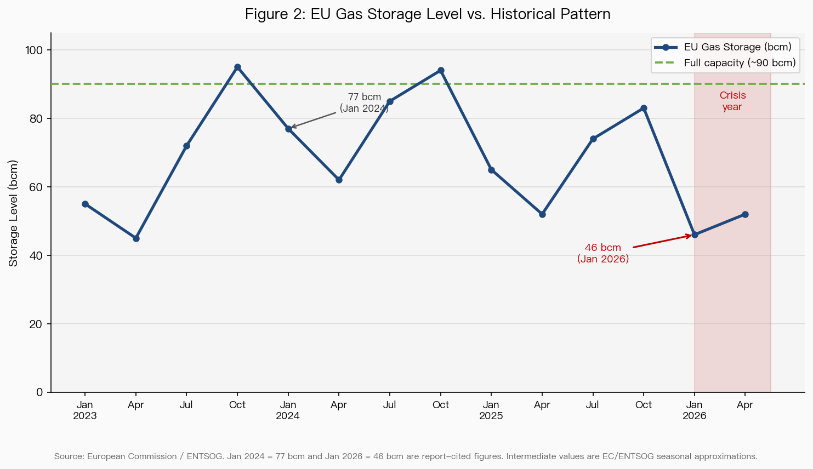
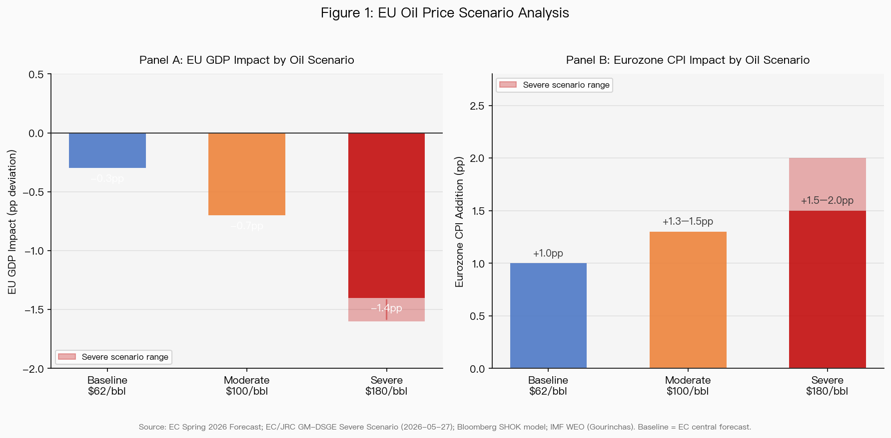
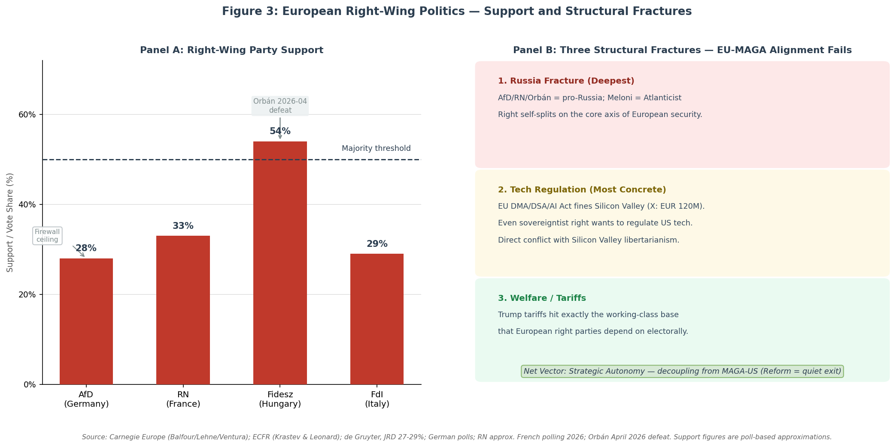

# 欧洲在伊朗冲击下的评估:管理式收缩 + 主权派脱钩

**基线 2026-05-30　|　文档类型:区域评估(能源传导 + 严重情景 + 地缘政治走向)　|　信源:智库/IFI 一手为主,具名分析师;德/法语本地源已纳入;全程区分【事实】与【推演】**

---

## 执行摘要

伊朗/霍尔木兹冲击对欧洲是一个**加速器,不是起点**。欧洲在冲击前已处于去工业化中途,且因自己禁俄油 + 第 18 轮制裁,把成品油生命线**重建在了如今 ~5% 通行的海湾走廊上**。冲击通过**价格(而非物理进口量)**击中欧洲,叠加一个独特的**三线财政重压**(能源应急 + ReArm €800B + 对乌 €90B)。

政治上欧洲在右转,**但不是 MAGA 那种右,而且净矢量是脱离 MAGA 领导的美国,不是与之合流**。本报告的核心判断:欧洲的演变轨迹是**"管理式收缩 + 主权派脱钩"**——经济上部分工业外迁、被迫加速电气化/战略自主;政治上反美迁移到中间派主流,欧洲右翼则沿俄罗斯/美国轴自我碎裂,使 MAGA 合流所需的统一不可能。

---

## 一、能源暴露:自己造的陷阱

- 中东占 EU 柴油进口 **43%**、航煤 **40% 经霍尔木兹**(S&P Global / Kpler)
- 禁俄油后把成品油生命线集中到海湾走廊;**EU 第 18 轮制裁(2026 起禁"用俄油炼的成品油")把印度柴油这个替代源用政策自己关掉了**
- **关键传导机制**:通过**价格**击中,与物理进口量无关——Bruegel(Simone Tagliapietra):"任何阻断都会立即引发价格飙升,无论欧洲物理进口多有限";储气进入 2026 已耗到 **46 bcm**(2024 是 77)
- IEA 放储 4 亿桶、已用 ~41%;美湾 + Dangote 替代被 Kpler 判定"不足以完全替代"

## 二、价格与宏观

- **EC Spring 2026 Forecast**:EU 增长砍到 **1.1%(−0.3pp)**、通胀 **3.1%(+1.0pp)**,延伸到 2027
- **EC/JRC GM-DSGE 严重情景(2026-05-27)**:Brent **Q4 2026 峰值 ~$180**、气 ~€80/MWh、Hormuz 仅部分重开,EU 增长 **0.7%(vs 1.1%)**、通胀升到 **3.5%**(JRC:几乎全由油气价格驱动)
- **Bloomberg SHOK**:$110 油 → 欧元区 +1pp 通胀 / −0.6% GDP;$170 → 约翻倍(滞胀)
- ECB:3 月、4 月按兵不动;Lagarde 留"measured adjustment"空间

## 三、工业:加速器不是起点(本地语言层最重要的纠正)

**关键纠正(德语源)**:BASF Ludwigshafen 那批标志性关厂是 **2023 年(乌克兰断气危机),不是 2026 伊朗冲击**。德语源里**找不到任何具名工厂是 2026 霍尔木兹冲击单独造成关停的**——2026 冲击通过**价格/利润率/外迁意向**起作用,还没变成新一波具名关厂。

→ **"管理式收缩" 2022 年就在跑,伊朗冲击是踩油门,不是点火。**

实证(德语比英文聚合强):
- **外迁是证据最硬的一环**:1/4 德国工业企业计划外迁、35% 在海外投资、BASF **€37 亿**投北美;EU-US 气价差 ~$10/MMBtu;基础化工"每三家就有一家离开欧陆"
- **VCI**(德国化工协会):化工开工率 **70%(历史低点)**,订单较 2021 跌 20%
- **Ifo / 联合预测**:德国 GDP 砍 ~0.3pp 到 0.6%/0.9%、2026 减 10 万岗、累计 €400 亿产出损失
- 化工/金属/矿物/纸消费 ~65% 的 EU 工业天然气,在 ~4 倍于美国的气价下——最先流血的部门(Bruegel 2023 部门结构数据,标注为前危机 vintage,仅用结构)

## 四、三线财政重压(确认 + 第四条)

- 德国 2026 联邦预算 €524.5B、国防安全 €100.9B、对乌 €11.5B、2027 缺口 €34.4B,全撞债务刹车;赤字推到 **3.7-4.2%**
- **ReArm Europe / SAFE** ~€800B(含 €150B 联合贷款);**对乌 €90B 贷款**(2026-27,资本市场借款,非冻结资产)
- **工业电价上限 Industriestrompreis(€0.05/kWh)= 强制电气化 + 非对称补贴坐实**;德国还enacted 经济学家反对的 Tankrabatt(5/1 燃油折扣)
- 全欧取舍(Bruegel / Bini Smaghi/OMFIF):补贴保工业(碎裂单一市场、拖慢转型)vs 保财政空间和绿色转向——这是活的政策断层

## 五、法国是镜像

- **核电护住工业**(通胀 +1.7%,比德国温和)
- **但燃油分配政治更易爆**:gilets-jaunes 记忆、RN 要永久砍 30% 燃油税、政府拒绝普遍减税、€11.8 亿定向补贴
- 结构:德国是工业震中(收缩),法国是核护工业、燃油政治更燃

## 六、严重情景(伊朗政权崩溃 / 全面战争)对欧洲

- 能源从"流量冲击"变"产能冲击":OIES(Fattouh & Economou)——全面中断海湾损失**近 1300 万桶/天**,**闲置产能在封锁内部、无释放阀**;OIES(Fulwood)气——removes **~20% 全球 LNG**、欧亚枢纽价**翻三倍到 ~$30/MMBtu**(Europe"在体量上不成比例地受损",因 LNG 转流向亚洲)
- IMF WEO 严重情景(Gourinchas):油 $110/$125、全球增长 ~2%、通胀 >6%——"全球衰退一线之差"
- 对欧洲:EC 已建模的 $180 严重情景是上限锚;三线财政在严重情景下变急性

## 七、地缘政治走向:右转但非 MAGA,净脱钩

**会右转吗?会,但撞天花板 + 2026 有具体挫败**
- AfD 领跑德国民调(27-29%);但**Orbán 2026-04 大选落败**(旗舰塌)、Meloni 输公投、RN 大城市撞顶
- Carnegie(Balfour/Lehne/Ventura):极右"总体稳定","Trump 效应没帮欧洲极右建成共同平台"——**分裂赢了**

**会跟 MAGA/硅谷右翼合流吗?三条结构性断裂让合流做不成**
1. **俄罗斯(最深)**:欧洲右翼自裂——Meloni 大西洋派 vs AfD/RN/Orbán 亲俄派
2. **科技监管(最具体的经济战)**:EU DMA/DSA/AI Act 罚硅谷(对 X €1.2 亿),Trump 威胁报复;**连欧洲主权派右翼都想监管美国科技,不放松**——与硅谷自由意志主义结构冲突
3. **福利/关税**:Trump 关税打的正是欧洲右翼的工人阶级基本盘
- **Meloni 是失败的桥**——EU-MAGA 中间地带collapse(de Gruyter)

**最关键洞察(Krastev & Leonard, ECFR)**:Trump 把极右重塑为跨国先锋,**把主流政党变成"新欧洲主权派"**——反美迁移到中间派,亲美成了极右标记。**战略自主(脱离 MAGA-美国)正在变成中间派事业。** 净矢量:ReArm、"静默退群"(丹麦选 SAMP/T 而非爱国者)——**脱钩,不是合流**。

## 八、强人轨迹(欧洲:发散)
- **Orbán**:已倒——最entrenched 的也可被击败
- **Meloni**:正常化/建制化(选大西洋主义 + EU 合作),非激进化
- **AfD/Weidel**:涨但被防火墙关在外——**最危险的摇摆案例**(若 CDU 裂,脱钩论削弱)
- **Le Pen/RN**:Le Pen 被判禁选,Bardella 继承,大城市撞顶,2027 是测试

## 九、结论与轨迹判断

欧洲的演变是**管理式收缩 + 主权派脱钩**:
- 经济上:伊朗冲击给本已进行的去工业化踩油门;最受**结构性侵蚀**(无快杠杆 + 三线财政挤压);外迁是最硬的一环
- 政治上:右转但碎裂;净脱离 MAGA-美国而非合流;主流变"新主权派"
- 德国是工业震中 + 政治摇摆案例;法国是镜像(核护工业、燃油政治更燃)

**最大风险变量:德国**——AfD 领跑是唯一一个 MAGA 式、亲俄、Musk 背书的党在涨而非见顶的地方;若防火墙破,脱钩论大幅削弱。

## 不确定性账本
- 高:EC/ECB/Ifo/Bruegel/OIES 宏观与能源数据;BASF 2023 关厂时序;ReArm/对乌财政数
- 中:外迁意向调查数(单一调查);"净脱钩"是 ECFR/Carnegie 支持但解释性判断,Kundnani/Münchau"自主能力跟不上意愿"是反方
- 推断/缺口:伊朗冲击→极右上升是经能源价格中介的推断,无单独隔离研究;ECFR/FA 部分 PDF 403,经检索引述

**具名分析师/机构**:Krastev & Leonard、Balfour/Lehne/Ventura、de Gruyter(ECFR/Carnegie)· Tagliapietra(Bruegel)· Fattouh/Economou/Fulwood(OIES)· Gourinchas(IMF)· EC/JRC · Ifo/VCI/BDI · Kundnani、Münchau(反方)

---
*文档结束。基线 2026-05-30。概率/机制分析,非确定性预测。*
