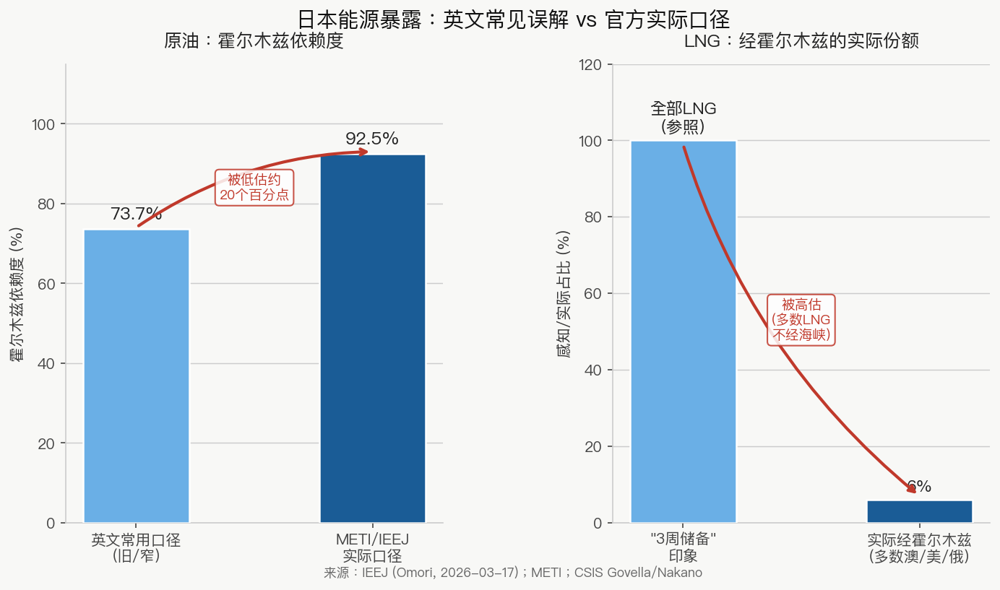
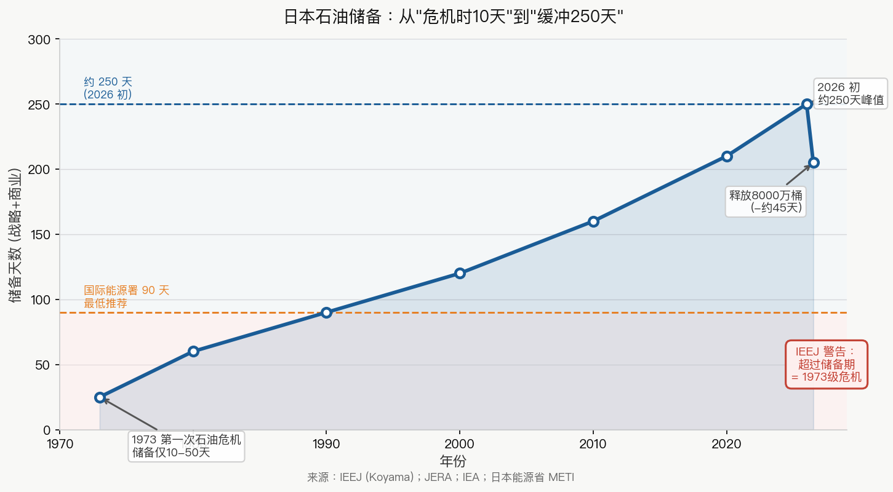
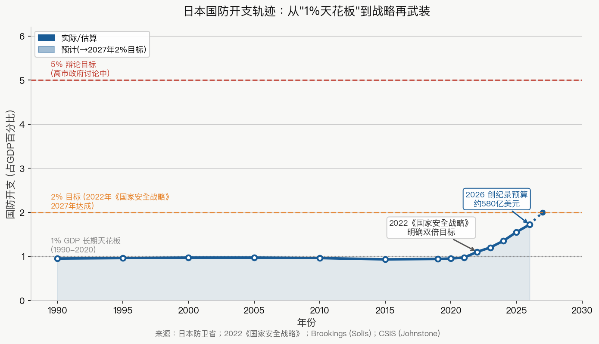

# 日本在伊朗冲击下的评估:时间有界的韧性 + 安全民族主义右转

**基线 2026-05-30　|　文档类型:区域评估　|　信源:智库/IFI + 日语一手源(IEEJ（日本能源经济研究所）/JAIF（日本原子能产业论坛）/METI（日本经济产业省）已读原文);全程区分【事实】与【推演】**

---

## 执行摘要

日本是三个区域中**最有韧性的**,但这个"从容"是**有期限的**。日本原油 ~90-95% 来自中东、90%+ 经霍尔木兹(IEEJ/METI 官方口径,纠正了英文里的 73.7%),**但 LNG 只有 ~6% 经霍尔木兹**——所以它原油暴露极深、LNG 暴露很浅(英文常把这两个混了)。250 天石油储备 + 消費地精製主義（在消费地建立炼油设施的能源政策,减少对进口成品油的依赖）+ ¥3 万亿财政后盾让它几个月内从容;一旦长期关闭拖过储备期,IEEJ 判断将是"自第一次石油危机以来最严重"。

政治上日本明确右转——但是**statist 的安全民族主义,不是 MAGA（"让美国再次伟大",特朗普的政治运动）式的反建制民粹**。轨迹是**"加倍抱美 + 暗建后路(Plan B)"**:在 Trump 的不可靠下,日本既加深对美绑定(国防、LNG、导弹共产),又被 Trump 自己逼出自主对冲。对华是**离心的**(台湾/稀土断裂)。

---

## 一、能源暴露:原油深、LNG 浅(关键数字纠正)

- **原油 ~95% 中东、90%+ 经霍尔木兹**(IEEJ 理事 Ōmori, 2026-03-17 原文:"90%+ 原油经海峡","足元 95%");UAE 43% + 沙特 39%(CSIS Govella/Nakano)
- **但 LNG 仅 ~6% 经霍尔木兹**——多数来自澳/美/俄萨哈林。日本政策源把 ~400 万吨 LNG 库存框为"相当于一年的霍尔木兹-routed LNG"
- **英文层的纠正**:那个"经霍尔木兹原油 73.7%"是更窄/更旧的口径,**METI/IEEJ 实务用 90-95%**;而"3 周 LNG 储备"(全 LNG)和"1 年 Hormuz-LNG"都对,但答的是不同问题。**日本原油比英文低值暗示的更暴露,LNG 比"3 周"暗示的更不暴露**

## 二、缓冲(三区最深)

- 石油储备 **~150-250 天**(IEEJ 引国家储备从 1970s 的 10-50 天升到 ~150;JERA（日本最大电力公司,由东京电力和中部电力合并而来）口径原油 ~250);已释放 **8000 万桶(~45 天需求)**
- 消費地精製主義（在消费地建立炼油设施的能源政策,减少对进口成品油的依赖）（本土炼油自足）
- 中东占日本一次能源**已从 1973 的 58% 降到 2024 的 28%**——系统权重降了 30 个百分点（pp，百分点）(Koyama)

## 三、适应杠杆

- **核重启在真实加速**(JAIF 2026-03-09 表):**17 座已过新规重启,某日实际发电 14 座**(其余定检轮换)。可用基数 17 座几乎全是关西/九州/四国 PWR（压水堆,最常见的核电站类型）。**柏崎刈羽 6 号(TEPCO（东京电力公司）福岛后东日本首座,14 年来第一次)2026 初重启**——冲击在催的管线加速,"15/36"抹平了它
- **但核杠杆对原油帮不上**(LNG 才 6% 经霍尔木兹);LNG 油价挂钩 + ~4 个月滞后 → 原油飙升**反而传进电价**,账单冲击 later 才峰值(IEEJ)
- 临时 suspend 低效石炭火力 50% 利用率上限(省 ~50 万吨 LNG/年)
- **JERA ¥9 万亿($620 亿)转向美国 LNG**(20 年长约 NextDecade/Commonwealth/Sempra/Cheniere)——既是远离中东 diversification,又是给 Trump 的 deliverable

## 四、财政/政治应对(日语源补的硬数)

- 燃油补贴 **¥37.2/升**(2026-03-19 重启);补贴基金 **6 月底枯竭**。**¥3 万亿补正预算**(5/26 内阁通过)含专设 **"中東情勢対応予備費"** + 每户 ¥5000 电气补助(Jiji)
- BOJ（日本银行,即日本中央银行）预测:FY2026 GDP 0.5%、核心 CPI 2.8%、日元 159
- 高市政权支持率结构转"被动/生活实感"。高市**先抵制后屈服**于补正预算。**80%+ 经济学家主张废除燃油补贴**(JCER（日本经济研究中心）)——精英意见与民粹补贴相反

## 五、IEEJ 的"twin shock"分析(英文层missed)

- ~20% 世界 LNG 因霍尔木兹 + Ras Laffan 消失;亚洲现货 LNG 冲 ~$25/MMBtu（百万英热单位,天然气价格单位）
- 日本油价挂钩长约 LNG **~3 个月滞后**上涨——账单冲击延迟至峰值
- 需求时机缓冲:过了冬峰 + 中国现货需求弱 → 物理耗竭大概率避免
- **二阶 twin shock**:中东也是化肥/石化枢纽,6-12 月后 urea/农业通胀
- 结构:"LNG-glut 幻象已死",日本买家削中东 LNG 份额、加速北美(与 JERA ¥9 万亿一致)

## 六、严重情景(伊朗政权崩溃 / 长期全面关闭)对日本

- IEEJ(Koyama):超过储备期限的长期关闭将是"自第一次石油危机以来最严重"
- 全球层 OIES/IMF:产能冲击、无释放阀、全球衰退一线之差
- **对日本判断:韧性是"时间有界"的**——250 天储备 + 非霍尔木兹 LNG 让它几个月从容;拖过期限即"1973 级"。这是日本与欧/东南亚最大的不同:它买到的是**时间,不是豁免**

## 七、地缘政治走向:安全民族主义右转,非 MAGA

**右转了吗?明确是。是 MAGA 吗?明确不是。**

- 高市早苗(Takaichi)**史上最大胜(两院三分之二超多数)**。她是安倍派民族主义者、日本会議（日本会议,日本最大的民族主义团体,高市早苗的重要支持基础）成员、持修正史观、挺台、主张修宪第九条。Kōmeitō（公明党,日本联合政府中的小党,传统上对防卫政策偏保守）退出、右翼维新入阁(去掉了防卫的"刹车",换成"油门"——Tobias Harris)
- **但她是 statist**(引撒切尔却主张大政府大支出)+ **亲同盟**——跟 MAGA 反国家/反同盟正相反。这是**戴高乐式/安全化民族主义,不是 Trump 主义**;她跟 Trump 的摩擦方向**正相反**(Trump 嫌她法律上太受约束)

**合流向量:加倍抱美 + 被 Trump 逼出的自主对冲**

- 加倍(3/19 华盛顿峰会):"日美同盟新黄金时代"、$5500 亿投资基金、~$580 亿创纪录国防预算、新国家情报厅、导弹共产、Golden Dome(Solís/Brookings;Johnstone/CSIS)
- **但 Trump 不可靠在逼出对冲**:Hormuz 派军舰要求是"双输"(82% 日本人反对伊朗战争,只 9% 支持——Harris);更深恐惧是 **Trump-Xi"瓜分地区"**(SCMP（《南华早报》）);Michael Green:自主辩论"前所未有势头",智库公开想"Plan B"
- 防卫开支提前两年到 2% GDP(在辩论冲 5%);反击能力仍是最受争议环节

## 八、对华:离心(结构性断裂)

- **2025-26 中日危机**:高市 2025-11 对国会称中国攻台可能是日本"存亡危机"、允许集体自卫;Beijing 报复 **稀土/双用途出口禁运(2026-01-06)**+ 旅游/贸易施压
- Sheila Smith(CFR):"危机可能成为中日关系常态,北京试图塑造日本对台偏好"
- 日本回应:Minamitori（南鸟岛,日本最东端岛屿,附近海底发现大量稀土矿藏）附近深海稀土开采测试——**经济安全脱钩,非妥协**

## 九、强人轨迹(日本:被框住的强人)

Takaichi 超多数,但轨迹**被三重约束**:(a)同盟依赖(不能全自主)、(b)民意(82% 反伊朗战争——不能跟 Trump 进 Hormuz)、(c)statist 非民粹——**通过建制统治,不是反建制**。轨迹:史观/防卫/台湾上强硬,但被美依赖 + 鸽派民意框住。**风险是对华过度扩张**(台湾言论已触发稀土危机)。

## 十、结论与轨迹判断

日本的演变是**时间有界的结构性韧性 + 锚定但对冲的安全民族主义**:
- 能源:加速既定核重启 + 维持煤电 + LNG 需求结构性下降;最稳且稳是结构性的;但拖过储备期即"1973 级"
- 地缘:安全民族主义右转(非 MAGA);加倍抱美 + 建 Plan B;对华离心
- **核心差异**:日本被中国胁迫、**无处可对冲**,只能抱美更紧同时建后路——与东南亚(有空间向中国对冲)相反

## 不确定性账本
- 高:IEEJ/JAIF/METI 日语原文(已读)、Jiji 补正预算、Solís/Harris/Smith;原油 90-95% 经霍尔木兹(日本官方口径)
- 中:Bloomberg Japan/Nikkei JERA ¥9 万亿(经一次 fetch 确认);"online today"反应堆整数随定检漂移
- 推断/缺口:"statist 非 MAGA"对高市是我的归类(底层特征有源);具体反应堆 2026 进度英文薄;IISS 高市文 403

**具名分析师/机构**:Ken Koyama(IEEJ)· Mireya Solís(Brookings)· Tobias Harris · Christopher Johnstone(CSIS)· Sheila Smith(CFR)· Michael Green · JAIF/METI/JCER

---
*文档结束。基线 2026-05-30。概率/机制分析,非确定性预测。*
