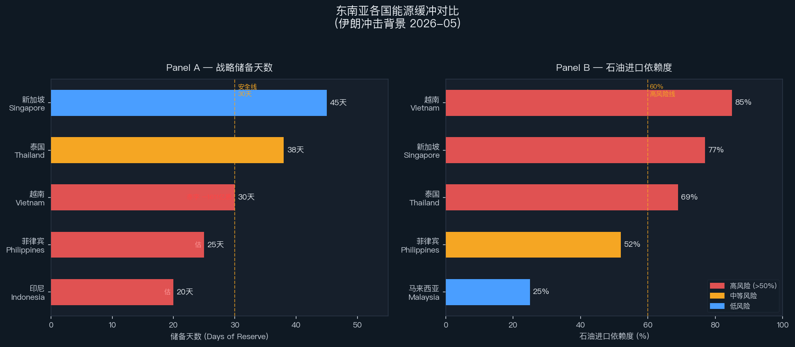
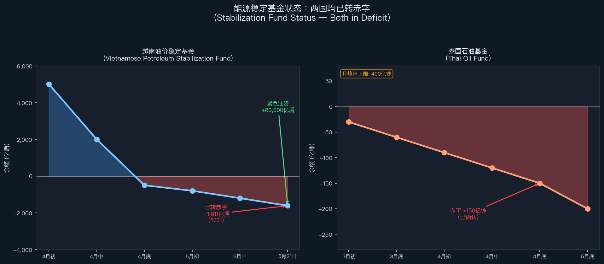
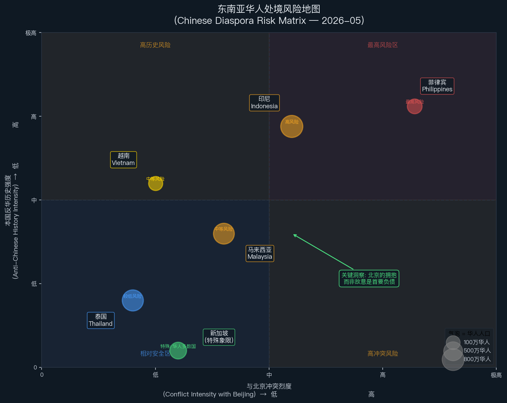

# 东南亚在伊朗冲击下的评估:最碎片的脆弱 + 华人处境的冷战公式反转

**基线 2026-05-30　|　文档类型:区域评估(能源传导 + 地缘政治 + 族群处境)　|　信源:智库/IFI + 本地语言源(印尼/越/泰)+ 华人研究专家;全程区分【事实】与【推演】**

---

## 执行摘要

东南亚是三个区域中**最碎片、最脆弱**的:缓冲最薄(越南 30 天、泰国 38 天储备,且**两个稳定基金已实测转赤字**)、杠杆最少、制度协调最弱。生产国/进口国断层比英文说的更"歪"——**印尼名义产油国、实际是财政承压的伪产油国,不是赢家**。

地缘上东南亚**根本不是意识形态右转**:对外是**对冲更硬 + 微向中国**(ISEAS 52/48),但首选仍是经 ASEAN 一体化求战略自主;对内是**强人化/不自由的实用主义,与 MAGA 不同轴**(借交易主义风格,不借文化战意识形态)。冲击**强化了中国的区域之手**(broker、能源稳定器、被绕过的 ASEAN)。

本报告的独立重心是**华人处境**:你提的"上次冷战华人是美国动员 + 本国强人的牺牲品",这次**冷战公式已经反转**——危险不再主要来自"敌视中国的阵营把华人当中国代理",而来自"**中国自己坚称他们是代理**"。**北京的拥抱、而非敌意,成了侨民的首要负债。**

---

## 一、能源暴露与已发生的事实

- 区域消费 ~5 mb/d、只产 ~2,进口 ~3;~60% 石油靠中东;进口依赖:越南 85%、新加坡 77%、泰国 69%(原油更高)、菲律宾 ~52%、马来 25%
- **缓冲已实测耗尽(本地源,非预测)**:
  - **越南**:稳定基金**已转赤字 −1,611 亿盾(5/21)**,紧急注资 80,000 亿盾;储备仅 **30 天**
  - **泰国**:**油基金赤字 >150 亿铢**,月烧最高 400 亿铢;储备 38/60 天
- **已发生**:菲律宾 3/24 全国能源紧急状态(EO 110)、425 站断油、5/13 ~200 万人断电、四天工作周;越南配给 + 越航取消航班;印尼 4/1 限购
- 双重打击:既是燃料进口国,又是石化加工基地(亚洲石化石脑油 54% 来自中东;新加坡石化 + 印尼 Chandra Asri 已宣布不可抗力;PE/PP 数周涨 30-40%)

## 二、生产国/进口国断层比英文更"歪"

- **印尼名义产油国、实际财政承压的净进口国**:19% 原油经霍尔木兹、30% LPG 来自沙特;补贴 **Rp 381.3 万亿**按 $70 ICP 编制(每超 $1 加 Rp 7-10.3 万亿);**靠冻结补贴价吸收压力**(政治代价高)。**印尼不是赢家**
- 真正 windfall 只归**马来西亚/文莱**
- → 断层比"产油 vs 进口"二分更单薄、更不对称

## 三、社会脆弱不均,泰国是断裂点

- **泰国(最强政治反弹)**:劳工联盟 + 运输业集会、**要求能源部长辞职**、甚至要求炼厂国有化;柴油销量翻倍抢购
- **菲律宾**:全国能源紧急状态 + ~200 万断电
- 印尼:抢购排队,被冻价压住,无反政府街头;越南:囤积,被行政手段管住
- → 脆弱集中在"高中东原油依赖 × 开放竞争性政治"的交点(=泰国)

## 四、区域应对:全是 aspiration

- 5/8 宿务 ASEAN 峰会:推区域燃料共享 + 电网 + 储备 + 重燃民用核兴趣
- **但卡在分配**:Marcos 自问"怎么分?谁付钱?";CFR"东盟又一次失败"——生产国没动力补贴进口国最需要的约束性共享协议
- ADB 把发展中亚洲增长砍到 4.7%;UNDP 估 880 万亚太人返贫(后者标媒体/倡导源)

## 五、严重情景(伊朗政权崩溃 / 全面战争)对东南亚

- 缓冲最薄 → **最先撞墙、最重**;ASEAN 在生产国/进口国断层下无法协调,区域方案卡在纸面
- 中国作为 broker 角色在严重情景下**作废**(没有可谈的伊朗中央)→ 把局势从"可谈判僵局"推向"无人控制的碎裂",对最依赖进口的东南亚冲击最大
- 全球层:IMF 严重情景全球衰退一线之差;IFPRI——霍尔木兹承载 20-30% 全球化肥出口,fuel→fertilizer→food 级联打粮食进口国

## 六、地缘政治走向:对冲更硬 + 微向中国,非 MAGA

- **ISEAS 态势 2026 调查**:被迫选边 **52% 中国 / 48% 美国**(中国重回首位);**"Trump 治下美国"是头号地缘担忧(51.9%)**,盖过南海;但首选是**经 ASEAN 一体化求战略自主(42.2%)**
- Joanne Lin(ISEAS)原话:"**hedging harder, not tilting decisively toward China**"
- 国内**不是 MAGA**——是**强人/不自由的实用主义**:Prabowo"多向结盟"(同日 BRICS + 五角大楼伙伴 + 克里姆林宫 5 小时)、泰国精英管控的君主-军方、Marcos"同盟内对冲"。借的是 Trump 交易主义/强人风格,**不借文化战意识形态**
- **中国之手被冲击强化**:作为 Hormuz broker(5/14-15 Trump-Xi)+ 最大能源客户 + 基建金主(Kausikan:中国在连续性/可预测上更像可靠伙伴);**美中斡旋停火绕过 ASEAN,侵蚀其制度可信度**(Lowy)
- US 信誉被关税打击(越南 44-49% 等)→ **ASEAN-中国 FTA 升级 2026-05 达成**;Laksmana(IISS)"multialignment / I5"——不是"选哪边",是"各自多granular 地编织对齐网"

## 七、强人轨迹(东南亚:交易型对冲者)
- **Prabowo**:个人化集权 + 机会主义多向结盟,被"既需美又需中"框住
- **泰国**:强人是制度(军方+王室)不是个人——精英管控半民主延续
- **Marcos**:最亲美但"没忘怎么对冲" + Marcos-Duterte 内斗 destabilize
- 统合:**交易型对冲者,不是 MAGA 意识形态盟友**——他们在发散

## 八、华人处境:冷战公式的反转(本报告独立重心)

### 8.1 先修正历史基线(否则推演建在夸大地基上)
你说"上次冷战华人成了牺牲品"——但最权威专家(**Coppel & Cribb**,《A Genocide That Never Was》, *J. Genocide Research* 2009)指出:**1965-66 印尼大屠杀是反共清洗(死 50 万-100 万),针对华人的部分约 2000 人,"反华种族灭绝"在很大程度是 myth**(Jess Melvin 的 Aceh 档案研究部分复杂化:种族确是动机之一)。真正把华人**作为"北京第五纵队"清洗**的清晰案例是**越南 1978-79**(华裔占船民 60-70%、~25 万逃往中国)。**建在"印尼 1965=反华"夸大基线上的推演本身是错的。**

### 8.2 核心判断:三段式公式两段已反转
冷战逻辑 = 美国反共十字军 + 美国阵营强人 + 华人当"共产中国代理"。今天:
1. **中国从共产妖魔变成拉拢侨民的崛起强权**——用 qiaowu(侨务)/统战**故意模糊 huaqiao(华侨)/huaren(华人)**,"无论国籍动员华人服务中国利益"(**Suryadinata, ISEAS**)。Chong Ja Ian(NUS)斥之"疯了",类比"英国要求所有姓英国姓的人效忠王室";其论点是危险**双向**——北京的认领 + 西方"凡华裔皆 PRC 代理"的框架都危及侨民
2. **各国向中国对冲,不为美国清洗**——下注中国投资的政府**没有动机**许可反华动员(跟冷战阵营相反)
3. **新断层是 xin yimin(新移民)vs 老 huaren,不是共产主义**——BRI 劳工、Forest City 地产、尤其缅甸/柬埔寨诈骗园区(Hong Liu, NTU);反华情绪今天可能是**intra-华人**的,矛头对 PRC 新移民,老华人遭殃

**最锋利的反转**:冷战里华人的危险来自一个**敌视中国**的阵营把他们读作中国代理;**今天的危险来自一个坚称他们是代理的中国**——**北京的拥抱、而非敌意,成了侨民的首要负债。**

### 8.3 风险地图(高→低)
- **菲律宾(最高)**:唯一一处冷战三段式**部分重组**——美国阵营 + 南海冲突 + Alice Guo 间谍/诈骗案(2025-11 判无期)。Tsinoy 面临被与 PRC 混同(Caroline Hau, Kyoto:Tsinoy 主动"表演与北京的距离")
- **印尼(中,历史最易爆)**:1998 反华骚乱记忆 + Prabowo 涉 1998。**但 2025-08 全国动乱中华人没被针对**——"扫货互助"口号,"靠华人转移矛盾的老把戏不灵了"(制度改革 + 华人融入 + 强大中国威慑)
- **马来西亚(中低,结构性非暴力)**:风险在 bumiputera 配额(Ngeow Chow Bing:马来对北京"deference 与 defiance 并存")
- **越南(现低,但冷战最坏先例)**;**泰国(最低,最同化——Kasian Tejapira 的"Thainess"吸纳)**
- **新加坡(独特)**:华人多数国,风险是**被北京宣称为"中国人国家"**——故政府反而主动驳"华人特权"论 + 立 FICA(Dickson Yeo 案)

### 8.4 华人处境底线
**不太可能重演冷战式大规模暴力**;有风险处是**不同的东西、不同机制**:(1)与北京冲突 + 亲美的国家(菲律宾),老三段式部分重组——最高风险;(2)其余地方更可能是**安全化的"北京代理"嫌疑(FICA 模式)+ 新移民/诈骗/BRI 摩擦的溢出**(矛头本对 PRC 新移民,老华人遭殃)。**与冷战最锋利的区别:上次美国动员这条腿断了(各国向中国对冲),本国强人"借华人转移矛盾"也开始失灵(印尼 2025);真正的新威胁来自中国自己的认领。**

## 九、结论与轨迹判断

东南亚的演变是**最碎片的脆弱 + 华人处境的反转**:
- 能源:最薄缓冲(已实测耗尽)、最弱协调;菲/越/泰是急性前线,泰国政治断裂,印尼是伪产油国财政陷阱
- 地缘:非意识形态右转;对冲更硬 + 微向中国,但自主而非结盟是doctrine;中国之手被强化、ASEAN 制度被削弱
- 华人:冷战公式反转,北京拥抱成新负债;菲律宾最高风险(三段式部分重组),其余是securitized 嫌疑 + 新移民摩擦溢出

## 不确定性账本
- 高:ISEAS 调查、菲律宾紧急状态事实、Coppel/Cribb 历史修正、Suryadinata/Chong/Hong Liu 框架、印尼 2025-08 华人未被针对
- 中:越南基金赤字/泰油基金烧速(本地源/官员引述,primary-adjacent);UNDP 返贫数(标媒体/倡导)
- 推断:"illiberal 非 MAGA"对东南亚强人是我的归类;生产国/进口国逻辑强化中国之手是推断;华人风险的国别排序是机制判断

**具名学者/机构**:Leo Suryadinata、Wang Gungwu、Hong Liu、Chong Ja Ian(ISEAS/NTU/NUS)· Caroline Hau(Kyoto)· Ngeow Chow Bing(Malaya)· Coppel & Cribb、Jess Melvin(历史)· Joanne Lin、Kausikan、Laksmana(ISEAS/IISS)· Susannah Patton(Lowy)

---
*文档结束。基线 2026-05-30。族群政治为敏感议题,本报告严守 fact/forecast 区分,不作 sensational 推断。*
