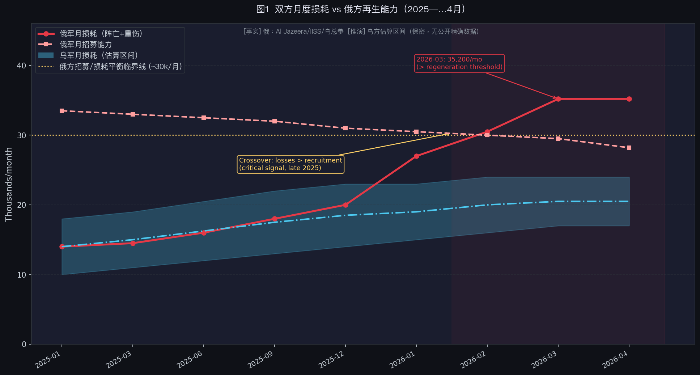
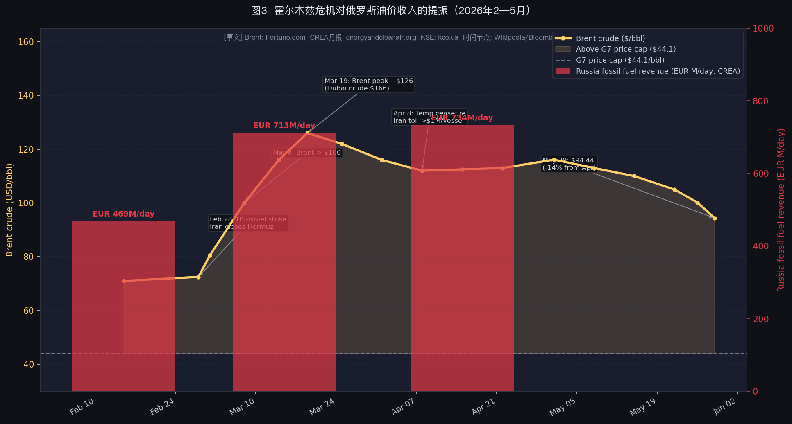
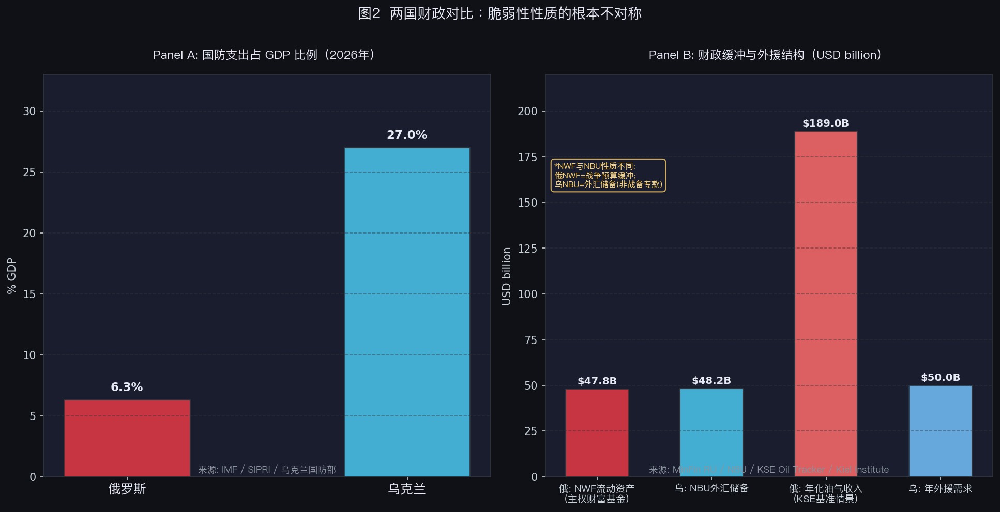

# 俄乌战争结构性评估 v4（2026年6月2日）

**基线日期：2026-06-02　|　文档类型：综合分析报告　|　信源纪律：全程区分【事实】（已发生、可核实）与【推演】（机制风险、分析判断）**

---

## 执行摘要

到2026年6月，俄乌战争已凝固成一个**三重消耗的稳态**：战场上，无人机透明化封锁了双方机动，没有一方能取得战役级突破；财政上，两国都吃紧，但脆弱性的性质根本不同——俄罗斯是内生、慢性、自控的失血，乌克兰是外生、可能骤断、命在他人的悬崖；政治上，俄罗斯是"压制式稳定"（中期有继承与"枪炮 vs 黄油"风险），乌克兰是"动荡但制度撑住"。

v4相较v2的核心更新有三：其一，**战场数据更新**——2026年全年累计（1月1日至5月26日）俄军净推进仅约104平方公里，而2025年同期为1,619平方公里，同比降幅达94%；但5月下旬出现局部反弹（四周净获54平方公里），说明整体锁死中局部仍有波动；其二，**伊朗/霍尔木兹危机对俄罗斯财政的意外提振**获得了完整的量化数据——3月化石燃料出口日均收入环比+52%，4月进一步创2023年9月以来新高；4月Urals均价达$112.3/桶，是G7价格上限（$44.1/桶）的两倍有余（高出155%）；其三，**外交谈判轨迹更新**——5月底美方Rubio宣告谈判"陷入僵局"，欧洲提出的30天停火被俄方拒绝，停火前景被外生变量（伊朗战场分心、普京趁油价高位待价而沽）双重推迟。

**本报告的核心判断不变：这场战争的走向不主要由战场决定，而由两个"外生托底"决定**——俄罗斯的油价托底（受伊朗/霍尔木兹危机意外抬升）和乌克兰的外援托底（美欧政治意志）。谁的外生托底先撤，谁先接近临界。

---

## 方法论与信源说明

本报告综合自2026年5—6月多轮定向研究，涵盖[ISW（战争研究所，美国智库，每日发布战场评估）](https://www.criticalthreats.org/programs/ukraine)战场评估、[CREA](https://energyandcleanair.org/)与[KSE](https://kse.ua/)能源收入月报、[IISS](https://www.iiss.org/)战略平衡报告、[荷兰军情局（MIVD）](https://english.aivd.nl/publications/annual-reports)公开评估、[Mediazona/BBC](https://en.zona.media/article/2026/05/22/casualties_eng-trl)伤亡统计，以及外交事件的多源交叉核实。

**数字诚实原则**：所有伤亡与产量数字高度争议，且来自有立场的信源。乌方总参谋部口径系统性偏高；俄方官方口径系统性偏低；[Mediazona/BBC](https://en.zona.media/article/2026/05/22/casualties_eng-trl)基于obituaries的统计偏向保守（仅可查证者）；[IISS](https://www.iiss.org/)/GCHQ（英国政府通信总部，英国情报机构）属于西方情报评估，有自身认知局限。本报告以**方向性**而非**精确值**作为论证支点，并明确标注每个数字的口径。

**事实/推演区分**：本报告严格使用【事实】标记已发生、可核实的事件；【推演】标记机制分析与条件判断。

---

## 一、战场：锁死状态中的局部波动

### 1.1 领土变化：94%降幅的量级意义

【事实】2026年全年累计（1月1日—5月26日），俄军净推进约**104平方公里**，而2025年同期约1,619平方公里——同比降幅**94%**（来源：[ISW](https://www.criticalthreats.org/analysis/russian-offensive-campaign-assessment-may-31-2026)/[Al Jazeera](https://www.aljazeera.com/news/2026/5/29/russian-rate-of-losses-in-ukraine-almost-triples-in-one-year)综合，[Russia Matters War Report Card 2026-05-27](https://www.russiamatters.org/news/russia-ukraine-war-report-card/russia-ukraine-war-report-card-may-27-2026)）。

这个数字需要两层解读。第一层：推进减速本身已反映在战场均衡中——无人机透明化、苏联存量装备见底、兵源质量下滑三重约束叠加，都在压缩俄军的机动空间。第二层：ISW警告，大量俄军使用"渗透战术"（infiltration tactics），名义"占领"区域的实际控制度远低于面积数字暗示的水平，因此跨年度对比须谨慎。

【事实】过去12个月（2025年5月27日—2026年5月26日），俄军净占领约3,870平方公里，占乌克兰全境约0.6%（[Russia Matters](https://www.russiamatters.org/news/russia-ukraine-war-report-card/russia-ukraine-war-report-card-may-27-2026)）。

【事实/局部波动】4月28日—5月26日四周内，俄军净获约54平方公里，显示5月下旬出现局部反弹。5月31日ISW简报：斯洛维扬斯克方向俄军持续进攻未能推进；沃夫昌斯克方向（哈尔科夫）俄军尝试建立浮桥渡口被乌军摧毁；6月2日波克罗夫斯克扇区记录到178次交战、俄军36次冲锋（当日最高）。

**结构判断**：宏观数字（94%降幅）和微观波动（局部反弹）并不矛盾。战场整体被锁在低速消耗均衡中，但局部仍有数十平方公里量级的来回——这是渗透战术+无人机透明化下的"定格运动"，不是哪一方即将突破的前兆。

### 1.2 三个互锁的结构约束

俄军攻势反复熄火，三个约束同时绑死且互相强化：

**① 兵力：伤亡已超招募，且招募在降**

【事实】2026年4月单月俄军损失35,203人（阵亡+重伤，[ISW](https://www.criticalthreats.org/analysis/russian-offensive-campaign-assessment-may-31-2026)/[Al Jazeera](https://www.aljazeera.com/news/2026/5/29/russian-rate-of-losses-in-ukraine-almost-triples-in-one-year)），而月招募能力约28,200—30,000人（约940人/日×30天，来源：[LBC](https://www.lbc.co.uk/article/russia-troop-losses-recruitment-ukraine-war-manpower-crisis-5HjdXx2_2/)/[Carnegie](https://carnegieendowment.org/research/2026/03/ukraine-military-russia-war-manpower-recruitment)估算）——损失已超过补充上限。

【事实】从效率角度看，俄军每推进1平方公里损失**179人**（2026年），而2025年同期为67人/平方公里——损耗率接近三倍（[Al Jazeera，2026-05-29](https://www.aljazeera.com/news/2026/5/29/russian-rate-of-losses-in-ukraine-almost-triples-in-one-year)）。

【事实】约40%新兵来自"脆弱人群"（囚犯、债务人），兵员质量持续下滑（[Carnegie](https://carnegieendowment.org/research/2026/03/ukraine-military-russia-war-manpower-recruitment)）。Putin于2026年5月26日签法免除新兵最高14万美元债务——这是在用涨价购买持续缩水的兵源。

**② 装备：苏联库存进入物理底部**

【事实/OSINT（开源情报，通过公开渠道收集的军事情报）】储备装甲车/火炮已耗>50%；APC库存降到战前约39%。[IISS](https://www.iiss.org/online-analysis/military-balance/2026/04/attrition-and-adaptation-ukraines-evolving-war-effort/)判断：若维持2024节奏，俄军"2026年初起将没有足够主战坦克支撑有效进攻"。被迫大规模转向摩托车/越野车/小组步兵冲锋；唯一在扩张的火力是滑翔炸弹（UMPK，俄制滑翔炸弹改装套件，给普通炸弹加装滑翔翼，2026年1月单月投>5,700枚）——防区外打击不需兵力集结。

**③ 无人机饱和战场：机动的根本性代价上升**

FPV（第一人称视角无人机，操作员通过视频头盔实时操控）+光纤无人机造出15—40公里的"击杀区"，前线"透明化"。光纤无人机无射频信号，无法被电子战干扰，废掉了此前短暂保护车辆的EW手段。任何兵力集结（突破的前提）在集结前即被发现摧毁。[Kofman/Lee](https://warontherocks.com/mike-kofman-and-rob-lee-on-drones-in-ukraine/)："无人机让机动更难、错误更贵、突破更稀有……它没有终结阵地战，而是重塑了它。"

---

## 二、Attrition数学：转折点的量化阈值

### 2.1 交换比必须除以兵力池不对称

单纯的伤亡交换比没有意义；有意义的是"交换比 ÷ 双方可动员兵力池的不对称"。

俄罗斯人口约1.44亿；乌克兰实控人口约3,000—3,300万（占领区+难民流失后）。原始人口比约4:1；按"政治可承受成本下可动员的兵源"算约**3:1**（俄罗斯拒绝第二次总动员，自压池子）。**含义**：乌克兰即使保持2:1的交换比，只要低于约3:1的池比，它的池子仍先见底——这是"纯人力数学上时间偏向俄罗斯"的底层原因。

### 2.2 转折点的两种等价表述

**比率表述**：乌克兰要让纯attrition转向对自己有利，须持续保持≥3:1；决定性要4—5:1。[Frontelligence](https://frontelligence.substack.com/)：乌克兰需把损失比改善到"at least 1:3"或获得改变格局的外援。

**绝对速率表述（更精确）**：俄罗斯再生约28,200—30,000人/月。若乌克兰持续造成>35,000—40,000/月俄军损失，则俄罗斯力量生成转净负，池子耗尽——这是操作上的转折阈值。该阈值在2026年3月被触及（单月35,203），关键是能否持续。

### 2.3 双向临界矩阵（图1见下）

| 交换比（偏乌） | 谁先崩 |
|---|---|
| <约2:1持续 | **乌克兰先崩**——池小+动员政治封顶，尽管杀得更多 |
| 约2:1至3:1 | **刀锋地带**——双方向各自上限流血，是赛跑 |
| >约3:1持续 | **俄罗斯先崩**——损失超再生 |
| 4—5:1持续 | 俄罗斯加速崩 |

当前第三方估计交换比约**2:1至2.5:1偏乌**（一个口径1:1.86；Economist某快照高到5:1），落在刀锋地带偏俄一侧。

**图1说明**：折线图显示俄军月损耗（红实线）在2025年末至2026年初越过俄方月招募能力（红虚线），3月触及35,200人/月高点，超出临界线约17%。乌方月损耗（蓝色区间）因保密政策无精确公开数据，以估算区间呈现。数据来源：Al Jazeera、IISS、乌克兰总参谋部（日均数字折算）、LBC/Carnegie（招募估算）。

### 2.4 两国各自距临界线

**俄罗斯**：招兵已跌破损失、装备库存2026初物理见底——离临界更远，但约束更**硬**（库存物理耗尽，不像兵源可靠政治选择扩）。[荷兰军情局（MIVD，2026年4月）](https://www.defensenews.com/global/europe/2026/04/22/russia-could-be-ready-for-nato-conflict-year-after-ukraine-dutch-warn/)评估俄方累计永久损失约120万人（阵亡50万以上）——属西方情报机构高端估计，与[Mediazona](https://en.zona.media/article/2026/05/09/losses)约352,000阵亡（obituaries计，偏低）构成宽区间，区间跨度本身即说明不确定性之大。

**乌克兰**：补充率17,000—24,000/月（比俄罗斯低）+逃兵净流出10,000—15,000/月（独有的第二道流出）+前线旅满编率低至30%——力量生成明显净负，离自己的临界线更近。但有三个offset：防御+无人机省人；战线未崩（5月俄净失地整体仍为负）；未动用的18—24岁征召作为政治储备杠杆。

---

## 三、伊朗/霍尔木兹危机：俄罗斯战争财政的意外外生托底

### 3.1 霍尔木兹关闭的油价轨迹

【事实】2026年2月28日，美以联合空袭伊朗后，伊朗宣布封锁霍尔木兹海峡。以下价格数据来自[Fortune.com日报](https://fortune.com/article/price-of-oil-05-29-2026/)与[Bloomberg](https://www.bloomberg.com/graphics/2026-iran-war-hormuz-closure-oil-shock/)图表（多源一致，高可信度）：

| 时间 | 事件 | Brent均价 |
|------|------|-----------|
| 2026年2月28日 | 海峡关闭宣告 | ~$72.5/桶 |
| 2026年3月8日 | Brent突破$100 | ~$100+/桶 |
| 2026年3月19日 | 阶段性高点 | ~$126/桶（迪拜原油$166创纪录）|
| 2026年4月8日 | 临时停火，伊朗开征通行费>$100万/艘 | 高位盘整 |
| 2026年5月1日 | 回落中 | $116.10/桶 |
| 2026年5月29日 | 进一步回落 | $94.44/桶（较4月高位-14%，但YoY +47.65%）|

**这条价格轨迹的含义**：截至6月初，Brent虽从峰值回落约25%，但仍比一年前（$63.96）高出近48%。俄罗斯从霍尔木兹危机中获得的是一个结构性的高油价窗口，不是一次性脉冲。

**图3说明**：左轴（金色线）为Brent日价，右轴（红色柱）为CREA月报俄方化石燃料出口日均收入（EUR M/day）。金色填充区为Brent超过G7价格上限（$44.1/桶）的部分——整个3—5月区间价格上限均形同虚设。关键事件节点叠加于价格线上。

### 3.2 俄罗斯化石燃料收入量化（CREA月报 + KSE油轨跟踪器）

【事实，高可信度，[CREA](https://energyandcleanair.org/april-2026-monthly-analysis-of-russian-fossil-fuel-exports-and-sanctions/)为独立机构数据】：

**2026年3月（最大提振月）**：
- 俄方化石燃料出口日均收入：**EUR 713百万/天**（全年最高，两年来峰值），环比**+52%**
- 海运原油收入：+115% MoM，达EUR 372百万/天
- 整体原油收入：+94% MoM，达EUR 431百万/天
- [KSE](https://kse.ua/about-the-school/news/russian-oil-tracker-april-2026-russias-oil-revenues-nearly-doubled-in-march-amid-the-war-in-iran/)估算3月石油出口收入总额：**$190亿**（环比增加$93亿）

**2026年4月（持续高位）**：
- 俄方化石燃料出口日均收入：**EUR 733—734百万/天**（进一步+4%，创2023年9月以来新高）
- Urals均价：**$112.3/桶**（环比+19%），超过EU/UK价格上限$44.1/桶的**155%**
- 54%的俄方海运原油经"影子油轮"运输（3月为48%）
- 管道天然气：EUR 82百万/天（+15% MoM）；LNG：EUR 58百万/天（+25% MoM）
- KSE预测：若G7价格上限得到完全执行，4月将减少俄方收入约46%，约EUR 67亿——但事实上未被执行

**全年视角（KSE基准情景）**：
- 2026年全年化石燃料出口收入基准预测：**$1,890亿**
- 乐观情景（油价部分回落）：$1,640亿
- 极端情景（高油价持续）：$2,440亿

### 3.3 制裁"剪刀差"被油价溢出覆盖

【推演，基于CREA/KSE数据的机制分析】：G7价格上限设计的逻辑是将Urals压在$44.1/桶以下，切断超额收入与战争融资的联系。但霍尔木兹危机将实际交易价格推至$112.3/桶，差价约$68/桶完全由俄方（通过影子船队）和中间商获取。这是制裁史上少见的"价格溢出覆盖制裁剪刀差"场景——外生地缘事件（与俄罗斯无关的美以—伊朗冲突）意外成为俄罗斯制裁规避的最大帮手。

[Carnegie的Vakulenko](https://carnegieendowment.org/russia-eurasia/politika/2026/04/russia-oil-gains-losses)分析乌克兰对炼厂打击的效果时指出：打击造成的是出口**时间延迟**而非永久收入损失，而3—4月的价格上涨"补偿有余"。当霍尔木兹开始重新谈判、油价回落时（5月下旬已开始），对炼厂打击的累积效果才会显形（预计需6个月至1年）。

---

## 四、两国财政：脆弱性性质的根本不对称

**图2说明**：Panel A显示两国国防支出占GDP之比（俄6.3% vs 乌27%）——数字的不对称不仅反映战时动员强度，更揭示乌克兰民用经济已被抽干至极限。Panel B并排列出四个财政指标：

- 俄方NWF（俄罗斯国家财富基金）流动资产：$47.8B
- 乌方NBU外汇储备：$48.2B
- 俄方年化油气收入（KSE基准）：$189B
- 乌方年外援需求：约$50B

两国的储备数字看似接近，但性质根本不同：NWF是战争预算缓冲，NBU储备是外汇流动性，不可直接比较。

| | 俄罗斯 | 乌克兰 |
|---|---|---|
| 2026年赤字 | 2.5% GDP（1—4月已超全年1.6%计划） | 约18—19% GDP（IMF） |
| 财政结构 | 自给，油气占预算已降至约22% | 100%自筹收入全进国防；每分民用开支靠外援 |
| 缓冲 | NWF流动资产$478亿（<2% GDP），若油价低+卢布强一年内可能耗尽 | NBU储备$482亿（4个月从峰值降16%） |
| 外部依赖 | 低（被冻结$3,000亿，但可借债+加税） | 约$500亿/年外部需求；2026—27残口约$630亿；欧盟€90B贷款覆盖约2/3 |
| 国防开支 | 6.3% GDP | 约27% GDP（全球最高） |
| 利率/通胀 | 14.5% / 5.7% | 15% / 8.6% |
| 最新信号（5月底） | Siluanov要求冻结除军费外所有预算线 | Q1 2026外援流入骤降73%；IMF警告"钱柜可能2026年中见底" |

### 4.1 俄罗斯：内生、慢性、自控

【事实】油气收入1—4月同比−38%（前一年基准低，叠加2026年伊朗提振前的疲软期）；NWF单月（3→4月）抽掉约$40亿，从战前6% GDP降至<2% GDP。

分析共识（[Kluge](https://janiskluge.substack.com/p/russian-recruitment-fell-by-20-in) / [Prokopenko](https://carnegieendowment.org/russia-eurasia/politika/2026/02/russia-internal-resources-war) / [BOFIT](https://www.bofit.fi/en/forecasting/latest-forecast-for-russia/)）：靠本土借债、加税、货币贬值，莫斯科可再撑**至少2—3年**，代价是民用经济被掏空、对外部冲击（油价崩、对炼厂打击、银行压力）的敏感度急升。**没有外人能突然掐断它。** 但伊朗油价提振本质上是一次借来的时间——当霍尔木兹逐步重开、Brent回落至$70—80区间，俄方财政将重新面对之前的压力，且累计的NWF消耗不可逆。

### 4.2 乌克兰：外生、可能骤断

乌克兰**只在外援按时到账时才偿付得起**，没有民用开支的本土后备。欧盟€90B贷款覆盖约2/3的缺口，但美国通过PURL（欧洲出资购买美国武器转交乌克兰的机制）提供的高端防空拦截弹（Patriot PAC-3）不可替代——这是纯财政数字覆盖不了的战备死穴。一个欧盟拨款延迟或PURL转向，可以在几个月内造成融资悬崖。债务约122.6% GDP；World Bank重建需求约$5,880亿。**命门在别人手里。**

---

## 五、武器供应：从PURL动摇到F-16实战

### 5.1 PURL机制的结构性动摇

【事实】2026年3月，五角大楼通知国会，计划将欧洲通过PURL筹集的**$7.5亿用于偿还美国自身库存**（补充拜登政府时期已转交乌克兰的装备），而非直接购买新武器转交乌克兰。欧洲各国政府对此强烈质疑，认为不符合资金用于基辅的原始意图（[Militarnyi.com](https://militarnyi.com/en/news/us-repurpose-750-million-nato-for-ukraine/)/[Ukrainska Pravda](https://www.pravda.com.ua/eng/news/2026/05/12/8034264/)，2026年3月）。

【事实】2026年5月11日，[《华盛顿邮报》](https://www.washingtonpost.com/national-security/2026/05/11/us-ukraine-trump-weapons-purl/)报道欧洲国家越来越不愿通过PURL追加资金（[Pravda USA引述](https://usa.news-pravda.com/world/2026/05/11/768760.html)）。同期，美以伊朗战场消耗大量美制弹药，欧洲担忧美国将自身订单和对乌交付同时推迟，进一步削弱PURL信心。

【推演】PURL机制已处于功能性受损状态——资金用途分歧+欧洲信任下降+伊朗战场弹药竞争三者叠加，乌克兰通过该渠道获得美制武器的节奏将放缓。唯一补不上的高端防空缺口（Patriot PAC-3）因此更加突出。

### 5.2 F-16实战表现的边界

【事实，来源：[Aviation Week，2026年初](https://aviationweek.com/defense/budget-policy-operations/ukraine-claims-1000-aerial-kills-f-16s)】截至2026年1月，乌克兰空军通过F-16击落约**1,000个航空目标**（巡航导弹+单程攻击无人机）。F-16主要承担**防空拦截角色**，而非对地打击或空优任务。俄方Su-35、MiG-31、Su-57保持高空发射超视距导弹，F-16被迫低空规避，限制了机动空间。

【事实】**乌方F-16已知损失至少4架**：其中3架系停场时遭无人机袭击而非空战击落；4架损失中3架飞行员未能幸存（1架飞行员弹射成功）。2026年5月16日，一名乌克兰F-16飞行员在夜间防空任务中击落3个目标后弹射逃生。

【推演】F-16的防空贡献实实在在（拦截1,000目标），但对地打击和制空效果受限于俄方反介入战术，并未改变战场深层均势。F-16更多扮演的是消耗拦截弹的"昂贵工具"角色，不是制空权变量。

### 5.3 乌克兰本土无人机生产：工业对抗的核心

【事实，来源：乌克兰国防工业/[United24媒体](https://united24media.com/)，有宣传成分，方向性可信】：

| 无人机类型 | 月产/日产量 | 状态 |
|-----------|------------|------|
| FPV拦截无人机 | >2,000架/天（近期峰值） | 乌克兰企业生产 |
| FPV作战无人机 | >800万架/年（2025年底年产能） | 乌克兰国家安全委员会 |
| 长程FP-1无人机 | 3,000架/月，单价约$55,000 | 追平俄方Shahed月产 |
| Octopus拦截无人机（英乌联产） | 1,000架/月（2026年2月起） | United24媒体 |

2026年1月7日，乌克兰FPV拦截无人机日产突破1,500架，随后提升至2,000以上。这意味着俄方Shahed每月约3,000架的投放，乌方在拦截端已有工业规模对等的能力。

**关键修正（沿袭v2结论）**：关于"中国能否通过供应链掐断乌克兰无人机生产"，[RUSI（英国皇家联合军种研究所）2025年11月深度研究](https://www.rusi.org/explore-our-research/publications/research-papers/drones-decoupling-supply-chains-china)（18位专家访谈）明确判断：乌克兰的无人机模式**近期不受此威胁**；中国真正握着的是对**西方主权生产**的长期命门。这一判断在v4中不变。

### 5.4 ATACMS与Storm Shadow：从政治约束到弹药约束

【事实】截至2026年3月，乌方使用ATACMS（陆军战术导弹系统，美国提供给乌克兰的远程导弹）、Storm Shadow/SCALP合计超过500次（TASS/[Pravda EN](https://www.pravda.com.ua/eng/)）。2025年约使用45次Storm Shadow/SCALP、约24次ATACMS（频率较2024年峰值大幅下降：2024年约220次ATACMS、>90次Storm Shadow）。2026年3月具体案例：乌方用7枚Storm Shadow打击俄罗斯布良斯克州。

【事实/推演】打击限制已实质解除，但约束从政治转向弹药库存——每枚Storm Shadow造价超$100万，供应量有限。5月乌克兰"物流锁定"（logistics lockdown）战略：集中打击M-03、M-14、M-30公路的俄军补给线，ATACMS/Storm Shadow是关键工具，但精确使用次数未披露。

---

## 六、外交谈判：从停滞到宣告僵局

### 6.1 2026年1月—6月初时序

【事实，多源交叉核实】：

**2026年1月6日 — 巴黎峰会**：27国领导人聚集，法国、英国承诺停火后向乌克兰境内派兵；美方Witkoff/Kushner出席，美国承诺主导停火监察机制；Merz称德国部队可参与停火监察但驻扎于邻国而非乌克兰境内。

**2026年5月4日 — 竞争性停火宣传**：泽连斯基与普京相互宣布独立临时停火，实质是各自宣传攻势，未实现协调停火。

**2026年5月8—11日 — Trump 3日停火**：Trump宣布俄乌同意5月9—11日3日停火（配合俄罗斯胜利日）+各释放1,000名战俘；泽连斯基确认。同期，Macron（法）、Merz（德）、Starmer（英）、Tusk（波）共同访基辅，联合宣布提议从5月12日起实施**30天完全无条件停火**（陆海空全域）。

**俄方回应**：拒绝。拉夫罗夫提出"去军事化"+"去纳粹化"（即乌克兰解除武装+泽连斯基下台）作为前提条件——实为拒绝停火谈判框架本身。

**2026年5月22—28日 — 美方退出节奏**：
- 5月22日，Rubio公开表示谈判"陷入停滞"，美方不愿参加"没有成果的无休止会议"
- 5月26日，Rubio确认："美国目前没有与乌克兰谈判，也没有计划这样做"
- 5月28日，Rubio宣告俄乌谈判"陷入僵局"，以"局势升级"为由宣告停滞，但称"如条件改变随时准备重返"

### 6.2 谈判停滞的外生结构

【推演，基于已验证事实的机制分析】：谈判停滞不是单纯的意愿问题，而有两个外生变量的结构性驱动：

**一、伊朗战场分散了Trump团队的外交注意力**。美以—伊朗冲突是2026年上半年最耗费Trump决策层精力的地缘危机，Witkoff/Kushner调停乌克兰的带宽被压缩。

**二、高油价给了普京等待的财政支撑**。当俄方月化石燃料收入在3—4月达到两年来峰值、战场上未出现可接受的停火线、继续拖延的代价相对可控时，普京没有理由接受欧洲提出的无条件30天停火。伊朗危机意外成为普京的谈判筹码。

这意味着停火前景与伊朗/霍尔木兹危机的走向高度相关：若霍尔木兹谈判取得实质进展（5月末已有迹象，但截至6月2日未经证实）、油价进一步回落、俄方财政压力重新上升，可能重新创造谈判窗口。

---

## 七、两国政治稳定

### 7.1 俄罗斯：压制式稳定，中期继承风险

Putin掌控仍稳但更个人化（[Stanovaya](https://carnegieendowment.org/russia-eurasia/politika/2026/04/russia-elites-internal-conflict)：推数字管控时不顾Peskov/Kiriyenko反对）。**绍伊古网络清洗**：Ivanov 13年、Popov 19年、Tsalikov 2026年3月软禁——读作**受控的忠诚纪律，非体系裂痕**；绍伊古本人保留安全会议秘书头衔但权力被掏空（明升暗降+抄家底）。

【事实】[Levada](https://www.levada.ru/en/)：支持军队72%但**67%要和谈**（创纪录），明显疲劳但仍>70%。政变传闻（CNN 2026-05-04泄露）：单一来源、对绍伊古无证据、可能是信息战——**安保收紧可信，"活跃政变"未证实**。

真正的中期风险：**2030继承问题**（无继承人）+"枪炮 vs 黄油"矛盾随缓冲变薄而尖锐。判断：**近期有韧性，中期脆弱**。

### 7.2 乌克兰：动荡但制度撑住

【事实】**2025年11月Operation Midas腐败案**重创核心圈——能源系统约$1亿回扣案，[NABU（乌克兰国家反腐局）](https://nabu.gov.ua/en)突袭，**Yermak下台**（Budanov 2026年1月接任总统办主任），justice/energy部长被免。但Zelensky信任度**58%**（挺过战时最大丑闻）；**反腐机构（NABU/SAPO，SAPO即专项反腐检察署）顶住压力存活**——制度韧性的信号。

战争意志疲劳：51%要打到完全收复（2022年为71%）；但67%反对**法律**承认失地——"想停打，但不想承认失败"，支持战争意志在收窄但尚未反转。**Zaluzhny是停火后头号政治对手**。

判断：**紧张但未碎裂**。

---

## 八、中国供应链：钳制能力的真实边界（v4维持v2结论）

**三层真相不变**：

**① 扎实成立**：中国主导关键投入品——永磁约90%、成熟制程半导体、传感器、约80%全球MUAS市场。

**② 有据可查的偏袒行为**（[RUSI](https://www.rusi.org/explore-our-research/publications/research-papers/drones-decoupling-supply-chains-china)记录）：2024年12月扣留对美国Skydio的电池；产能优先导向俄罗斯；严查乌克兰对永磁的获取；锗出口管制；2022年末乌克兰经第三国采购被截、竞价输给俄罗斯。**中国确实把手按在天平上偏向俄罗斯。**

**③ RUSI Key Finding（[Tollast，2025年11月](https://www.rusi.org/explore-our-research/publications/research-papers/drones-decoupling-supply-chains-china)）原文**："Ukraine's affordable 'dronisation' model **may not be threatened by Chinese restrictions on components in the near-term**, but it will be difficult for NATO to substitute components when shortages arise." 真正补不上的是**NATO主权生产**，不是乌克兰现有战争。

**④ 双重用途困境：中国为什么在结构上很难禁止**

这是RUSI结论成立的一个深层机制，但经常被讨论遗漏。中国FPV无人机零部件（电机、ESC电调、飞控、图传、电池）从深圳工厂流出时，是作为**民用消费电子**销售的——用于农业植保、摄影、竞速、快递。军用FPV和民用FPV使用的是**完全相同的组件**，物理上不可区分。

这造成了一个执行层面的结构困境：

- **无法在货源端区分**：深圳一家电机工厂的出货，目的地可能是波兰摄影师、泰国植保公司、或者经由中间商辗转进入乌克兰战场——工厂本身可能都不知道最终用途。[RUSI报告](https://www.rusi.org/explore-our-research/publications/research-papers/drones-decoupling-supply-chains-china)明确记录了乌克兰通过"多跳"第三国（立陶宛、波兰、土耳其、格鲁吉亚）建立采购渠道，每一跳都进一步稀释了溯源能力。

- **无法在用途端区分**：DJI已对官方军用渠道实施禁售，但同款消费级产品在全球任何电商平台公开销售。这个禁令形同虚设——军事用途的FPV组件进入战场时，走的是消费品通路，不走军售通路。

- **中国民用无人机产业规模决定了禁令代价极高**：中国是全球无人机出口的主导方，2023年无人机出口额超过130亿美元（[中国海关统计数据](https://www.customs.gov.cn/)），其中绝大多数是民用或两用。对整个品类实施管控，等于主动放弃一个高增长出口产业，且大量民用客户（农业、物流、检测）会受到无辜伤害——政治成本极高。

- **"无法区分"本身是一种战略便利**：中国官方在面对西方压力时一贯以"无法证明军用目的"作为不采取行动的理由。这个说法并非完全虚假——技术上确实无法区分——但它同时也是一个方便的政策挡箭牌，允许北京在不正式支持俄罗斯的情况下维持对俄罗斯有利的供应流。

【推演】这个双重用途结构的政策含义是：**对乌克兰来说，中国的禁止能力比中国的偏袒意愿更受限**。即使北京真心想禁绝，执行成本也极高、漏洞极大——这正是RUSI"近期不受威胁"结论的底层支撑之一。中国的真正钳制能力不在于禁止FPV消费组件（这做不到，也不想做），而在于对特定高端材料（永磁、特殊半导体）实施定向出口管制——这个能力已经在锗管制中有所展示，但针对性地打击乌克兰还需要政治意愿的大幅提升。

**总判断**：中国握的是对西方主权生产的长期结构性命门+一个文档化的偏袒俄罗斯的倾斜；但"近期掐死乌克兰无人机战争"是媒体强化版，最可靠的深度研究明确说乌克兰近期不受此威胁——部分原因正是双重用途结构让中国本身也无法精准封堵。参见[CSIS无人机供应链分析](https://www.csis.org/analysis/drone-supply-chain-war-identifying-chokepoints-making-drone)。

---

## 九、关键变量框架与转折点综合判断

### 9.1 关键变量

**轴变量**（任一塌陷=一方失去继续打的能力）：① 力量生成/兵源　② 财政可持续性　③ 政治稳定/战争意志　④ 防空拦截弹（Patriot，西方唯一不可替代输入）。

**驱动变量**：⑤ 能源基础设施互打　⑥ 油价/制裁（霍尔木兹线）　⑦ 外援可靠性（美国PURL/欧盟拨款时点/乌融资悬崖）　⑧ 中国稀土磁体（对西方主权生产的慢性命门）　⑨ 谈判/第三方政治意志（Trump、欧洲疲劳、2030俄继承）。

### 9.2 转折点综合判断

| | 俄罗斯的衰竭 | 乌克兰的衰竭 |
|---|---|---|
| 性质 | 内生、慢性、自控 | 外生、可能骤断、他控 |
| 财政 | 缓冲缩，2—3年runway（但伊朗油价提振为借来的时间）| 悬崖，命在外援时点 |
| 兵源 | 招兵已跌破损失，损耗率接近三倍 | 净负+逃兵，更紧 |
| 装备 | 苏联库存2026见底（硬约束） | 防空拦截弹是死穴 |
| 政治 | 压制式稳定，中期继承风险 | 动荡但制度撑住 |
| 外生托底 | 伊朗油价（借来的时间，正在退潮） | 美欧政治意志（PURL动摇，悬而未断） |
| 谈判状态 | 等待，高油价支撑拖延 | 需要停火但拒绝接受条件 |

**最actionable的判断**：

**俄罗斯**：会慢慢烂、烂得很慢且自己说了算——但伊朗油价提振是外生的、临时的。当霍尔木兹逐步重开、Brent回落至$70—80区间，油价遮羞布消失，对炼厂打击的累积效果才显形（[Kluge](https://janiskluge.substack.com/p/russian-recruitment-fell-by-20-in)："给它6个月到1年"）。2026下半年到2027年是它结构最脆弱的窗口，尤其NWF接近耗尽+装备库存物理见底叠加的时间点。

**乌克兰**：随时可能撞悬崖，但悬崖来自外部决定——欧盟拨款、美国PURL、Patriot拦截弹，任一断档即急性危机。反过来，只要外援按时到，其制度和意志比想象的更韧。Q1 2026外援流入骤降73%是一个预警信号，但尚未演变为系统性断流。

**真正的转折点不在战场，在两个外生托底**：俄罗斯的油价托底（伊朗线）和乌克兰的外援托底（美欧政治）。谁先撤，谁先临界——而这两者都不在战场上决定。这也是为什么Rubio宣告谈判僵局的时机（5月末）与油价从峰值开始回落（5月初）高度吻合：当俄方的财政压力还没有重新上升到让步的程度，谈判自然无法推进。

---

## 不确定性账本

| 主张 | 置信度 | 基础 |
|---|---|---|
| 2026年累计推进104 km²，同比降94% | 高 | ISW/DeepState/Russia Matters收敛 |
| 苏联装备库存>50%耗、IISS 2026初坦克临界 | 高 | OSINT+IISS |
| 无人机透明化锁死机动 | 高 | 分析师普遍共识 |
| 损耗率接近三倍（179人/km² vs 67人/km²） | 高 | Al Jazeera/IISS多源一致 |
| CREA 3月/4月化石燃料日均收入数字 | 高 | CREA独立机构月报 |
| KSE 3月石油出口$190亿 | 高 | KSE原始数据 |
| Brent价格时序 | 高 | Fortune.com日报 |
| 俄方4月Urals均价$112.3/桶 | 高 | KSE/CREA一致 |
| Rubio宣告谈判僵局 | 高 | 多来源一致，5月22—28日 |
| 欧洲30天停火提案被俄方拒绝 | 高 | RFERL/NPR/Kyiv Post一致 |
| F-16拦截1,000目标 | 高 | Aviation Week确认 |
| 俄招兵28,200—30,000/月 ≈ 损失 | 中 | Kluge OSINT，估算 |
| 交换比~2—2.5:1偏乌 | 中 | 第三方估计，绝对值误差大 |
| 俄NWF $47.8亿、赤字2.5% GDP | 高 | MinFin/[Reuters](https://www.reuters.com/) |
| 俄财政2—3年runway | 中 | 分析共识，非硬预测 |
| 乌补充率17—24k/月、旅30%满编 | 中高 | [RUSI](https://www.rusi.org/)/[Carnegie](https://carnegieendowment.org/research/2026/03/ukraine-military-russia-war-manpower-recruitment) |
| 乌方月度伤亡精确数字 | 低 | 不透明，估计误差大，不宜作精确论据 |
| PURL $7.5亿被挪用至美国自身库存 | 高 | [Militarnyi.com](https://militarnyi.com/en/news/us-repurpose-750-million-nato-for-ukraine/)/[Ukrainska Pravda](https://www.pravda.com.ua/eng/news/2026/05/12/8034264/)/The Hill |
| 无人机产量数字 | 中 | 来自乌方官媒[United24](https://united24media.com/)，有宣传成分，方向性可信 |
| 中国"近期掐断乌克兰"不成立 | 中高 | [RUSI](https://www.rusi.org/explore-our-research/publications/research-papers/drones-decoupling-supply-chains-china)明确+[CSIS](https://www.csis.org/analysis/drone-supply-chain-war-identifying-chokepoints-making-drone) |
| 霍尔木兹当前通道状态 | 低—中 | 截至6月2日仍属动态，重开协议未经证实 |

---

## 核心信源

**Tier 1（直接数据，高可信）**：
- CREA，"April 2026 — Monthly analysis of Russian fossil fuel exports and sanctions"：https://energyandcleanair.org/april-2026-monthly-analysis-of-russian-fossil-fuel-exports-and-sanctions/
- CREA，"March 2026 — Monthly analysis"：https://energyandcleanair.org/march-2026-monthly-analysis-of-russian-fossil-fuel-exports-and-sanctions/
- KSE Institute，"Russian Oil Tracker – April 2026"：https://kse.ua/about-the-school/news/russian-oil-tracker-april-2026-russias-oil-revenues-nearly-doubled-in-march-amid-the-war-in-iran/
- ISW Russian Offensive Campaign Assessment（May 31, 2026）：https://www.criticalthreats.org/analysis/russian-offensive-campaign-assessment-may-31-2026
- Russia Matters War Report Card（May 27, 2026）：https://www.russiamatters.org/news/russia-ukraine-war-report-card/russia-ukraine-war-report-card-may-27-2026
- Al Jazeera，"Russian rate of losses in Ukraine almost triples in one year"（2026-05-29）：https://www.aljazeera.com/news/2026/5/29/russian-rate-of-losses-in-ukraine-almost-triples-in-one-year
- IISS，"Attrition and adaptation: Ukraine's evolving war effort"（2026年4月）：https://www.iiss.org/online-analysis/military-balance/2026/04/attrition-and-adaptation-ukraines-evolving-war-effort/
- Fortune.com油价日报系列（2026年5月）：https://fortune.com/article/price-of-oil-05-29-2026/
- Wikipedia，"2026 Strait of Hormuz crisis"：https://en.wikipedia.org/wiki/2026_Strait_of_Hormuz_crisis
- Bloomberg，"Iran War: How High Could Oil Prices Get with Strait of Hormuz Closure?"：https://www.bloomberg.com/graphics/2026-iran-war-hormuz-closure-oil-shock/
- Aviation Week，"Ukraine Claims 1,000 Aerial Kills With F-16s"：https://aviationweek.com/defense/budget-policy-operations/ukraine-claims-1000-aerial-kills-f-16s
- Militarnyi.com，PURL $750M挪用：https://militarnyi.com/en/news/us-repurpose-750-million-nato-for-ukraine/
- Carnegie Endowment，乌克兰兵员分析：https://carnegieendowment.org/research/2026/03/ukraine-military-russia-war-manpower-recruitment

**Tier 2（外交谈判轨迹）**：
- Kyiv Post，"Rubio Says Ukraine Peace Talks Stalled"：https://www.kyivpost.com/post/76692
- RFERL，欧洲领导人30天停火提案：https://www.rferl.org/a/kyiv-macron-merz-starmer-vist-support-ukraine-ceasefire-zelenskyy/33410068.html
- NPR，Trump 3日停火：https://www.npr.org/2026/05/09/nx-s1-5816478/trump-russia-ukraine-ceasefire

**Tier 1（既有核心信源，沿袭v2）**：[RUSI《Drones: Decoupling Supply Chains from China》(Tollast, 2025-11)](https://www.rusi.org/explore-our-research/publications/research-papers/drones-decoupling-supply-chains-china) · [CSIS无人机供应链分析](https://www.csis.org/analysis/drone-supply-chain-war-identifying-chokepoints-making-drone) · [Mediazona/BBC伤亡统计](https://en.zona.media/article/2026/05/22/casualties_eng-trl) · [IMF Article IV（俄/乌）](https://www.imf.org/en/Publications/WEO) · [Kiel Ukraine Support Tracker](https://www.ifw-kiel.de/topics/war-against-ukraine/ukraine-support-tracker/) · Carnegie（[Prokopenko](https://carnegieendowment.org/russia-eurasia/politika/2026/02/russia-internal-resources-war)/[Stanovaya](https://carnegieendowment.org/people/tatiana-stanovaya)/[Vakulenko](https://carnegieendowment.org/russia-eurasia/politika/2026/04/russia-oil-gains-losses)）· [Frontelligence Insight](https://frontelligence.substack.com/) · [BOFIT](https://www.bofit.fi/en/forecasting/latest-forecast-for-russia/)

---

*文档版本 v4，基线 2026-06-02。本报告为概率/机制分析，非确定性预测；所有伤亡与产量数字标注口径，以方向性为论证支点。图表文件路径：assets/figru_1.png、figru_2.png、figru_3.png。*
